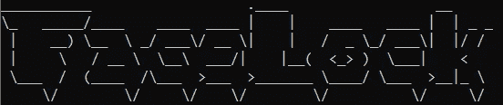
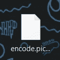

# Python 中的简单面部识别锁

> 原文：<https://medium.com/analytics-vidhya/simple-facial-recognition-lock-in-python-fc3bdb65f9e2?source=collection_archive---------5----------------------->



互联网上有成千上万的文章教人们如何编写面部识别程序，但如果你对进一步开发人工智能或只是面部识别不感兴趣，你可以用这些技能和知识做什么？在本文中，我将向您展示如何简单地使用面部识别作为工具来解锁 python 程序中的一些特殊功能，让我们开始吧！

# 第一个脚本:用你的脸扫描图像

要使面部识别锁工作，我们需要两个程序，主程序和面部编码程序。我们需要一个充满我们面部数据的文件，就像这样:

```
[-0.0862740874, 0.0845895484, 0.00457824348, -0.0318371728, -0.100712053, -0.0418178774, -0.0960027054, -0.133479297, 0.154759556, -0.10576304, 0.227993041, -0.0542645939, -0.201107845, -0.0896851793, -0.051155258, 0.185108796, -0.189338654, -0.0807494298, -0.023903545, -0.00611156411, 0.0360367298, -0.000108173699, 0.0220226366, 0.10286174, -0.0518482327, -0.361791611, -0.102660321, -0.130110055, -0.0168904345, -0.0592981838, -0.105417296, 0.0476256534, -0.134715512, -0.06483794, 0.0398214161, 0.0726992786, -0.0366758741, -0.0319151953, 0.214342266, -0.0181660987, -0.194284335, 0.00949012395, 0.0287496075, 0.224820495, 0.161936209, 0.0535234362, 0.0294731073, -0.155835524, 0.111303784, -0.142807156, 0.0162547529, 0.167122349, 0.0853853449, 0.0324059725, -0.0510545149, -0.120040506, 0.0221806802, 0.091224499, -0.140660241, 0.00179720065, 0.0806006864, -0.147366777, -0.0763955563, -0.0365661718, 0.307173997, 0.109180234, -0.119325541, -0.189195797, 0.102084883, -0.173305988, -0.108043648, 0.0138288997, -0.142863572, -0.180734307, -0.292608291, 0.00601311959, 0.375898182, 0.0840220973, -0.206772164, 0.0971529856, -0.12172585, -0.043821238, 0.119383149, 0.179529011, -0.0306802131, 0.0182257965, -0.0724082515, -0.0192991868, 0.223633379, -0.0940892547, 0.0138434339, 0.211511686, -0.000297587365, 0.12877129, 0.0305812079, -0.0346990041, -0.0490746126, 0.0227140095, -0.0909718052, -0.00931461621, 0.0639288872, -0.0302120745, 0.0152705275, 0.0721999854, -0.215995222, 0.106535025, -0.00207017828, 0.0114724403, 0.0923817977, -0.0237524286, -0.119121008, -0.119517364, 0.189791232, -0.237717852, 0.21647267, 0.161980346, 0.11064291, 0.147651345, 0.136242002, 0.10126932, -0.0106870839, -0.0220588408, -0.227553442, 0.0265891906, 0.154135481, -0.0370164737, 0.0795107111, -0.0148447473]
```

在这篇文章中，我会用更简单的方法，用你的照片代替摄像机。

对于今天的脚本，我使用的是 https://github.com/ageitgey/face_recognition 的人脸识别模块，你可以访问网站并获得更多信息。

```
import face_recognition as fr
import os
import pickle
```

在编写脚本之前，我们需要创建一些文件夹来存储我们的 pickle 文件和我们想要扫描的图像。在我的情况下，我的文件夹是


人脸数据库

因此，在脚本开始时，我们需要指定文件夹路径:

```
db_path = "C:\\Users\\your\\path\\face_db\\"
```

要扫描 face_db 文件夹中的那些图像，我们需要用 os.listdir()将每个图像名称放入一个列表中:

```
faces = os.listdir(db_path)
```

然后，我们需要一个列表来存储我们的编码:

```
known_face_encodings = []
```

要开始扫描，我们可以为面孔列表中的每个面孔创建一个 for 循环:

```
for face in faces:
```

下一步，我们需要加载图像并用 face _ recognition . load _ image _ file()和 face_recognition.face_encoding()对其进行编码，然后将其添加到“know_face_encoding”列表中:

```
 im = fr.load_image_file(db_path + face)
    **#encode the first face in the image**
    encoding = fr.face_encodings(im)[0]
    known_face_encodings.append(encoding)
```

扫描完所有的面后，我们需要创建一个 pickle 文件:

```
file = open('encode.pickle','wb')
**#you can add a path in front of the file name,it is not necessary, but the pickle file will be the location of your script**
```

然后将我们的数据转储到 pickle 文件中并关闭它:

```
**#dump encoding in pickle file**
pickle.dump(known_face_encodings,file)
file.close()
```

这是第一个脚本的结尾，您应该得到这样一个 pickle 文件:



完整脚本:

```
import face_recognition as fr
import os
import pickledb_path = "C:\\Users\\your\\path\\face_db\\"
faces = os.listdir(db_path)
known_face_encodings = []
n = 1for face in faces:
    im = fr.load_image_file(db_path + face)
    #encode the first face in the image
    encoding = fr.face_encodings(im)[0]
    known_face_encodings.append(encoding)
    print("%1d of %2d is done"%(n,len(faces)))
    n+=1       
#create a pickle file
file = open(path+'encode.pickle','wb')#dump encoding in pickle file
pickle.dump(known_face_encodings,file)
file.close()
```

# 演示:

# 第二个脚本:面部识别锁

对于我们的主程序，面部识别锁，我们需要访问我们计算机的摄像头，所以我将使用 Opencv。

```
import face_recognition as fr
import pickle
import cv2
import os
```

要从相机中获取帧，我们只需使用 cv2。视频捕获():

```
video_capture = cv2.VideoCapture(0)
**#if you got two cameras you could use cv2.VideoCapture(1) instead of cv2.VideoCapture(0) to switch between cameras**
```

为了使程序工作，我们需要分配一些布尔和列表:

```
face_is_match = False**#this is not necessary**
face_encodings = []
```

为了获取我们之前脚本中的面部数据，我们需要使用以下命令打开 pickle 文件:

```
known_face_encodings = pickle.load(open('encod.pickle','rb'))
```

在所有事情都设置好之后，我们需要使用 face_recognition 模块通过 face _ recognition . face _ locations()定位视频捕获的每一帧中的人脸，通过 face _ recognition . face _ encodings()对其进行编码，并通过 face_recognition.compare_faces()将其与我们的数据进行比较:

```
while True:
        ret, frame = video_capture.read()
        face_locations = fr.face_locations(frame, model="hog")**#can use 'cnn' instead of 'hog'**
        face_encodings = fr.face_encodings(frame, face_locations)
        face_names = []
        name = "Unknown" for face_encoding in face_encodings:
                matches = fr.compare_faces(known_face_encodings, face_encoding, 0.4)
```

对于那些不太了解神经网络或人工智能的人来说， **hog 被称为有向梯度直方图，cnn 被称为卷积神经网络**，你可以从【https://en.wikipedia.org/wiki/Convolutional_neural_network】的[和](https://en.wikipedia.org/wiki/Convolutional_neural_network)[的 https://en . Wikipedia . org/wiki/Histogram _ of _ Oriented _ gradients](https://en.wikipedia.org/wiki/Histogram_of_oriented_gradients)中了解其中两个。在我们的脚本中，它们之间的主要区别是输出数据的速度和准确性，**“hog”使用较少的 GPU 功率，输出精度较低的数据，处理速度较快，但我们需要输入大量的训练数据，这是我们的图像**，而**“CNN”使用较多的 GPU 功率，精度较高，处理速度较慢，但我们可以输入相对较少的训练数据，**您可以根据您的计算机性能在它们之间进行选择。

因此，在比较之后，如果我们找到与我们的面部匹配的第一个数据，我们可以启动特殊功能，在我的情况下，它是“print ('welcome ')”和“face_is_match =True”:

```
if True in matches:
                        first_known_face = matches.index(True)
                        print("Welcome")
                        face_is_match = True
                else:
                        print("Access Denied")
```

面部识别锁定脚本到此结束

完整脚本:

```
import face_recognition as fr
import pickle
import cv2
import osvideo_capture = cv2.VideoCapture(0)
face_is_match = False
face_encodings = []
known_face_encodings = pickle.load(open('encode.pickle','rb'))

while True:
        ret, frame = video_capture.read()
        face_locations = fr.face_locations(frame, model="hog")
        face_encodings = fr.face_encodings(frame, face_locations)

        face_names = []
        name = "Unknown"for face_encoding in face_encodings:
                matches = fr.compare_faces(known_face_encodings, face_encoding, 0.4)

                #find first match
                if True in matches:
                        first_known_face = matches.index(True)
                        print("Welcome")
                        face_is_match = True

                else:
                        print("Access Denied")
```

# 演示:

希望你喜欢这个教程！