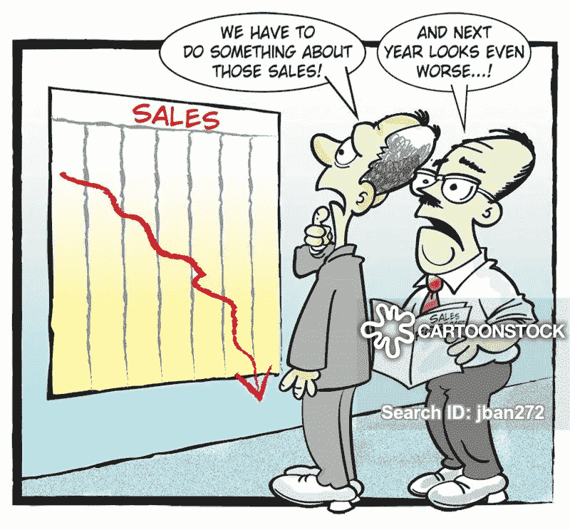

# 简单的预测方法

> 原文：<https://medium.com/analytics-vidhya/simple-forecasting-methods-a8016812ae38?source=collection_archive---------14----------------------->

能够预见未来不是很好吗？我们可能有一天会达到这一点，但时间序列预测让你更接近，因为它允许我们提前预测时间，并帮助我们进行商业预测。

有些预测方法极其简单，却出奇的有效。虽然有各种各样的预测方法，但在本文中，我们将重点介绍三种简单的方法，金融分析师可以用它们来…