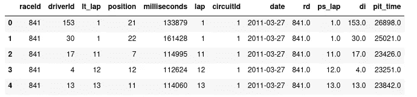

# Python 中 SQL 的简单指南

> 原文：<https://medium.com/analytics-vidhya/simple-guide-for-sql-in-python-8c0640895eed?source=collection_archive---------28----------------------->

使用本地服务器在家用电脑上创建 SQL 查询的简单指南。你们中的许多人可能想知道为什么本地服务器？如果您想要连接到远程服务器，唯一真正的更改是主机名输入和密码。这更有助于在转移到其他平台之前理解该过程，在这些平台上，安全性是需要考虑的问题。第一步是导入 pymysql。如果您还没有安装 pymysql，您可以安装:

$ python3 -m pip 安装 PyMySQL

Pymysql 使用一个基于 pep 249 的 mysql 客户端库。“这个 API 被定义为鼓励用于访问数据库的 Python 模块之间的相似性。通过这样做，我们希望实现一致性，从而产生更容易理解的模块、跨数据库更易移植的代码，以及 Python 更广泛的数据库连接。(python.org)"

```
prod_conn = pymysql.connect(
  host='localhost',
  user='root',
  password='Mike4568!',
  port=3306,
  database='FORMULA1')
with prod_conn:
    cur = prod_conn.cursor()
```

以上代码是 Python 代码连接到服务器时的示例。如果你使用你的 pc 作为服务器，那么 host = ' localhost 如果不是，那么您应该复制主机名。您可以将变量命名为 prod_conn 或 cur，但它们将用于您的其余代码，所以要简单。现在一切都将使用我的“cur”变量来发送 SQL 查询。

```
cur.execute(“SHOW DATABASES;”)
4
```

使用。execute()会将您的查询发送到本地或远程服务器。在这个例子中，我有四个数据库，所以它返回了四个，但是这不是这个 SQL 查询应该返回的。从查询中检索信息还需要一个步骤。

```
rows = cur.fetchall()
print(rows)
(('FORMULA1',), ('information_schema',), ('mysql',), ('performance_schema',))
```

如果您只是向服务器发送数据或做一些不需要返回的事情，那么。执行应该够了。如果您的查询是多行的，最好使用三个引号并将其保存到一个变量中，然后执行如下所示的字符串变量。

```
circuit_ = """
            CREATE TABLE circuits
            (
             circuit_id  INT NOT NULL,
             circuit_ref VARCHAR(30) NOT NULL,
             name        VARCHAR(45) NOT NULL,
             location    VARCHAR(30) NOT NULL,
             county      VARCHAR(30) NOT NULL,
             lat         DECIMAL(10,6) NOT NULL,
             lng         DECIMAL(10,6) NOT NULL,
             url         VARCHAR(150),
             PRIMARY KEY ( circuit_id )
            );
            """
cur.execute(circuit_)
```

然后，我会建议您编写一些函数，使您更容易执行您知道会经常使用的查询。

```
def drop_table_(name):
    cur.execute(f"DROP TABLE {name};")
    cur.execute("COMMIT;")
```

在向表中插入 1000 行数据时非常有效。

```
def insert_values(table_, name):
    insert_into = f"INSERT INTO {name} VALUES "

    for i in range(0,table_.shape[0]):
        a =table_.loc[i].values
        r =[j for j in a]
        r= str(r).replace('[','(').replace(']',')')
        insert_into+=r
        if i != (table_.shape[0]-1):
            insert_into+=", "
    return insert_intocircuit_insert = insert_values(data, "circuits")
cur.execute(circuit_insert)
```

插入所有数据后，现在您将能够查询所有的表或行，并且根据您想要如何格式化信息，它可以作为数据框返回。在我的例子中，我将结果作为数据帧返回。

打印(行)

```
def data_retr(input_str):
    cur.execute(input_str)
    table = cur.fetchall()
    a = list(cur.description)
    column_names = [str(a[x][0]) for x in range(len(a))]
    return pd.DataFrame(list(table),columns=column_names)
```

这个函数执行并获取发送给服务器的查询结果。然后使用。描述，您可以检索每一列的名称。最后，举一个例子，看看它们组合在一起会是什么样子。

```
another_one = """
SELECT *
FROM (
    SELECT lt.raceId, lt.driverId, lt.lap AS lt_lap, lt.position, lt.milliseconds, lt.lap, rs.circuitId, rs.date 
    FROM lap_times lt
    INNER JOIN races rs on lt.raceId = rs.raceId
) aLEFT JOIN(
   SELECT ps.raceId AS rd, ps.lap AS ps_lap, ps.driverId AS di, ps.millisec as pit_time
    FROM pit_stops ps
) bON (a.raceId = b.rd) AND (a.driverid = b.di) AND (a.lap = b.ps_lap);
"""res1 = data_retr(another_one)
res1.head()
```

