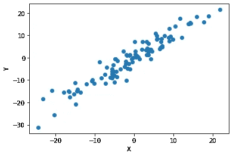
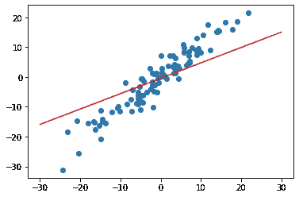
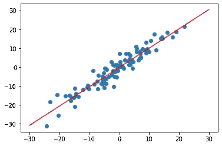

# 简单线性回归

> 原文：<https://medium.com/analytics-vidhya/simple-linear-regression-1b15f07e555e?source=collection_archive---------21----------------------->

线性回归是分类问题的最简单形式。我们有许多技术来做这种类型的回归。今天我们将学习如何使用 PyTorch API 来帮助我们进行分类。

# 概念

线性回归背后的核心概念是直线方程。

Y = m * x + C

其中 Y，x =直线上的点，m =斜率，C = Y 截距

因此，从上面的等式中，我们可以通过找到 m，c 的最优值来创建一条线。

# 想法

所以我们创建了一个神经网络并用随机权重和偏差初始化它。这些代表直线的 m，C。

在上图中，很明显，m，C 不能帮助我们正确地对数据进行分类。所以，任何从网络中推断出来的预测都是错误的。

现在，我们必须训练网络来获得 m，C(权重和偏差)的最佳值。

# 训练后

现在很明显，我们已经为我们的网络找到了最佳的权重和偏差。

虽然为简单回归问题训练网络时，我们在大多数情况下不需要太担心过度拟合，但是如果时期的数量不够，那么模型可能会欠拟合。

在大多数情况下，100-200 个历元就足够了。

# 密码

 [## srimanthtenneti/线性回归

### 线性回归的 PyTorch 实现。通过创建一个应用程序，为 srimanthtenneti/线性回归开发做出贡献

github.com](https://github.com/srimanthtenneti/Linear-Regression) 

代码中的注释将指导您完成整个过程。

# 应用程序

一个很好的科学应用是 pH 和 DO2(溶解氧)测量。两个信号调理单元都产生线性数据。电压将随 pH 和 DO2 线性变化。

因此，pH 值和溶解氧测量的第一步称为校准，我们在其中进行线性回归。我们将装置的探针放在 3 或 2 个化学标准中，并读取电压读数。因此，我们确定 m、C 值并构建线性模型。一旦在未来完成，我们将获得未知溶液中的电压值，并确定 pH 值和溶解氧。

Y =电压，x = pH / DO2，[m，C] =常数

x = Y-C / m

# 结论

现在，您将能够使用 PyTorch API 解决简单的回归问题。

希望这能帮助你，如果你需要更多的帮助，请随时通过我下面的 Linkedin 链接联系我。

# 接触

 [## Srimanth Tenneti -自由职业者-自由职业者| LinkedIn

### 我是 Srimanth Tenneti，一名 20 岁的硬件设计师和软件开发人员。目前就读于北京理工大学二年级…

www.linkedin.com](https://www.linkedin.com/in/srimanth-tenneti-662b7117b/)