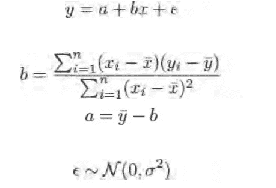

# 简单线性回归— 7

> 原文：<https://medium.com/analytics-vidhya/simple-linear-regression-7-655537eee4c5?source=collection_archive---------11----------------------->

> *如果您还没有阅读 R 数据分析系列的第 6 部分，请阅读下面的文章，其中我们讨论了使用 R-6*的* [高级统计。](/analytics-vidhya/advanced-statistics-using-r-6-2789539a0167)*
> 
> 这篇文章的内容是我在 IIM-B 时代得到的几本书的要点。
> 
> 人人有责——贾里德·p·兰德
> 
> *实用数据科学与 R —妮娜·祖梅尔&约翰·芒特*
> 
> *文中讨论的所有代码块都以 R markdown 的形式出现在*[*Github link*](https://github.com/viveksrinivasanss/Data_Science_Using_R)*中。*
> 
> *要看我写的所有文章请使用链接，*[*Vivek Srinivasan*](/@viveksrinivasan)*。*


统计分析的主力是线性模型，尤其是`regression`。最初由`Francis Galton`发明，用于研究父母和子女之间的关系，他将其描述为回归均值，它已成为最广泛使用的建模技术之一，并催生了其他模型，如广义`linear models`、`regression trees`、`penalized regression`等。

在本文中，我们的讨论主要围绕着`regression` 的基本原理及其与`ANOVA` 的关联。稍后我们将看到一个例子来演示如何使用`R`实际应用回归。在下面的文章中，我们将通过一个案例研究来介绍`multiple linear regression` ，并讨论重要的`model diagnostics`方法。

## 简单线性回归

最简单的形式`regression` 用于确定两个变量之间的关系。也就是说，给定一个变量，它告诉我们可以从另一个变量中得到什么。这个强大的工具被称为`simple linear regression`，它经常被教授，可以用最小的努力完成大量的分析。

在我们继续之前，我们先澄清一些术语。结果变量(我们试图预测的)被称为`response`，输入变量(我们用来预测的)是`predictor`。统计之外的字段使用其他术语，如`response`的`measured` 变量、`outcome` 变量、`experimental` 变量，预测值的`covariate`、`feature` 、`explanatory` 变量。最糟糕的是术语`dependent` (响应)和`independent` (预测)变量。

这些名字都是用词不当。根据概率论，如果变量 y 依赖于变量 x，那么变量 x 不能独立于变量 y。所以我们只使用响应和预测这两个术语。

simple `linear regression`背后的一般思想是使用预测器得出响应的平均值。这种关系被定义为



该等式本质上描述了一条穿过数据的直线，其中`a`是`y-intercept` 而`b` 是`slope`..在这种情况下，我们使用父亲的身高作为预测值，儿子的身高作为响应值。穿过这些点的蓝线是回归线，它周围的灰色带表示拟合的不确定性。方程中的误差项是指存在正态分布的误差。

```
data(father.son, package='UsingR')
library(ggplot2)
head(father.son)
```


现在让我们绘制这些数据来理解变量之间的关系。

```
ggplot(father.son, aes(x=fheight, y=sheight)) + geom_point() +  geom_smooth(method="lm") + labs(x="Fathers", y="Sons")
```


使用简单线性回归，用父亲的身高预测儿子的身高。父亲的身高是预测因素，儿子的身高是反应因素。穿过这些点的蓝线是回归线，它周围的灰色带表示拟合的不确定性。

虽然这段代码生成了一个显示`regression (generated with geom_smooth(method=“lm”))`结果的漂亮图形，但它实际上并没有向我们提供这些结果。要实际计算回归，使用`lm` 功能。

```
heightsLM <- lm(sheight ~ fheight, data=father.son)
heightsLM
```


这里我们再次看到公式符号，它指定使用`father.son`数据对`fheight` (预测值)回归`sheight` (响应)，并自动添加截距项。结果显示了预测器`fheight`的`Intercept`和`fheight` 的系数，即`slope` 。对此的解释是，父亲的身高每增加一英寸，他的儿子的身高就会增加半英寸。在这种情况下，`intercept`没有多大意义，因为它代表的是父亲身高为零的儿子的身高，而这在现实中显然是不存在的。

虽然系数的点估计很好，但如果没有标准误差，它们就没有多大帮助，标准误差会给人一种估计不确定的感觉，类似于标准差。要快速查看模型的完整报告，请使用`summary`。

```
summary(heightsLM)
```


这将打印出更多关于模型的信息，包括`coefficients`的`standard errors`、`t-test`值和`p-values`、`degrees of freedom`、`residual summary`统计数据和一个`F-test`的结果。这些都是用于检查模型拟合度的诊断信息。当我们在下一篇文章中讨论`multiple linear regression`时，统计数据的细节将被广泛讨论。现在让我们退一步，讨论一下如何利用`linear regression`来代替`ANOVA`。

## 方差分析替代

运行`ANOVA` 测试的另一种方法(在上一篇文章中讨论过)是用一个分类变量和没有`intercept` 项的`regression` 来拟合。为了看到这一点，我们使用了`reshape2` 包中的 tips 数据，我们将对其进行回归拟合。

```
data(tips, package="reshape2")
head(tips)
```


我们将首先拟合一个方差分析模型，类似于我们在上一篇文章中所做的。排除下面显示的所有其他统计数据，仅关注`p-value`就可以看出，tips 数据中的天数存在显著差异。

```
# putting -1 in the formula indicates that the intercept should not be
# included in the model;
# the categorical variable day is automatically setup to have a
# coefficient for each level
tipsAnova <- aov(tip ~ day - 1, data=tips)
summary(tipsAnova)
```


现在让我们为相同的数据拟合`regression` 模型，并比较结果。

```
tipsLM <- lm(tip ~ day - 1, data=tips)
summary(tipsLM)
```


让我们了解上面显示的不同统计方法以及它们在模型构建中的重要性。`R-squared`测量模型和因变量之间的关系强度。然而，这不是一个正式的关系测试。我们的模型有一个非常好的`R-Square`值，表明与平均估计值相比，我们的模型变量解释了大部分方差。

具有全局意义的`F-test`是这种关系的`hypothesis test`。如果总体的`F-test`是显著的，你可以断定`R-squared`不等于零，那么模型和因变量之间的`correlation`在统计上是显著的。

将`F-test`的`p-value`与您的`significance level`进行比较。如果`p-value`小于`significance level`，您的样本数据提供了足够的证据，可以得出结论，您的回归模型比没有自变量的模型更适合数据。正如我们从结果中看到的，我们的`p-value`低于显著性水平，因此我们可以有把握地得出模型的总体显著性良好的结论。

当您`F-test`测量模型的整体重要性时，`t-test`则测量模型中每个变量的重要性。与`F-test`类似，将每个变量的`p-value`与显著性水平进行比较。如果 p 值小于显著性水平，则可以得出单个预测变量具有统计学显著性的结论。

一般来说，如果你的自变量都不具有统计显著性，那么总体`F-test` 也不具有统计显著性。偶尔，测试会产生相互矛盾的结果。这种不一致可能发生，因为总体重要性的`F-test`联合评估所有系数，而每个系数的`t-test`单独检查它们。例如，总体`F-test`可以发现系数*联合*是显著的，而`t-tests`不能单独发现显著性。

这些相互矛盾的测试结果可能很难理解，但请这样想。`F-test`对所有独立变量的预测能力求和，并确定所有系数不太可能等于零。然而，有可能每个变量本身都没有足够的预测性，没有统计学意义。换句话说，你的样本提供了足够的证据来断定你的模型是显著的，但不足以断定任何单个变量是显著的。

如果你的回归模型具有统计学意义，那就太棒了！但是，请检查您的`residual plots`以确定结果是否可信。当我们讨论模型诊断时，我们将在残差图上看到更多。

## 比较模型统计数据

请注意，`F-value`或`F-statistic`对两者来说是相同的，`degrees of freedom`也是如此。这是因为`ANOVA` 和`regression` 是沿着相同的线导出的，并且可以完成相同的分析。可视化系数和标准误差应该显示与使用`ANOVA` 公式计算它们相同的结果。均值的点估计是相同的，置信区间是相似的，差异是由于计算略有不同。

```
# first calculate the means and CI manually
library(dplyr)
tipsByDay <- tips %>%
  group_by(day) %>%
  dplyr::summarize(
    tip.mean=mean(tip), tip.sd=sd(tip),
    Length=NROW(tip),
    tfrac=qt(p=.90, df=Length-1),
    Lower=tip.mean - tfrac*tip.sd/sqrt(Length),
    Upper=tip.mean + tfrac*tip.sd/sqrt(Length)
  )
tipsByDay
```


我已经使用了 Hadley Wickham 的`dplyr` 库来计算数据的`mean` 和`Confidence Intervals (CI)`。到目前为止，在我们的数据科学中，我们还没有使用`R`系列讨论过`dplyr` 库。它本身是一个系列，我们将在`*advanced R programming*`系列中广泛讨论这些主题。到目前为止，上面的代码按每天分割数据，并计算数据的`mean` 和`CI`。

现在，我们使用适合`tips` 数据的线性模型汇总来计算类似的测量值。

```
tipsInfo <- summary(tipsLM)
tipsCoef <- as.data.frame(tipsInfo$coefficients[, 1:2])
tipsCoef <- within(tipsCoef, {
  Lower <- Estimate - qt(p=0.90, df=tipsInfo$df[2]) * `Std. Error`
  Upper <- Estimate + qt(p=0.90, df=tipsInfo$df[2]) * `Std. Error`
  day <- rownames(tipsCoef)
})tipsCoef
```


我们可以比较两个表，了解手动计算的和从回归模型计算的度量彼此相似。这比比较数值表更容易直观地理解。

```
ggplot(tipsByDay, aes(x=tip.mean, y=day)) + geom_point() +
  geom_errorbarh(aes(xmin=Lower, xmax=Upper), height=.3) +
  ggtitle("Tips by day calculated manually")ggplot(tipsCoef, aes(x=Estimate, y=day)) + geom_point() +
  geom_errorbarh(aes(xmin=Lower, xmax=Upper), height=.3) +
  ggtitle("Tips by day calculated from regression model")
```


这里使用了新功能和新特性。首先，我们引入了`within`，它与`with`的相似之处在于它允许我们通过名称引用`data.frame` 中的列，但不同之处在于我们可以在`data.frame`中创建新列，因此得名。这个功能在`dplyr` 中很大程度上已经被`mutate` 所取代，但是仍然值得一提。

第二，其中一列用空格命名为`Std. Error` 。为了引用名称中带有空格的变量，即使是作为`data.frame`中的一列，我们也必须将名称括在`back ticks (`)`中。

> [使用 R — 7 的多元线性回归](/@viveksrinivasan/multiple-linear-regression-2f28ad463e68)
> 
> 一定要通过评论和分享文章来分享你的想法和支持。