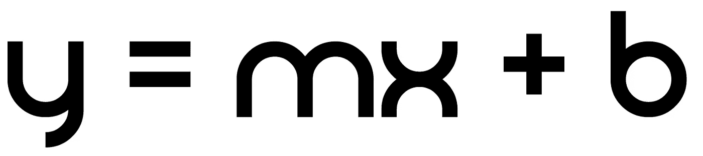
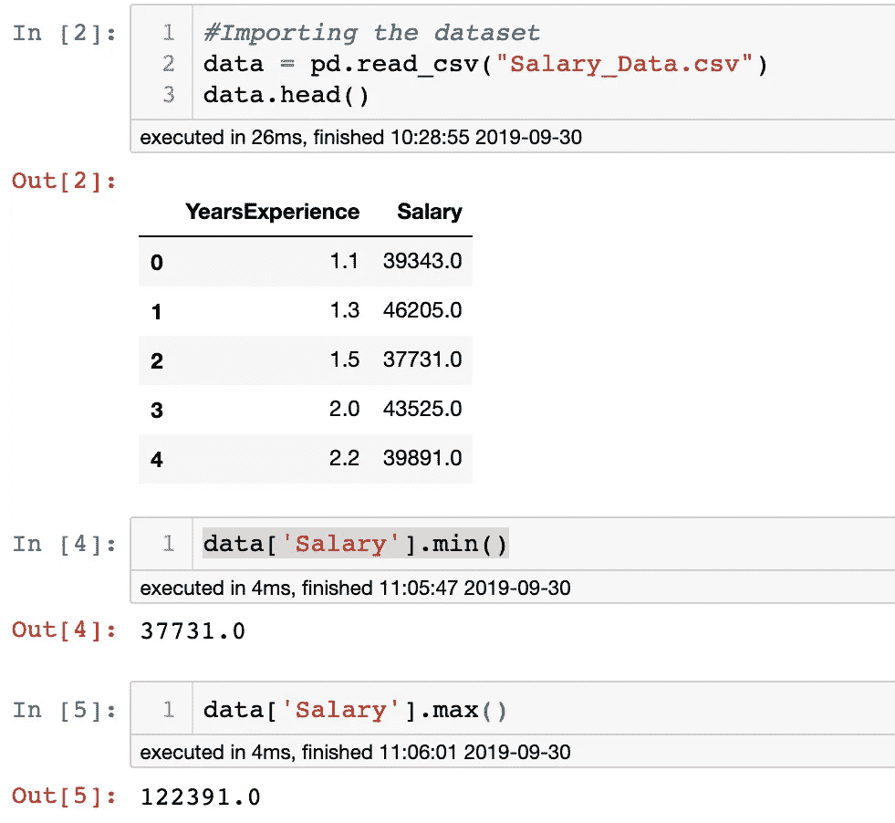
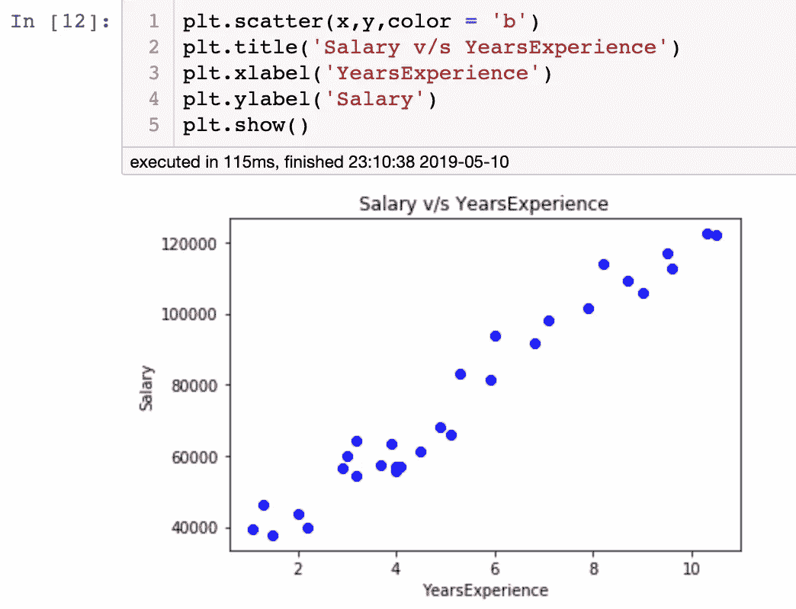
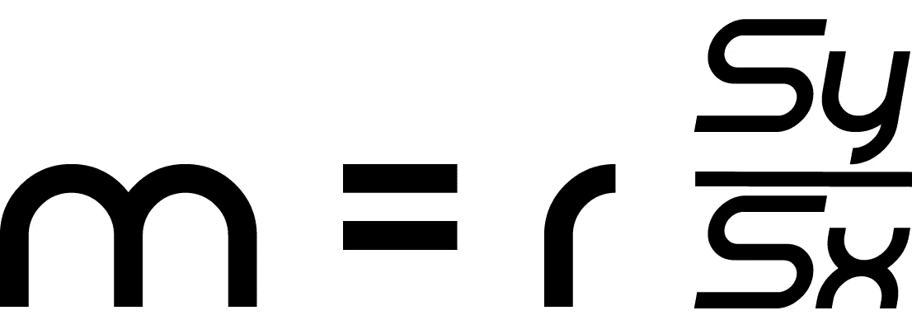
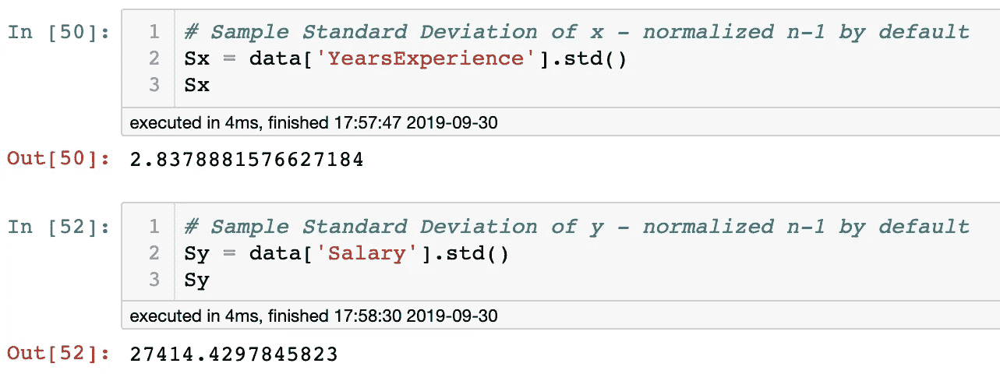
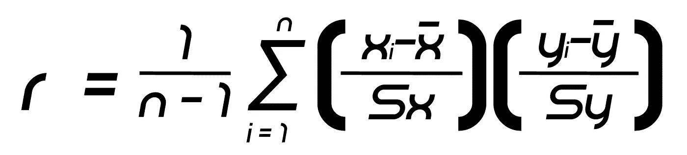
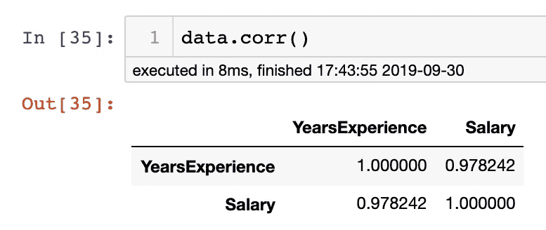
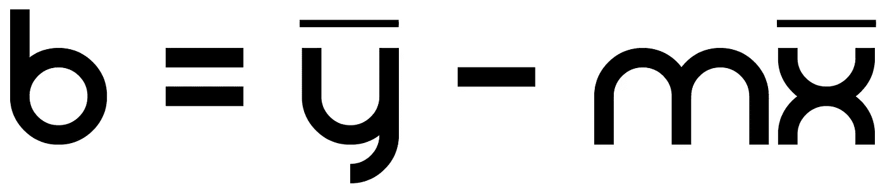
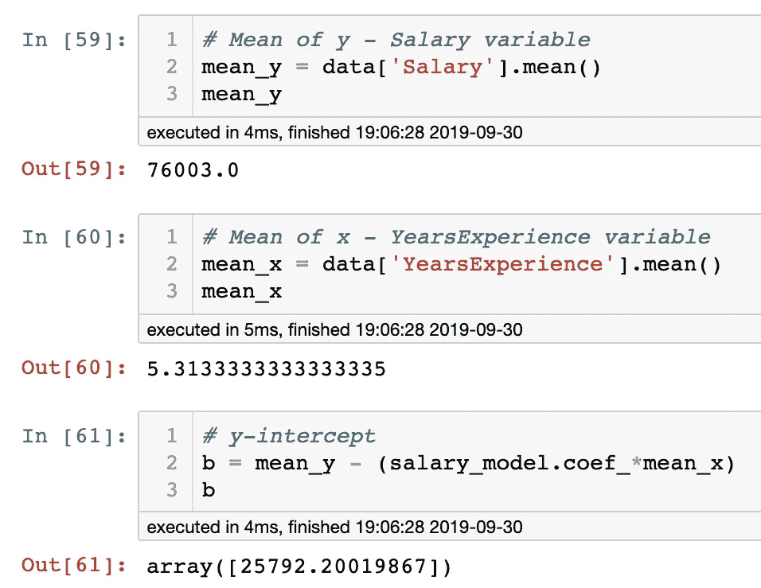
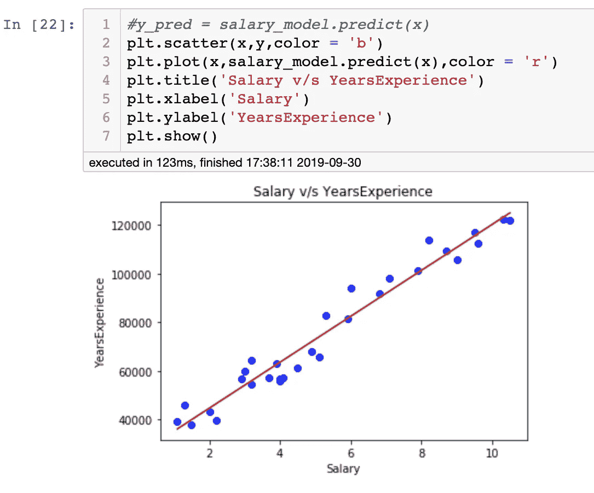

# 简单线性回归作者:新手

> 原文：<https://medium.com/analytics-vidhya/simple-linear-regression-by-a-rookie-82abc5732f32?source=collection_archive---------19----------------------->

线性回归公式

对于我来说，作为数据科学领域的新手，我在开始研究机器学习时遇到的最令人生畏的话题之一是线性回归。我被所有的术语、概念和概括这个主题的数学所困扰。尽管如此，我喜欢接受挑战，并决定开始学习统计学，包括研究线性回归的数学方法。

感谢像萨尔·汗这样的人，他创立了汗学院，让大众免费在线获得各种科学和数学研究和培训，我现在可以说我理解了简单的线性回归。是的，线性回归还有其他变体，如逻辑回归、多元线性回归和多元线性回归，但今天，我只打算解释简单的线性回归算法，它构成了机器学习中线性预测建模的基础。

简单线性回归是一种分析和寻找两个变量之间关系的统计方法。在简单线性回归中，有一个因变量(也称为响应变量)和一个自变量(也称为解释变量或预测变量)。例如，我将利用我在 [Hyperion Development](https://www.linkedin.com/school/hyperion-development-south-africa/) 完成的数据科学训练营的机器学习模块中包含的回归分析任务的课程信息。

我将展示一些来自相关 Jupyter 笔记本的带有代码片段和可视化(Python、Pandas、Matplotlib 和 Numpy)的截屏。我还将包括构成算法的数学公式以及它们的相关解释。我们开始吧！

我们的示例数据集包含由两列/变量组成的三十个实例或数据点对。这一列是我们的因变量，名为“薪金”,包含 30 份薪金，最大值和最小值分别为 122391.0 和 37731.0。我们可以假设称这种货币为“美元”,并以“每年”来衡量。

显示前五个实例以及最小值和最大值的示例/样本数据。

另一列，我们的解释变量被命名为“YearsExperience ”,包含的最小值和最大值分别为 1.1 年和 10.5 年。三十个数据点对中的每一个都包含一个“薪水”值和一个相应的“工作经验”值。对于这个例子，我们想通过回归分析找出年薪和工作年限之间的关系。最后，我们希望拟合这个数据，一个线性回归机器学习模型，以便我们可以根据个人多年的经验预测他们将获得什么样的工资。我们也希望这些预测尽可能准确，基于我们已有的给定数据。与数据拟合的模型将形成一条预测线，该预测线线性穿过我们现有的数据。这条线的数学公式是 **y = mx + b** 其中 ***m =线的斜率，b = y-截距，x =预测值*** (在本例中为“YearsExperience”)和 ***y =预测值*** (在本例中为“Salary”的预测值)。为了让我们能够预测任何类型的 *y* 值，我们需要确定最适合我们数据的直线的斜率和 y 截距。然后我们可以选择 *x* (“年经验”)的任意值，并预测 *y* 值或每年的“薪水”。

在继续之前，我想在这里快速说明一下，在这个例子中，为了便于解释主题和尽量缩短文章长度，使用了强正相关的数据。

样本数据散点图。

我在这里展示了我们的示例数据的可视化，显示了数据点对之间的强正相关性。简单地说，这意味着随着经验年限的增加，年薪也会增加。

让我们来看看计算我们数据的斜率 *m* 和 y 截距 *b* 的公式。

计算回归线斜率的公式。

我们的直线斜率公式(如左图所示)是这样计算的其中 ***r =数据的相关系数*** *。*相关系数解释了数据点对之间的关系，并提供了一个介于-1 和 1 之间的值，其中 1 表示完全正相关，而-1 表示完全负相关。与-1 相比，我们的示例数据肯定会更倾向于更接近完美正相关的值 1。然后将该系数乘以 ***Sy/Sx*** 其中***Sy = y 的样本标准偏差*** 和***Sx = x 的样本标准偏差*** (下面显示的样本标准偏差是通过。std(熊猫的()方法)。

使用熊猫和 Python 在 Jupyter 笔记本中显示的 x 和 y 的标准差。

同样，出于本文篇幅的考虑，我不会详细阐述样本标准差的计算。然而，互联网上有大量关于这方面的知识。简而言之，数据集的样本标准差是给定数据序列方差的平方根。

相关系数公式。

深入研究一个似乎非常令人生畏的公式(上面的相关系数公式)，我们从**用 1 除以数据点数量 *n* 减 1** 开始。**然后再乘以每个数据点对中每个值的 z 得分的乘积之和。将第一数据点对的值的相乘结果加到第二数据点对的值的相乘结果上，依此类推，直到覆盖了所有 30 个数据点对**。请注意，数据序列中任何值的 Z 得分被描述为一个值与给定数据序列的平均值相差多少个标准偏差。

为了计算相关系数，我再次使用了 Pandas 库，通过。corr()方法(见下文)。现在我们已经有了相关系数，我们可以将它乘以 Sy/Sx。

Jupyter 笔记本中显示的熊猫和蟒蛇的相关系数。

所以这里我们有 m 的值，也就是我们直线的斜率，是 9400。49360 . 68638686661 现在，我们需要完成回归线的公式，这就是 y 轴截距 *b 和*的值。我们根据左下图中的公式计算这个值。

简单线性回归中 y 轴截距的公式。

**我们计算出 *y* 的平均值，这是我们“工资”值的平均值，然后从中减去直线斜率(刚刚计算出的)和 *x* 的平均值的乘积，这是我们“年经验”值的平均值。**计算见左下方。

x 和 y 的平均值以及 y 截距的计算。

所以最后我们可以把这条线的公式写成:

**ŷ = 9449.962(x) + 25792.20** 。我们现在可以预测一个有一定经验的特定个人(以年为单位) *x* 的年薪。让我们试一试。假设你是一名在管道行业有 5 年工作经验的管道工，我们想根据我们刚刚建立的模型来看看你的年薪是多少(假设我们的样本数据来自管道行业的管道工薪水)。我们可以将 5 代入我们的回归线公式，比如 so**ŷ= 9449.962(5)+25792.20**，然后发现我们**预测的有五年工作经验的个人的年薪值是****【73，042.01 美元**。

通过使用 SKLearn 的线性回归模型，创建了一个名为“salary_model”的模型，并对数据进行了拟合。

下图显示了该模型的预测线。我们可以看到，如果我们必须匹配预测线上的数据点对，我们预测的年薪值 73，042.01 美元与我们 5 年经验的 *x* 值相符。

以红色显示的线性回归线/预测线。

本文中我没有涉及的一个主题是最小化回归线的平方误差。每个数据点都有一个误差，该误差通过用 y 的原始值减去 y 的预测值与 *x* 的配对值来计算。现在，我们最终想要找到使该误差最小的斜率值和 y 轴截距值。算法中用于计算斜率和 y 截距的公式已经针对直线的最佳拟合斜率和 y 截距进行了优化— [参见汗学院](https://www.khanacademy.org/math/statistics-probability/describing-relationships-quantitative-data)制作的视频系列“回归详情”一节中的证明。

在机器学习中，让线性回归算法学习用于将数据拟合到模型的最佳参数被称为训练模型。一种称为正则化的方法是学习算法中的超参数，用于防止数据过度拟合模型而导致过度泛化。然而，这是另一天的话题！

我希望这对你和对我一样有趣！祝您愉快:)

问候

艾蒂安