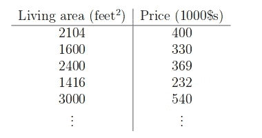
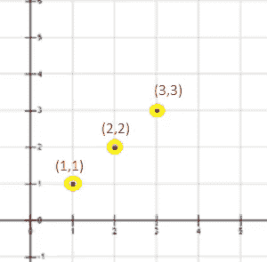
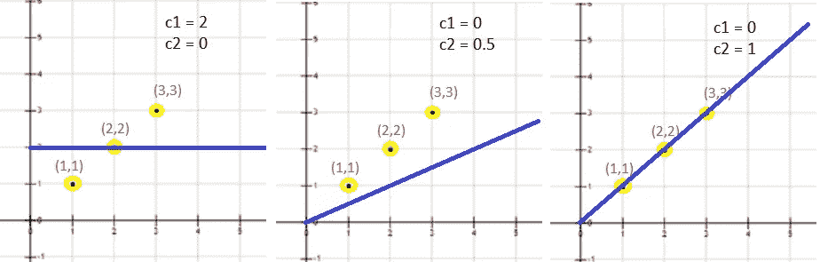
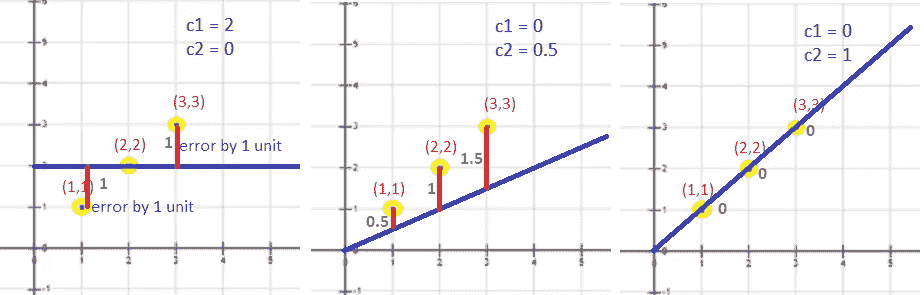
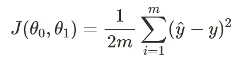
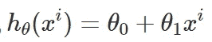
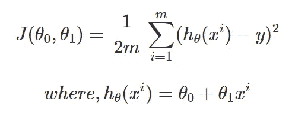
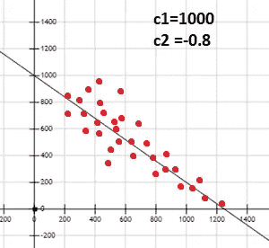
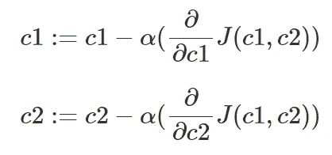
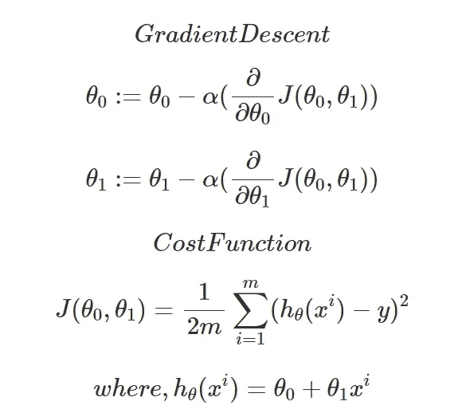

# 简单线性回归、成本函数和梯度下降

> 原文：<https://medium.com/analytics-vidhya/simple-linear-regression-cost-function-gradient-descent-50c5ed085770?source=collection_archive---------8----------------------->

[*线性回归*](https://en.wikipedia.org/wiki/Linear_regression) 是一种强大的统计技术和机器学习算法，用于预测通常为连续数据的两个变量或因素之间的关系。

图 1:线性回归| GIF:走向数据科学

# **应用线性** **回归**

线性回归主要用于了解业务和影响盈利能力的因素，对业务趋势进行评估和预测。线性回归用于分析产品的市场有效性、定价和促销。它还用于评估银行业的风险，并用于推荐系统。

让我们考虑一个简单的房价预测示例，其中房价是基于给定的房屋面积来预测的。

图 2:房屋数据

使用上述数据，我们可以构建一个散点图，从中可以得出一条回归线。回归线以这样一种方式通过，即该线更接近大多数点(图 1)。这可以通过最小化*成本函数*来实现。因为有一个因变量，即可以被视为 X 的面积，而要预测的价格是 Y，所以我们可以得出一个线性方程 Y = c1 + c2*X，其中给定的 X 值 Y 可以很容易地计算出来。

# **C1 的值应该是多少& c2？**

这些常量的值精确地决定了回归线，使得回归线更接近最大点数。让我们考虑 3 个简单的数据点，其中 X 和 Y 是预定义的，我们需要为这些数据找到一条最佳的直线。

图 3:数据点

通过观察，我们可以看到 X=Y，因此 c1 和 c2 的值应该是多少，才能使直线通过大多数数据点。

从左到右:图 4a、图 4b、图 4c

我们可以再次观察到，通过改变等式 Y = c1 + c2*X 中的 c1 和 c2，我们可以得到不同的线，其中我们可以观察到*图 4c* 其中该线通过最佳拟合的所有点。现在，我们可以知道 c1 & c2 的最佳值分别为 0 & 1，将这些值代入等式，我们得到 Y=0 +1X → Y=X，因此，现在我们可以使用该等式预测任意给定 X 值的 Y。类似地，我们可以为房屋数据绘制一个散点图(图 2 ),并找出最适合的数据。

> 这不像我们对上面 3 个数据点所做的那样简单，现在我们有数百万个数据点用于房屋数据

# 计算机如何知道哪条线最合适？

这是当*成本函数*进入画面时，成本函数计算平均误差(损失函数),我们的目标是尽可能减少成本函数，以获得最佳拟合线。

图 5:误差| L 至 R 图:5a、5b、5c

> 代价函数是 **J(c1，c2) =1/2m ∑( Y`- Y)** 共同写成如下方程**注:**【c1,c2)=(θ₀,θ₁】&y `= y(hat)=假设

*   Y →实际值(基本事实)
*   Y` = c1+c2X →(预测值)称为假设，即

*   m →数据点的数量
*   1/2m 和平方误差是为了计算平均值和简化数学

# **成本函数:**

现在，让我们通过使用(图 5)中的示例来解方程 ***J(c1，c2) =1/2m ∑( Y`- Y)*** 来理解它

*图****5a***→C1 = 2&C2 = 0 因此 Y`= 2，m=3

*J(c1，C2)=(1/2 * 3)*((2–1)+(2–2)+(2–3))***=*0.33***

*图****5b***→C1 = 0&C2 = 0.5y ` = 0+0.5X→y ` = 0.5X**且 m=3**

***J(c1，C2)=(1/2 * 3)*((0.5–1)+(1–2)+(1.5–3))***=*0.58*****

***图****5c→***C1 = 0&C2 = 1**y ` = 0+X→**y ` = X**且 m=3****

*****J(c1，C2)=(1/2 * 3)*((1–1)+(2–2)+(3–3))***=*0*******

****比较以上所有示例，图 5c 给出了最小成本函数，因此我们可以知道图 5c 中 c1=0 和 c2=1 是最佳拟合。因此，现在我们知道哪条线是最佳拟合线，以及如何计算成本函数来获得最接近大多数数据点的最佳拟合线。****

> ******注**:为了计算成本函数，我们需要事先知道 c1 和 c2 的值，其中 c1 和 c2 可以根据数据集在范围内变化，也可以负向变化以获得更好的拟合。那么，如何动态更新 c1 和 c2 的值，直到达到最佳拟合？****

********

****图 6:具有负 C2 值的数据****

# ****如何动态更新 c1 和 c2 的值？****

****这可以通过称为 [*梯度下降*](https://en.wikipedia.org/wiki/Gradient_descent#:~:text=Gradient%20descent%20is%20a%20first,the%20direction%20of%20steepest%20descent.) 的算法来解决，该算法将找到 c1 和 c2 的最佳值[局部最小值](https://en.wikipedia.org/wiki/Maxima_and_minima#:~:text=(Formally%2C%20if%20f%20is%20continuous,at%20critical%20points%20(or%20points)，使得*成本函数为*最小值。如果成本函数最小，那就是我们的回归线最适合的时候。****

> ******注意** : c1 和 c2 只不过是众所周知的参数，当调整时，我们得到回归直线(c1，c2) →(θ₀,θ₁的最佳拟合。这些也被称为 ***权重*** ，它们在机器学习算法中被计算并被存储为模型，当给定输入为 x 时，该模型预测输出 y’****

****梯度下降的整体思想是，我们可以给定 c1 和 c2 的任意随机初始值，然后使用梯度下降算法，通过评估每次迭代的成本函数，考虑每次迭代中的所有数据，更新 c1 和 c2。向局部极小值迈进了一步。****

# ******梯度下降******

********

*   ****c1，c2 →两个可以计算成本函数的参数****
*   ****J(c1，c2) →上面在图 5 中解释的成本函数****
*   ****α → [*学习率*](http://Learning rate) 用于参数的梯度下降****

****我们可以在上面的等式中看到，c1 和 c2 通过找到*成本函数*的偏微分并将其乘以*学习率(α)来更新。*****

> ******注意:** c1 和 c2 或(θ₀,θ₁…)任何数量的参数必须同时更新。我将发表新的文章详细解释为什么这和数学背后的梯度下降****

********

****梯度下降****

# ******概要:******

****你所要做的就是用下面的公式计算参数，你的模型就可以预测了。干杯！！****

********