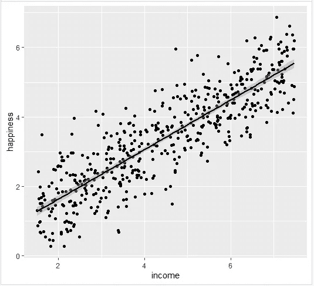
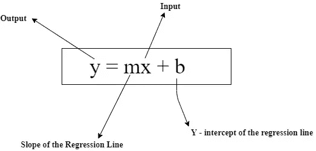
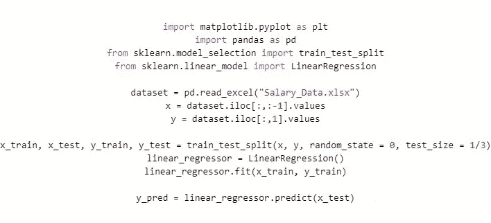
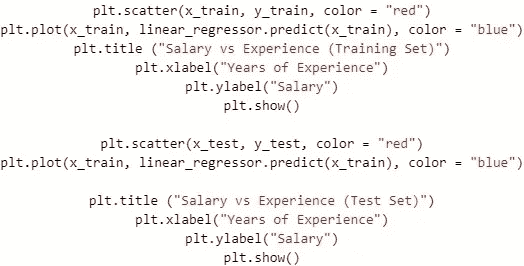
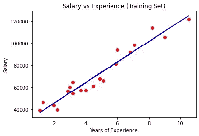
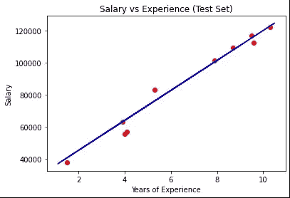

# 简单线性回归

> 原文：<https://medium.com/analytics-vidhya/simple-linear-regression-d89989307370?source=collection_archive---------20----------------------->

> 直觉，步骤，代码

**怀疑是否有联系:**

1.  **一个人的身高和体重？**

如果高度增加，我们预计重量也会增加

2.**车辆的行驶速度和耗油量？**

随着速度的增加，我们预计里程会减少

3.**饮酒量与血液酒精含量？**

随着酒精消费量的增加，我们会预计一个人的血液酒精含量会增加，但不是完美的。

是的，有联系，而**回归分析**可以帮助我们**量化**这一点。

# 简单线性回归

它允许我们总结和研究**两个连续(定量)变量**之间的关系:一个变量，x 作为预测变量或**自变量**。另一个变量 y 被视为响应或**因变量。**

例句:在这个图表中，y=幸福，x =收入。x 和 y 之间的关系最好通过画一条线来描述。

资料来源:Scribbr，Rebecca Bevans 的线性回归

# 直线方程

**m** 和 **b** 是我们的算法将尝试学习的变量，以产生准确的预测。

我们将处理一个简单的数据集，它有两个变量:**薪水(y)** 和**经验(x)。我们将尝试想象 y 如何随 x 变化:**

# **实施步骤**

该过程按以下步骤进行:

1.  导入库: **Matplotlib，Pandas，Scikit-Learn**
2.  加载数据集(Salary_Data)
3.  数据预处理
4.  列车测试数据分割
5.  在训练数据集上生成模型
6.  在测试数据集上评估模型
7.  可视化结果

下载数据集:

 [## dhananjay 3/中

### 在 GitHub 上创建一个帐户，为 Dhananjay3/Medium 开发做出贡献。

github.com](https://github.com/Dhananjay3/Medium) 

# 代码

建模

形象化

注意缩进，这只是代码的整体外观。

# 输出

# 了解更多信息:

通过 **JavaPoint** 进行机器学习中的简单线性回归

通过**机器学习词汇表**进行线性回归

**维基百科上的简单线性回归**