# 简单的线性回归从零开始，背后有数学支持。

> 原文：<https://medium.com/analytics-vidhya/simple-linear-regression-from-scratch-with-math-behind-it-e8e13c40bbb5?source=collection_archive---------43----------------------->

线性回归是线性模型，即显示输入变量(x)和单个输出变量(y)之间的线性关系的模型。更具体地，y 可以从输入变量(x)的线性组合中计算出来。当只有一个输入变量(x)时，该方法被称为简单线性回归。

考虑属性 x 是输入变量，y 是我们试图预测的输出变量。

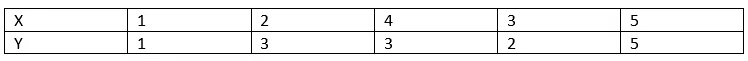

资料组

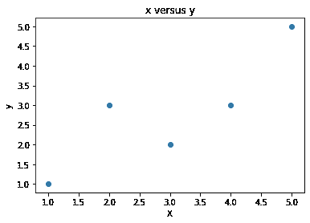

给定数据集的散点图

通过简单的线性回归，我们希望对数据建模如下:

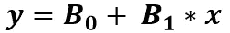

线性方程

其中，x 是输入变量

y 是输出变量

B0(偏差)，B1(斜率)是需要估计的系数

目标是找到系数的最佳估计值，以最小化从 x 预测 y 的误差，我们可以从估计 B1 和 B0 的值开始:

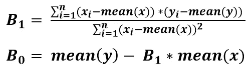

平均值计算如下:

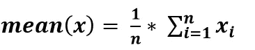

平均值(x) = 3

平均值(y) = 2.8

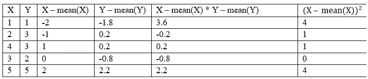

现在，我们将斜率和截距的值计算如下:

B1 = 0.8

B0 = 0.4

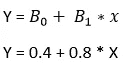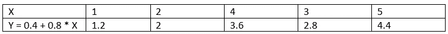

给定方程的预测输出

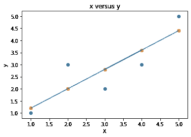

简单线性回归预测

**估计误差**

计算我们预测的误差分数，称为均方根或 RMSE

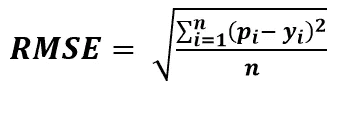

均方根误差

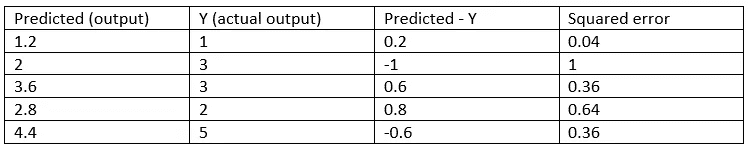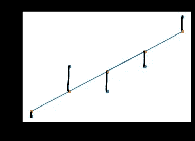

这些是每个点的 rmse

RMSE = 0.6928

每次预测平均误差约为 0.6928 个单位。