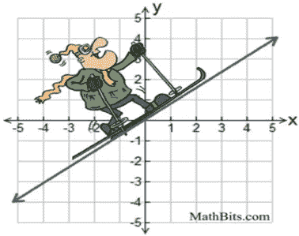

# 使用 Scikit 在 Python 中进行简单的线性回归。

> 原文：<https://medium.com/analytics-vidhya/simple-linear-regression-in-python-using-scikit-learn-713e5c88482c?source=collection_archive---------11----------------------->

图片来源:[https://mathbitsnotebook . com/代数 1/linear equations/oscarskupi . jpg](https://mathbitsnotebook.com/Algebra1/LinearEquations/OscarSKUpi.jpg)

回归是一种监督学习，其输出标签是一个连续(数值)值。在实际应用中，我们根据一个或多个输入变量的值，使用回归分析来预测输出数值变量的值。

线性回归是应用最广泛的算法之一。基于输入变量的数量，线性…