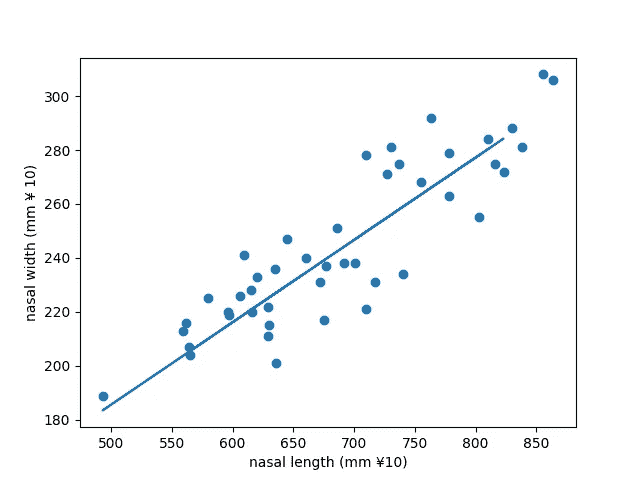

# 使用 Python 进行简单的线性回归

> 原文：<https://medium.com/analytics-vidhya/simple-linear-regression-using-python-6ba3b9a53bad?source=collection_archive---------4----------------------->

**回归** 它是统计学和机器学习中一个强大的领域，有助于找到两个或更多感兴趣的变量之间的关系。虽然有多种回归分析方法可用，但它们的核心都是检查一个或多个自变量对因变量的影响。