# Python 中简化的简单线性回归

> 原文：<https://medium.com/analytics-vidhya/simple-linear-regression-using-python-an-entry-to-data-science-world-48dd260ad746?source=collection_archive---------10----------------------->

理解线性回归是掌握更复杂的机器学习主题的第一步。我挑选了一个简单的问题来帮助您理解如何使用 Python 编写线性回归算法。从收集数据，到清理和绘制数据，我试图用最简单的方式解释每一步。在本文中，我假设你已经知道线性回归背后的数学，因此，我没有解释回归的理论，而是只关注如何处理数据。

太好了！我们开始吧。

**问题？**

假设你被一家新成立的电影制作公司聘为数据科学家，你的公司在一部新电影上投入了大量资金(1.75 亿美元)。作为他们的第一部作品，他们担心这部电影的票房表现如何。你接下手头的任务，并试图预测它的收益。现在电影的表现取决于很多因素，一些突出的因素是电影的演员，电影的导演，类型和电影预算。你挑选因素，电影预算，并试图找到它是否与收入有任何关联。

你开始挖掘互联网，找到 50000 多部电影的数据，这应该可以帮助你找到预算和电影收入之间的某种关系。一旦你找到了这种关系，你就可以预测你自己电影的收入。


[@jakobowens1](https://unsplash.com/@jakobowens1) 在 [Unsplash](http://unsplash.com) 上的照片。

## 既然我们手头有个问题。让我们使用一些 Python 来创建我们的预测模型。

X =预算
y =收入

**数据下载自:**[https://www.kaggle.com/rounakbanik/the-movies-dataset?select=movies_metadata.csv](https://www.kaggle.com/rounakbanik/the-movies-dataset?select=movies_metadata.csv)

**使用的 IDE:**Jupyter

导入所需模块:

```
import pandas as pd
import sklearn.linear_model as sk
```

导入我的数据:

```
df = pd.read_csv("movies_metadata.csv")
```

查看我的数据集的前 2 行，以了解数据集中存在的数据类型。


由于有 24 列，并且它们并不都在屏幕上可见，我想知道哪些列存在，然后决定哪一列与我的研究相关。所以我将使用下面一行代码来获取列的列表。

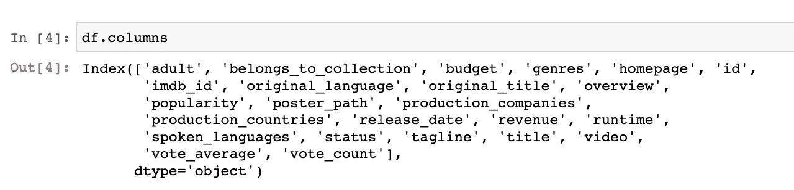

现在，从这个分析中，我想知道我是否可以通过预算预测收益，所以我将删除所有不相关的列，只保留相关的列。

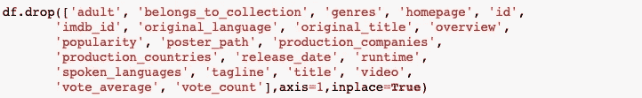

我删除了所有不相关的列，只保留了数据集中的 3 列。

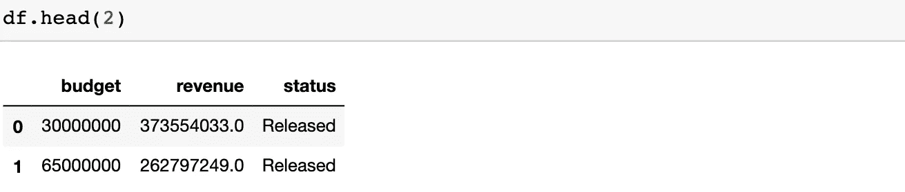

我还没有删除**状态**列，因为我感觉可能有一些状态是不相关的，如果不删除，可能会破坏我的分析结果。因此，我想首先浏览一下它们的类型，找出哪些是相关的。我将使用下面一行代码来检查状态的类型。

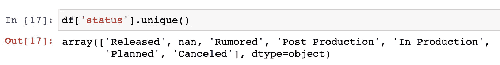

对于这项研究，我只关心已经发行的电影，因此我将删除除反对**发行**的行之外的所有行。

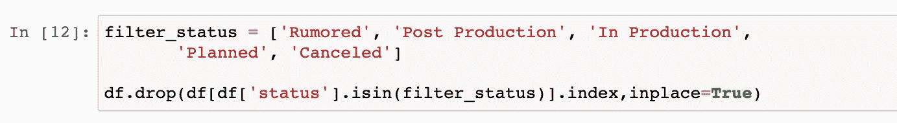

在上面的代码中，我创建了一个状态列表，我想从我的 dataframe 中删除它。一旦创建了这个列表，我就在 **isin** 方法中传递它，并使用 **drop** 方法删除它，然后执行代码块。现在让我检查一下我是否只发布了状态。


厉害！现在让我也删除这一列，只保留两列，即。**预算**和**收入**。

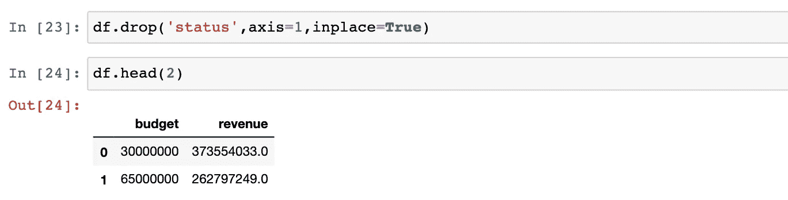

超级棒。现在我的数据集看起来有点干净，但真的是这样吗？让我检查一下我的两列的数据类型。

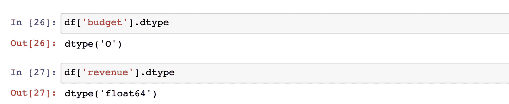

如果您注意到，预算列的数据类型是对象**和对象**，这在我的回归分析中不起作用。我需要把它改成 **float。**这有点棘手，因为人们通常会使用下面的代码将其从数据类型 object 改为数据类型 float。

```
df['budget'].astype(str).astype(int)
```

但是这将抛出一个错误，因为可能有 NaN 值。让我尝试一个不同的技巧，将它从数据类型 object 改为数据类型 float。

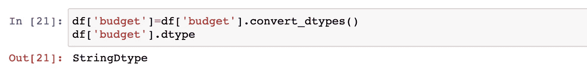

Convert_dtypes 已将数据更改为数据类型字符串。现在我将使用下面的代码把它改为数据类型 float。

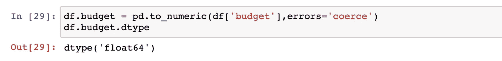

太棒了。现在两列的数据类型都是 float，在分析中不会抛出任何错误。接下来，我怀疑在预算和收入栏中会有很多垃圾值。让我检查一下是否有。

我想找出是否有预算值小于 10，000 美元的行。一部预算低于 10，000 美元的电影对我的分析来说并不真正有用，因为它不会真正帮助我进行预测。

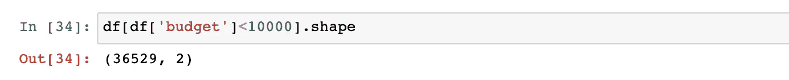

我的担心被证明是真的，有超过 35000 部电影的预算低于 10000 美元。为了这个分析，我会把这类电影全部去掉。

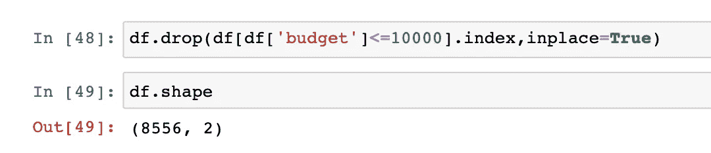

噪音。除去预算低于 10，000 美元的电影后，我的数据集现在包含 8556 部电影。现在让我们检查收入栏。为了这项研究，我不想要任何收入少于$1000 的值。

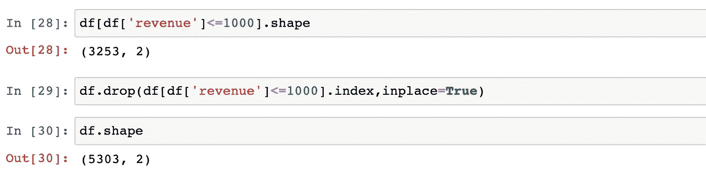

我对收入栏重复了相同的步骤，从数据集中删除了 3253 部电影。我的数据集现在包含 5303 部电影。

最后，我将检查数据集中的任何空值。

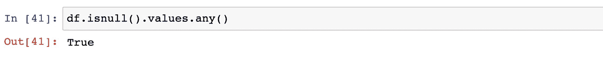

使用上面的代码行，我检查了空值，结果显示我的数据集确实有一些空值。我将删除所有包含空值的行。

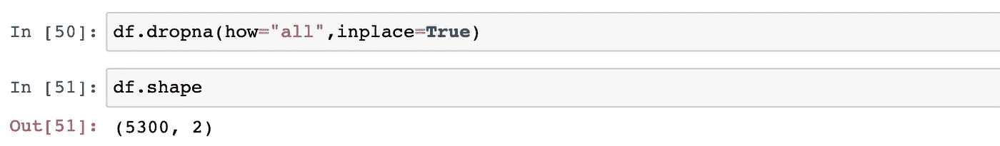

我已经删除了所有有一个空值的行。如果您注意到，我的数据集先前有 5303 行，在删除空值后，数据集包含 5300 行，这意味着有 3 行有空值。

厉害！现在我的数据看起来干净了。让我画出来，看看它看起来怎么样。

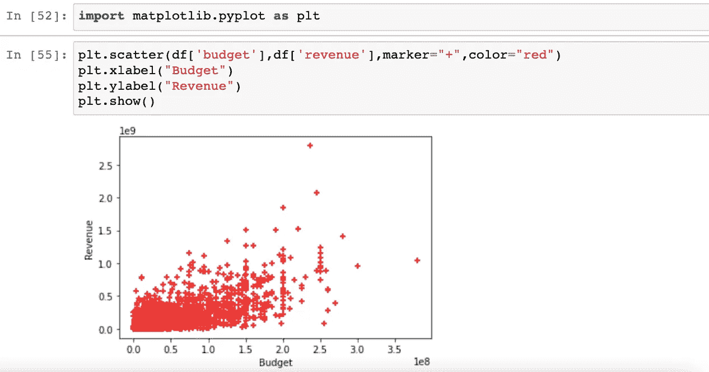

我已经使用 matplotlib 模块绘制了预算和收入之间的图表。在此图表的第一个视图中，我可以看到预算和收入之间存在某种关系。

最后，让我们编写一个回归算法，根据他们的预算来预测收入。

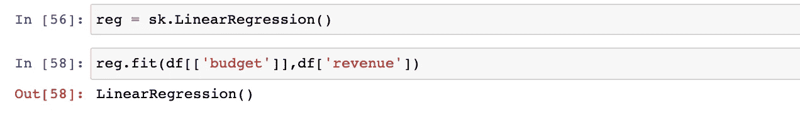

太好了！我们的线性回归模型由训练数据训练，它可以预测值。让我们找出系数和截距。

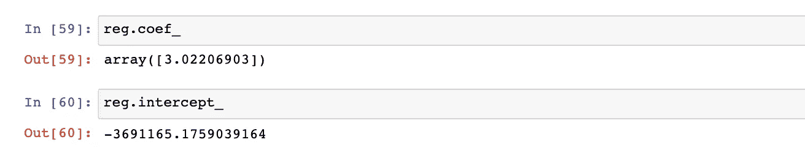

超级棒。我们的回归线是:

```
**y** = 3.02206903***x** + -3691165.1759039164
```

让我们在数据上画这条线。

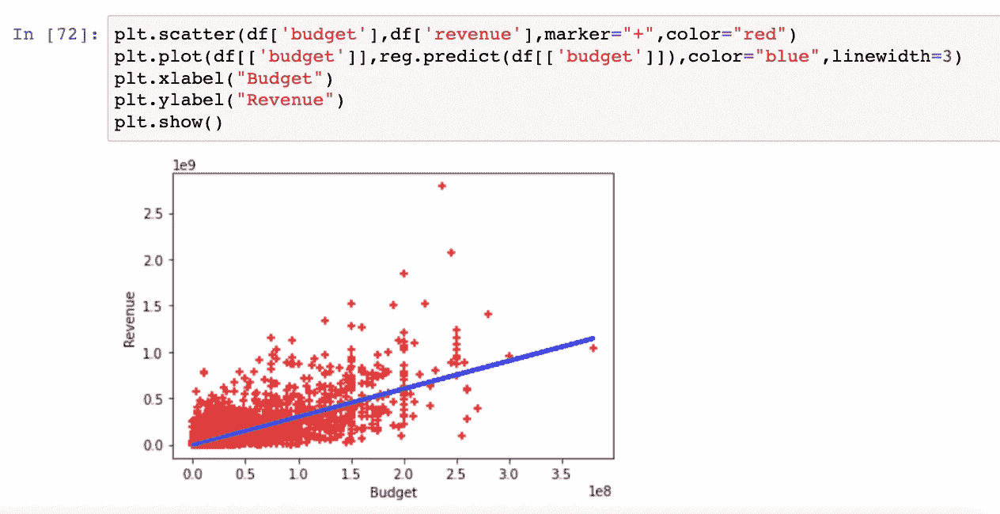

我添加了下面一行代码来画回归线。

```
plt.plot(df[['budget']],reg.predict(df[['budget']]),color="blue",linewidth=3)
```

我们做得很好！现在是时候预测我们的电影将产生多少票房收入了。我们公司在制作这部电影上投入了 1.75 亿美元。让我们预测一下它的收益。

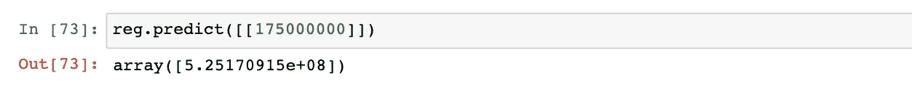

我们也可以使用直线方程。

```
**y** = m**x** + c
m = 3.02206903
c = -3691165.1759039164
**x** = 175000000**y** =3.02206903*175000000 + (-3691165.1759039164)
**y** =525170915
```

收入的预测值为**525，170，915 美元。鉴于我们的第一部电影，这是一个相当不错的数字，对吗？**

让我们也检查一下 R 平方值。

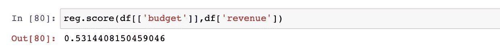

这是一个很好的数字，因为我们只使用了一个变量，即。它解释了电影产生的收入中几乎 53%的变化。当然，这个模型非常简单，我们只考虑了一个变量。有许多变量可能会影响电影收入，但这是留给下一篇文章。