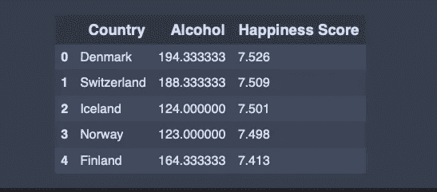
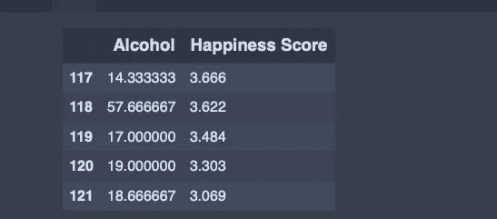
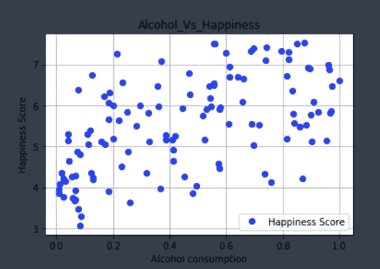
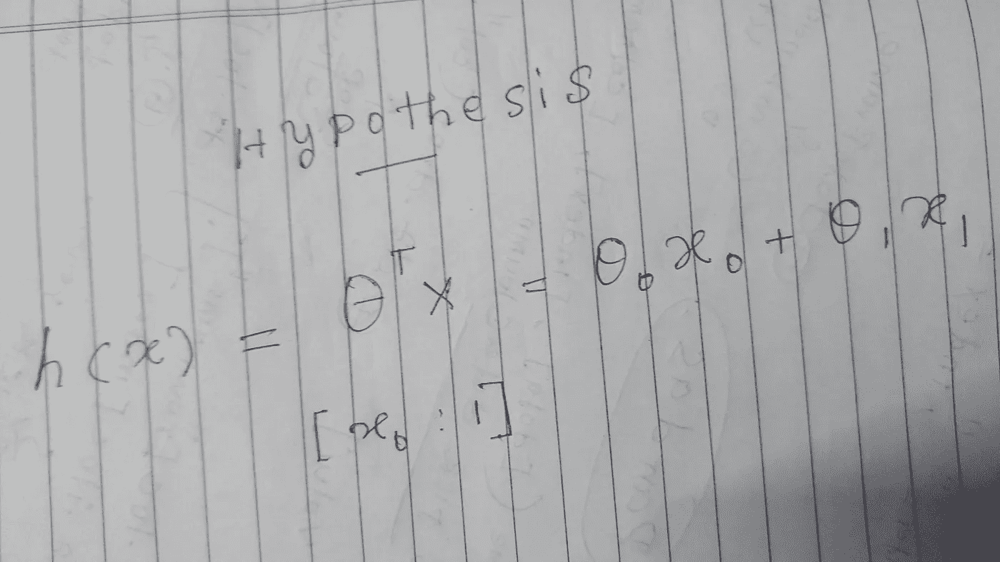
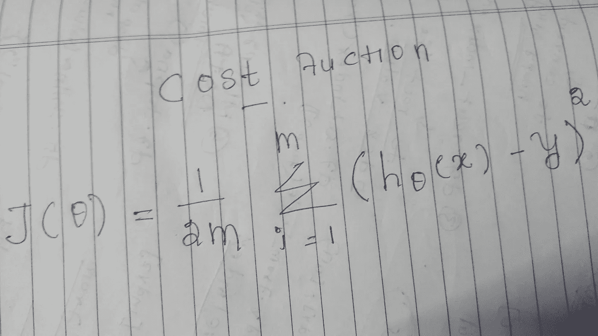
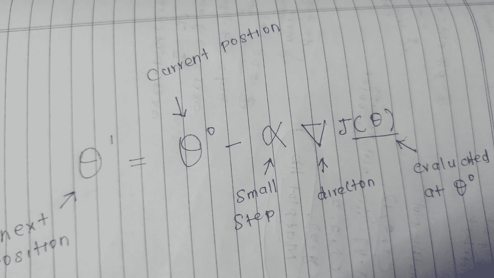
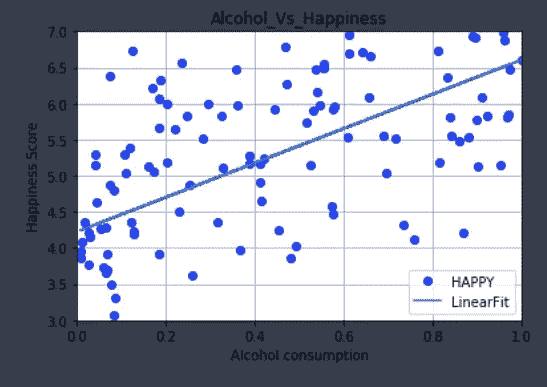
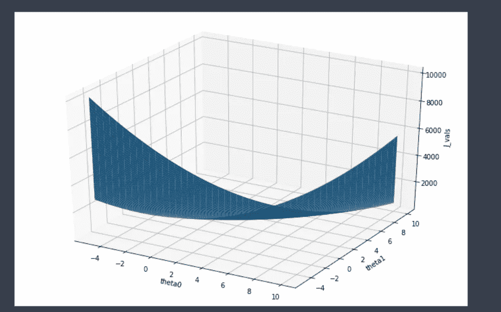

# 使用 NumPy 的简单线性回归示例

> 原文：<https://medium.com/analytics-vidhya/simple-linear-regression-with-example-using-numpy-e7b984f0d15e?source=collection_archive---------1----------------------->


在这篇文章中，我将用一个关于酒精和幸福之间关系的例子来解释机器学习中的一个基本算法。

让我们开始吧。

## 什么是线性回归？

线性回归是根据过去的数据推测未来输出的数学技术。

例如，假设你正在观看你最喜欢的球员在今天的比赛中踢足球，他在与对手的比赛中有着非常好的记录，平均每场比赛有 2 个进球，根据你头脑中的这个简单计算，你可能希望他至少得分 2 分或更多，所以你的大脑所做的是计算简单的平均值。

***平均值=与对手球队的总得分/与对手的比赛次数***

线性回归也与此类似，但我们不是取平均值，而是使用输入变量(x)和目标变量(y)之间的线性关系进行更好的统计猜测。

注:线性回归仅适用于连续变量，如降雨量与湿度、心率与跑步速度等。

让我们通过在流行的数值计算 python 包 NumPy 中实现它来看看它是如何工作的。

## 使用 NumPy 的线性回归

**第一步**:导入所有计算需要用到的包。

```
import pandas as pd
import numpy as np
```

**第二步**:使用 pandas 库读取输入文件。

```
data = pd.read_csv('/Users/arunramji/Downloads/Sourcefiles/Alchol_vs_Happiness.csv',',',
                  usecols=['Country','Alcohol','Happiness Score'])
```

现在让我们看一下导入的数据是什么样子的，

```
data.head()
```



**步骤 3** :只过滤需要的变量

```
A = data[['Alcohol','Happiness Score']]
A.tail()
```



**步骤 4** :将熊猫数据帧转换成 numpy 数组。

```
matrix = np.array(A.values,'float')
matrix[0:5,:]    #first 5 rows of dataarray([[194.33333333,   7.526     ],
       [188.33333333,   7.509     ],
       [124\.        ,   7.501     ],
       [123\.        ,   7.498     ],
       [164.33333333,   7.413     ]])
```

**步骤 5** :让我们为进一步的计算分配输入和目标变量，x 和 y。

```
#Assign input and target variableX = matrix[:,0]
y = matrix[:,1]
```

**步骤 6** : *特征* *归一化*-这是许多 ML 模型的重要步骤之一，我们实际上做的是将所有的输入变量压缩到更小且相似的量级，以便后面的计算更快更有效。下面我们有一个特征标准化技术，使输入变量 x 的大小相似。

```
#feature normalization# input variable divided by maximum value among input values in XX = X/(np.max(X)) 
```

**第七步**:由于它是一个输入变量和一个输出变量，我们可以绘制 2d 图，看看它是如何分布的。这将有助于我们更好地理解数据和问题。

```
import matplotlib.pyplot as pltplt.plot(X,y,'bo')
plt.ylabel('Happiness Score')
plt.xlabel('Alcohol consumption')
plt.legend(['Happiness Score'])
plt.title('Alcohol_Vs_Happiness')
plt.grid()
plt.show()
```



现在很明显，饮酒量和幸福指数之间存在某种关联，这意味着我们可以看到，饮酒量越大的国家越幸福！！

现在让我们开始计算假设。

> 假设是用于定义给定训练样本的近似目标值(y)的术语，它将由我们的 ML 模型计算。

## 假设

我们需要通过评估 X 和 y 之间的线性关系来计算假设，这里是酒精消耗量对幸福指数。

那么，对于给定的输入(x ),我们如何计算假设或近似输出值(y )?

> 一个想法是，如果我们在数据上绘制一条简单的线，它与实际值的偏差或误差较小，那么它可以用来预测未来值，误差非常小。

所以我们的目标是找到最佳线，下面是我们需要计算的线方程。



这里，我们从样本数据中知道 x，y 的值，使用该值，我们必须计算最佳θ0 和θ1，这具有最小的误差成本来绘制线性拟合。

> 成本或 SSE(误差平方和)是我们的假设和实际数据点之间的差异



**第 8 步**:让我们定义计算成本或 SSE 的函数。

```
def computecost(x,y,theta):

    a = 1/(2*m)
    b = np.sum(((x@theta)-y)**2)
    j = (a)*(b)
    return j
```

**第 9 步**:在我们现有的矩阵 X 中附加一个 x0 项，为了数学上的方便，x0 的值应该是‘1’。

并将一些初始θ指定为 0。

```
#initialising parameterm = np.size(y)
X = X.reshape([122,1])
x = np.hstack([np.ones_like(X),X])theta = np.zeros([2,1])print(theta,'\n',m)[[0.]
 [0.]] 
 122
```

让我们计算一下如果θ为 0，成本是多少，

```
print(computecost(x,y,theta))1941.7825705000002
```

我们的目标是进一步降低这个成本 J(theta)值，以便我们可以实现数据的最佳线性拟合。

## 梯度下降


梯度下降是一种这样的算法，用于使用给定的参数找到最佳参数“θ”,

x —输入值

y-输出值

Initial_theta —大多数情况下为空 theta

alpha —渐变指针下降到最佳值的速率

迭代——设置应该进行多少次迭代

理解“Gradinet Desecnd”可能需要一点微积分，但没有必要实现和使用它来解决 ML 问题。了解上述参数的作用对于实施来说通常就足够了。



**第十步**:定义梯度下降算法的函数。

```
def gradient(x,y,theta):

    alpha = 0.00001
    iteration = 2000#gradient descend algorithm
    J_history = np.zeros([iteration, 1]);for iter in range(0,2000):

        error = (x @ theta) -y
        temp0 = theta[0] - ((alpha/m) * np.sum(error*x[:,0]))
        temp1 = theta[1] - ((alpha/m) * np.sum(error*x[:,1]))
        theta = np.array([temp0,temp1]).reshape(2,1)
        J_history[iter] = (1 / (2*m) ) * (np.sum(((x @ theta)-y)**2))   #compute J value for each iteration 
    return theta, J_history
```

现在让我们对数据使用梯度函数，

```
theta , J = gradient(x,y,theta)
print(theta)[[4.22499706]
 [2.38031097]]
```

现在我们已经得到了用梯度下降法计算的最优θ，但是我们怎么能确定这就是最优θ呢，使用 computecost 函数我们可以看到它。

```
theta , J = gradient(x,y,theta)
print(J) array([[1936.24274283],
       [1930.71941566],
       [1925.21254022],
       ...,
       [ 115.49668262],
       [ 115.49460323],
       **[ 115.49255932]**])
```

成本或 SSE 值为 115.42，比θ= 0 时计算的 1941.78 好得多

第 11 步:现在让我们在数据上画线，看看它与数据的吻合程度。

```
#plot linear fit for our theta
plt.plot(X,y,'bo')
plt.plot(X,x@theta,'-')
plt.axis([0,1,3,7])
plt.ylabel('Happiness Score')
plt.xlabel('Alcohol consumption')
plt.legend(['HAPPY','LinearFit'])
plt.title('Alcohol_Vs_Happiness')
plt.grid()
plt.show()
```



对于给定的数据样本，这似乎是合理的，让我们使用这个线性拟合来计算新的未知输入值 x。

**步骤 12** :让我们预测新的输入值😃

```
predict1 = [1,(164/np.max(matrix[:,0]))] @ theta #normalising the input value, 1 is for intercept term so not need to normaliseprint(predict1)[**5.98606924**]
```

## **奖励说明**:

还有一些其他方法可以确定梯度下降是否有效，其中一种是绘制每次迭代的 J(theta ),并查看值如何变化，如果 J 值在每次迭代中减少，这很好，但如果它增加，那么我们的算法或数据一定有问题。

让我们看看它是如何工作的。

```
#visualising J (theta0 , theta1)theta0_vals = np.linspace(-5,10,100).reshape(1,100)
theta1_vals = np.linspace(-5,10,100).reshape(1,100)#initialise J value to matrix of 0
J_vals = np.zeros([np.size(theta0_vals),np.size(theta1_vals)])#fill J_vals
for i in range(0,np.size(theta0_vals)):
    for j in range(0,np.size(theta1_vals)):
        t = np.array([theta0_vals[:,i],theta1_vals[:,j]])
        J_vals[i,j] = computecost(x,y,t)# Because of the way meshgrids work in the surf command, we need to
# transpose J_vals before calling surf, or else the axes will be flipped
J_vals = J_vals.T
```

现在我们来出图。

```
#surface plot for covergence
from mpl_toolkits.mplot3d import Axes3D 
fig = plt.figure(figsize=[12.0,8.0])
ax = fig.add_subplot(111,projection ='3d')
ax.plot_surface(theta0_vals,theta1_vals,J_vals)
ax.set_xlabel('theta0')
ax.set_ylabel('theta1')
ax.set_zlabel('J_vals')plt.show()
```



在上图中，我们可以看到曲面在θ0→4 和θ1→2 附近收敛，因此我们可以说计算的参数是合理的。

## 结论

所解释的线性回归技术是预测连续变量的常用建模技术，那么它对各种数据都有效吗？这一点我们无法确定，但只要我们了解数据和问题，线性回归肯定会为未知和新的输入值提供良好的统计猜测。

> 为了更好的未来继续努力！！