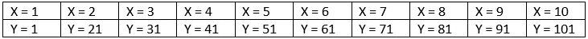
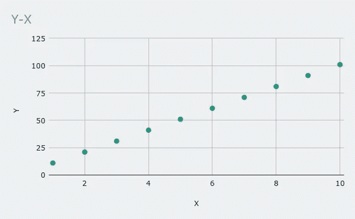
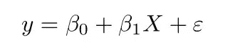
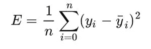
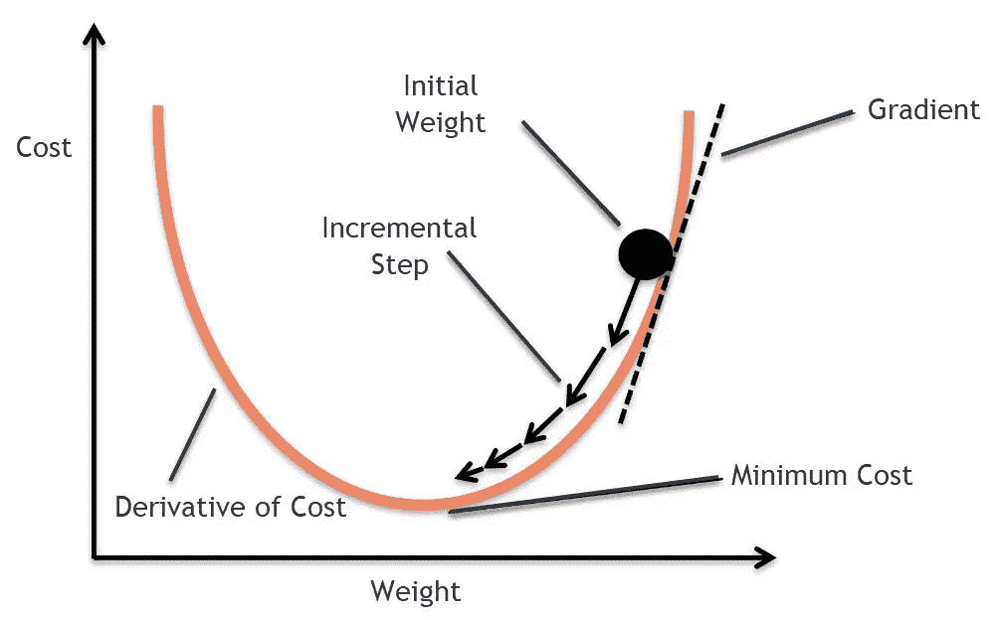
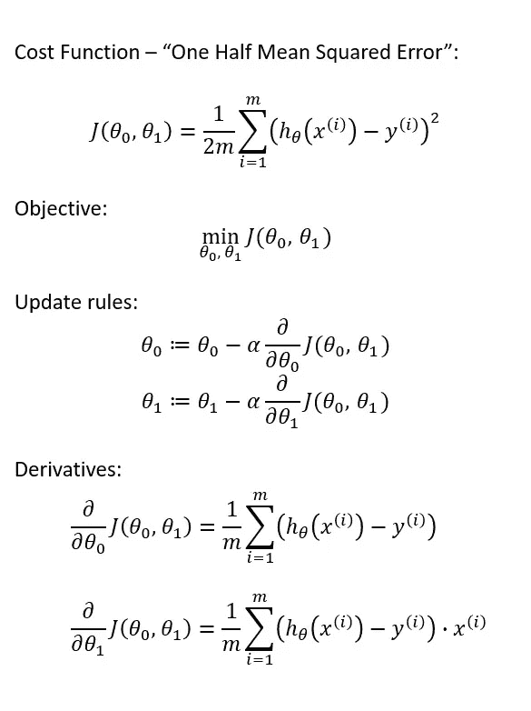
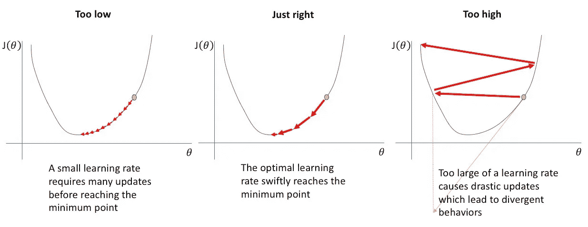

# 带划痕的简单线性回归

> 原文：<https://medium.com/analytics-vidhya/simple-linear-regression-with-scratch-a3cb352437ce?source=collection_archive---------23----------------------->

你好。欢迎使用 Scratch 学习简单线性回归，这是我们的 Scratch 机器学习系列的第一篇文章。如果我们需要检查我们将使用的数据

这些是我们的数据。

# 简单线性回归

我们代码中的公式就是上面的公式。解释一下公式，如果我们要估计的“y”的值是 B0“偏差”，则是固定的系数值称为其值。B1 是伴随我们输入的系数值。在编写算法时，我们的目标是找到我们能找到的最佳 B0 和 B1 值。

“为那些不想看代码就想写的人准备的待办事项列表”

1.  上传您的数据
2.  将您的数据分为训练和测试两部分
3.  我们丢弃 B0 和 B1 的随机值。(我发现值 0 适合这个代码。)
4.  我们运行我们的训练功能。
5.  我们用训练函数中的梯度下降算法找到 B0 和 B1 的最佳值。
6.  我们使用找到的 B0 和 B1 值来估计新值。

# 我们的功能是什么？

损失函数是一种测量单位，用于测量模型预测值与实际值的接近程度或距离。在这段代码中，我们使用了均方误差(MSE)函数来最小化它。

均方误差

这里是我们估计的值，yi 是我们在训练数据中估计的值。

# 什么是梯度下降？

梯度下降是一种优化算法，它将最小化我们的损失函数。为了更好地理解梯度下降，我强烈建议您听一下我们的 Uzak cetin 博士讲解的梯度下降系列。

> [*https://www.youtube.com/watch?v=rDaAXsJwnQI*](https://www.youtube.com/watch?v=rDaAXsJwnQI)
> 
> *【https://www.youtube.com/watch?v=pNJKMO4qPZQ】T5[T6](https://www.youtube.com/watch?v=pNJKMO4qPZQ)*
> 
> *[*https://www.youtube.com/watch?v=wLpA_9LSM6w*](https://www.youtube.com/watch?v=wLpA_9LSM6w)*

**

*梯度下降算法要做的事情*

1.  *确定起始重量*
2.  *对每个参数的成本函数求导*
3.  *更新重量和偏差值*

**

*在更新规则时，我认为“a”值引起了您的注意。那么什么是“a”值呢？这个系数叫做学习率，是在更新规则的同时衡量作业敏感程度的系数。那么应该如何选择系数“a”呢？*

**

*正如你在上面看到的，学习率系数在我们的函数中有着重要的作用。如果我们选择过高，它就不能像在“过高”部分那样找到损失函数的最小值。如果我们选择得太低，我们的函数将不得不重复大量的次数。常用的值是[0.01，0.001，0.02，0.03，0.005]，但是使用不同的值可能适合您的函数。*

*让我们继续我们的代码。*

1.  *让我们先导入我们的库*

*2.上传您的数据*

*解释我们的代码；我们的 x 变量将是我们将训练的数据的输入部分，而我们的 y 变量是训练时损失函数中使用的输出值。我们的 X1 值是预测数据的输入部分，而 X2 是我们用来计算模型的 MSE 分数的数据。定义数据后，我们可以将下面给出的“类”结构分配给“模型”变量，并从“模型”变量执行操作。*

*3.让我们编码我们的类结构*

*我们的“类”结构由 3 个不同的部分组成。第一个是我们的 __init__ 函数，我们将预定义它。我们首先定义在 __init__ 部分通常会用到的变量。在第二部分中，我们尽可能多次地旋转循环。在我们的下一个循环中，我们将决定梯度下降应用的转向量。在这个循环中，我们首先导出每个变量的损失函数。当我们将我们的学习率系数乘以我们的导数变量并从当前权重和偏差值中减去它时，我们更新了我们的权重和偏差值。下一步，我们将尝试使用第三步中通过梯度下降确定的最佳权重和偏差值来预测新的输入。*

*对于代码:[https://github.com/capogluuu/ml_scratch](https://github.com/capogluuu/ml_scratch)*