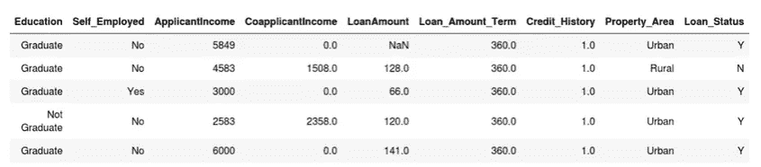
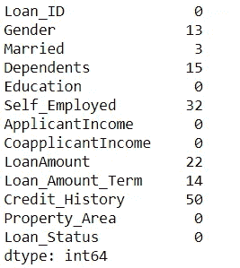
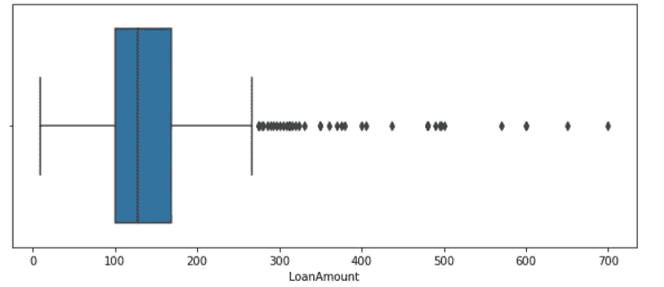
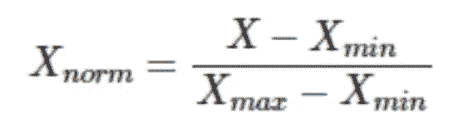
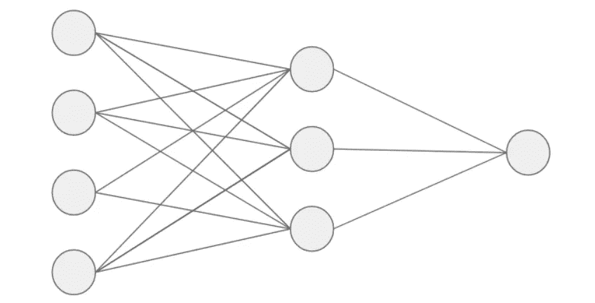
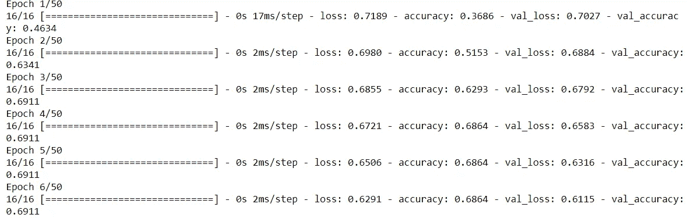
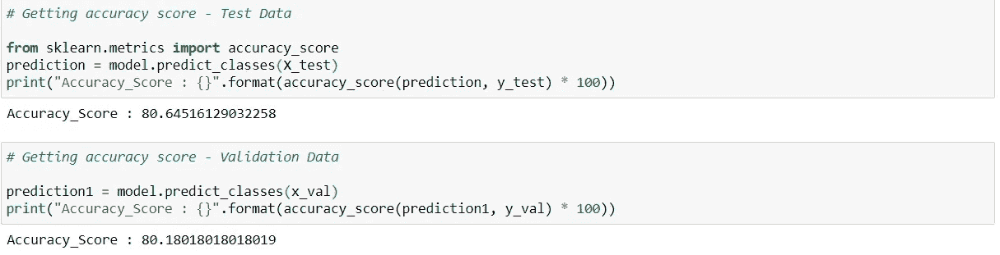
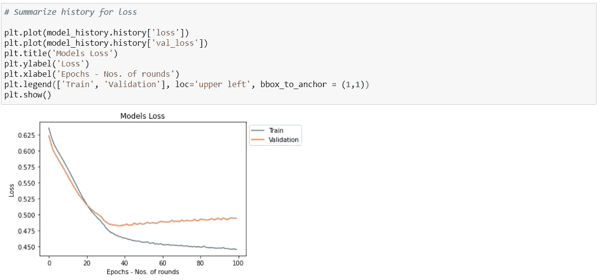
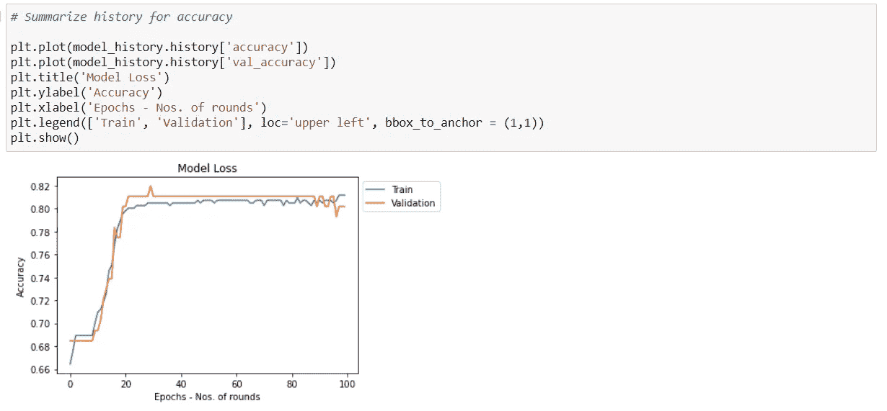

# 使用神经网络的简单贷款预测项目。

> 原文：<https://medium.com/analytics-vidhya/simple-loan-prediction-project-using-neural-network-bdac5e945fcc?source=collection_archive---------3----------------------->


来源:互联网

在这个项目中，我们将解决贷款预测问题，我们必须**根据客户详细信息预测贷款是否应该被批准**。下面是数据的一瞥。



来源:Vidhya 分析

我们有各种自变量，从 ***教育、收入、贷款额、信用历史*** 等。和一个目标变量 ***贷款状态*** 。因为在我们的目标变量中有两个值,“Y”代表贷款批准,“N”代表贷款未批准。

让我们深入研究这个问题，一步一步地解决它。

> **步骤 1:数据预处理步骤:**由于模型沉迷于数字，我们将在这个项目中关注的一些数据预处理步骤如下。

1.  *填充空值/缺失值*。
2.  *将分类值转换成数字*。
3.  *将所有变量置于(0 到 1)之间的相同范围内，这减少了计算时间，有助于神经网络更快地收敛*。

**缺少值。**

1.  分类值。

```
# Checking Null Values.data.isnull().sum()
```



来源:Vidhya 分析

我们的自变量列中存在多个空值。我们会一个一个处理。

```
# Handling Categorical Null Values -> Gender
data['Gender'].fillna(data['Gender'].mode()[0],
                      inplace = True)-> Married
data['Married'].fillna(data['Married'].mode()[0],
                       inplace = True)-> Dependent
data['Dependent'].fillna(data['Dependent'].mode()[0],
                         inplace = True)-> Education
data['Education'].fillna(data['Education'].mode()[0],
                         inplace = True)-> Self_Employed
data['Self_Employed'].fillna(data['Self_Employed'].mode()[0],
                             inplace = True)
```

2 .连续值。

```
plt.figure(figsize = (10,4))sns.boxplot(x = 'LoanAmount',
            data = data,
            orient = 'horizontal')plt.show()
```



由于我们在 LoanAmount 列中有许多异常值，我们将使用中位数估算缺失值，因为中位数对异常值没有任何影响。

```
data['LoanAmount'].fillna(data['LoanAmount'].median(),
                          inplace = True)
```

**处理分类值。**

```
# Converting the categories into numbers using map function.data['Gender'] = data['Gender'].map({'Male': 0, 'Female': 1})data['Married'] = data['Married'].map({'No': 0, 'Yes': 1})data['Dependents'] = data['Dependents'].map({'0': 0, '1': 1, '2': 2, '3+': 3})data['Education'] = data['Education'].map({'Graduate': 1, 'Not Graduate': 0})data['Self_Employed'] = data['Self_Employed'].map({'No': 0, 'Yes': 1})data['Property_Area'] = data['Property_Area'].map({'Rural': 0, 'Semiurban': 1, 'Urban': 2})data['Loan_Status'] = data['Loan_Status'].map({'N': 0, 'Y': 1})
```

**缩放数值-最小最大缩放器。**

我们将使用最小-最大缩放器，它将所有列的值缩小到 0 到 1 之间。最小-最大缩放器的公式如下所示。



来源:Vidhya 分析

```
for i in data.columns[1:]:
    data[i] = (data[i] - data[i].min()) / (data[i].max() - data[i].min())
```

> **第二步:构建神经网络的步骤。这里我们将讨论建立一个神经网络所需的步骤。**

1.  *加载数据*。
2.  *创建训练和验证数据*:我们将根据训练数据进行训练，根据验证数据进行验证。
3.  *定义我们模型的架构*:我们将定义输入神经元的数量，隐藏层和输出层神经元的数量。
4.  *编译模型(损失函数/优化器)*:这里我们将定义我们的成本函数，它将在反向传播期间使用。
5.  *训练模型:*我们将训练我们的模型，并定义纪元的数量。
6.  *评估模型在训练和验证数据上的表现*。

**训练&验证:**在这里，我们将使用我们的训练数据。在 100%的训练数据中，我们将保留 10%用于测试数据，并在此基础上评估模型的准确性。模型完全看不到这些测试数据。在剩余的 90%的训练数据中，我们将使用 20%来验证我们的模型，并对 70%的数据进行训练。

```
# Testing Data - 10%
from sklearn.model_selection import train_test_split
X_train, X_test, y_train, y_test = train_test_split(X, y, test_size = 0.1, stratify=data['Loan_Status'], random_state = 42)# Train & Valid Data - 90%
x_train, x_val, y_train, y_val = train_test_split(X_train, y_train, test_size = 0.2, stratify = y_train, random_state = 42)
```

*   *分层*将确保训练和测试/验证集中类的分布是相似的。
*   *随机状态*重新生成相同的训练和验证集。
*   *测试大小* 0.2 将在验证中保留 20%的数据，在训练集中保留 80%的数据。

**定义模型架构:**在定义模型架构时，我建议在使用优化器和激活函数之前，请让我们从以下关于优化器和各种激活函数的博客中了解一下。

[](/analytics-vidhya/optimizer-loss-functions-in-neural-network-2520c244cc22) [## 神经网络中的优化器和损失函数

### 深度学习中最常用的各种优化器和损失函数。

medium.com](/analytics-vidhya/optimizer-loss-functions-in-neural-network-2520c244cc22) [](/analytics-vidhya/activation-functions-in-neural-network-55d1afb5397a) [## 神经网络中的激活函数

### 在这个博客中，我们将了解深度学习中最广泛使用的激活函数。

medium.com](/analytics-vidhya/activation-functions-in-neural-network-55d1afb5397a) 

来源:Vidhya 分析

这里，我们将定义输入、隐藏和输出神经元的数量。

```
# Creating a skeleton of model.
from keras.models import Sequential# Defining layers
from keras.layers import Input, Dense
```

定义输入、隐藏、输出神经元和架构。现在，我选择了 ***relu*** 作为隐藏层的激活功能。还有，既然是二元分类问题，我在最后一层用了 ***sigmoid*** 激活函数。没有硬性规定我们必须只使用这些激活功能。我们也可以关闭其他激活功能。

```
# Input neurons
input_neurons = X_train.shape[1]# Output neurons (Since it is binary classification)
output_neurons = 1# Defining hidden layers & neurons in each layersnumber_of_hidden_layers = 2
neuron_hidden_layer_1         = 10
neuron_hidden_layer_2         = 5# Defining the architecture of the model
model = Sequential()
model.add(InputLayer(input_shape=(input_neurons)))
model.add(Dense(units=neuron_hidden_layer_1, activation='relu'))
model.add(Dense(units=neuron_hidden_layer_2, activation='relu'))
model.add(Dense(units=output_neurons, activation='sigmoid'))
```

**编译模型(损失函数/优化器):**在本部分中，我们定义了损失函数和优化器，这有助于验证我们的数据和反向传播。

```
model.compile(loss='binary_crossentropy',optimizer='Adam',metrics=['accuracy'])
```

**训练模型:**在这一部分，我们将通过传递自变量和因变量以及验证数据和时期数来训练我们的模型，时期数指定了我们的模型通过训练集的次数。

对于每个历元，训练集和验证集都会产生一个损失，而且我们会获得训练集和验证集的准确性，因为我们已经在编译阶段定义了它们，并且正在捕获它们

```
model_history = model.fit(X_train, y_train, validation_data = (X_test, y_test), epochs = 50)
```



**根据测试数据评估模型:**这里，我们将预测数据的类别，并使用度量作为*准确性*来评估模型性能。

```
# Getting predictions for the test set
prediction = model.predict_classes(X_test)# Getting accuracy score
from sklearn.metrics import accuracy_score
print("Accuracy_Score : {}".format(accuracy_score(prediction, y_test) * 100))
```

在对测试和验证数据进行分类预测后，我们得到了 80%的下降准确率。



**可视化结果(损失&精度):**在这里，我们将看到损失函数和精度在多个时期内的变化。

1.  损失函数



从上图中我们可以看出，随着历元数的增加，损失会减少。经过一定数量的时期后，验证损失似乎没有改善。

2.准确(性)



正如我们所看到的，5 到 10 个时期的精度变化不大。之后，训练集和验证集的准确性开始提高，因此我们可以说模型开始学习。从公元 20 世纪到公元 100 世纪，这个模型有了轻微的改进，或者我们可以说它停止了学习。

这就是我们如何在数据集上建立神经网络模型。我希望你喜欢它。

C结束语

因此，在这篇博客中，我们已经学会了如何使用 ANN 解决一个简单的神经网络贷款预测问题。我们可以通过做各种超参数调整和观察随机数据的准确性来进一步改进模型的性能。

请在 LinkedIn 上与我联系:【https://www.linkedin.com/in/gaurav-rajpal/ 

***敬请关注演示项目的进一步更新，我们将在卷积神经网络中处理图像数据集，并查看迁移学习。***

如果你喜欢，请给 50 个掌声。

问候，

高拉夫·拉杰帕尔·(gauravrajpal1994@gmail.com)