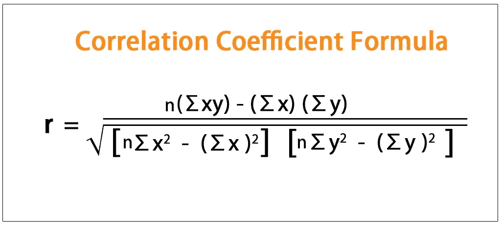
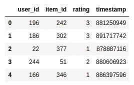
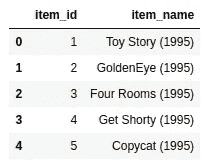
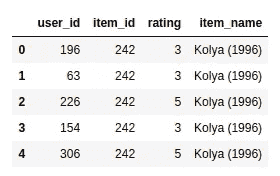
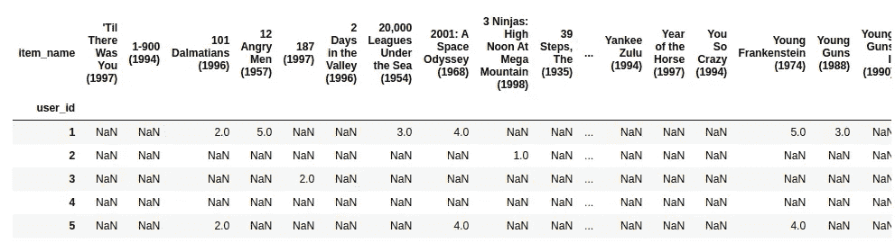
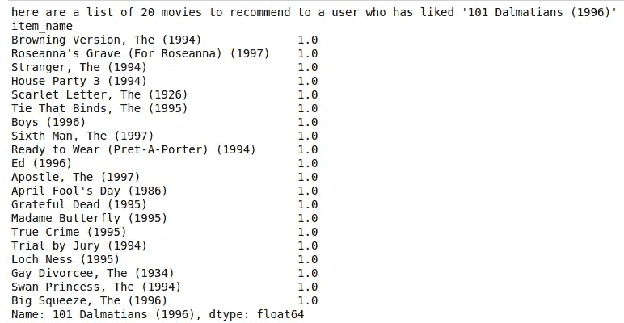

# 基于 Python 的简单相关系数电影推荐系统

> 原文：<https://medium.com/analytics-vidhya/simple-movie-recommender-system-with-correlation-coefficient-with-python-e6cb31dae01e?source=collection_archive---------4----------------------->


# 介绍

**推荐系统**是**系统**，它被设计成基于许多不同的因素向用户推荐东西

皮尔逊相关系数是一种非常简单而有效的方法，可以发现一个变量如何相对于另一个变量线性变化。我们可以利用这一点，用这个概念建立一个推荐系统

# 相关系数的工作



如果两个变量的相关系数接近 1，则这些变量彼此成正比。

如果更接近-1，这些变量就成反比。

如果相关系数的大小低于或接近于 0，变量之间可能没有很强的相关性。

# Python 代码:

1.  **导入必要的库。**

```
#importing the libraries
import numpy as np
import pandas as pd
```

**2。数据集(MovieLens 数据集)**
为了实现推荐系统，我使用了 movielens 数据集，它包含了 100k 部电影的评分

```
#data import
df1 = pd.read_csv('./ml-100k/u.data',sep='\t',names=['user_id','item_id','rating','timestamp'])df2 = pd.read_csv("./ml-100k/u.item", sep="|", encoding="iso-8859-1",names=["item_id","item_name","date","unknown1"
"website","rat1","rat2","rat3","rat4","rat5","rat6","rat7","rat8","rat9","rat10","rat11","rat12","rat13",
"rat14","rat15","rat16","rat17","rat18","rat19","rat20"])print(df1.head())
```

**输出:**



数据帧 1 包含用户 id、电影 id 和相应的分级

```
df2 = df2.iloc[:,0:2]
df2.head()
```

**输出:**



dataframe2 包含电影名称及其对应的 item_id

**3。合并数据帧**

```
data = df1.merge(df2,on="item_id")
data.drop(['timestamp'],inplace=True,axis=1)
data.head()
```



将数据帧 1 合并到数据帧 2 以获得整个数据集

**4。数据透视表**

```
data_table = pd.pivot_table(data,values='rating',columns='item_name',index='user_id')
data_table.head()
```

**输出:**



我们利用 pandas 的数据透视表创建一个表，每个电影代表一列，每个用户代表一行

**5。开始推荐**

对于这个基本的推荐系统来说就是这样，为了进行预测，我们将从用户那里获得一个电影名称，并给出用户可能喜欢的电影列表。这就是相关系数发挥作用的地方

**让我们假设用户喜欢电影《101 只斑点狗》(1996)。我们必须给出一个我们认为用户可能喜欢的电影列表。**

```
print("here are a list of 20 movies to recommend to a user who has liked '101 Dalmatians (1996)'")print(data_table.corr()['101 Dalmatians (1996)'].sort_values(ascending=False).iloc[:20])
```

**输出:**



这就是我们如何使用皮尔逊相关系数，根据用户喜欢的电影向他们推荐电影

# 结论

我们这里用透视表和相关系数来推荐电影。如果用户喜欢一部特定的电影，我们获取该电影的列，并找到该列与所有其他电影列的相关性，从而获得与所选电影高度相关的电影。这是因为，行代表用户，某个特定的用户可能喜欢相似的电影。因此，我们可以使用相关系数向用户推荐电影。

该代码文件将在 github 上提供以供参考:[https://github . com/ashwinhprasad/re commender system-correlation coefficient](https://github.com/ashwinhprasad/RecommenderSystem-CorrelationCoefficient)

# 谢谢你