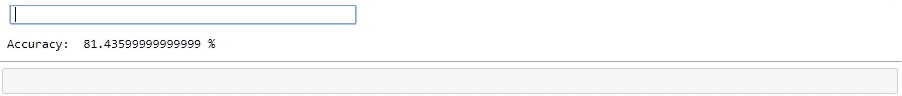
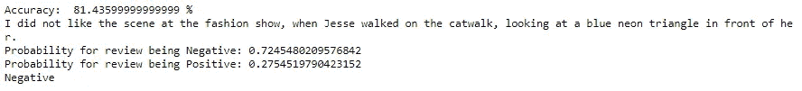

# 简单的 3 步电影评论分类器！

> 原文：<https://medium.com/analytics-vidhya/simple-movie-review-classifier-in-3-steps-2a97c8869dbc?source=collection_archive---------32----------------------->

## 机器学习|自然语言处理

## 只用几行代码就构建了一个+ve/-ve 电影评论分类器


照片由 [Unsplash](https://unsplash.com/?utm_source=medium&utm_medium=referral) 上的[乔治亚·瓦格姆](https://unsplash.com/@georgiavagim?utm_source=medium&utm_medium=referral)拍摄

虽然有许多方法可以用来建立一个分类器来分类一个电影评论是正面还是负面，但我们可以在单词袋和朴素贝叶斯的帮助下，通过 3 个简单的步骤来建立一个简单的分类器！让我们直接进入编码部分。我们将使用 IMDB 电影评论数据集。

# 1.导入和预处理！

我们将使用 sklearn 的朴素贝叶斯分类器和单词包中的计数矢量器来创建特征字典和矢量。

```
import re
from sklearn.naive_bayes import MultinomialNB
from sklearn.feature_extraction.text import CountVectorizer
```

现在是我们预处理语料库的时候了。我们需要清理我们的文本，以便在创建时，功能字典中没有无效的标记。

```
for line in open('full_train.txt', encoding="utf8"):
    reviews_train.append(line.strip().lower())
for i in range(len(reviews_train)):
    reviews_train[i] = re.sub(r'<br.?.?>','',reviews_train[i])
reviews_test = []
for line in open('full_test.txt', encoding="utf8"):
    reviews_test.append(line.strip().lower())
for i in range(len(reviews_test)):
    reviews_test[i] = re.sub(r'<br.?.?>','',reviews_test[i])
```

# 2.矢量化和标注

在我们的数据集中，对于训练和测试数据，前 12500 个是正面的，其他 12500 个是负面的评论。我们将在 *CountVectorizer 的帮助下把我们的数据(训练数据和测试数据)转换成向量。*点击 *可以了解更多关于*计数矢量器* [。它创建了特征字典，在它的帮助下，我们可以将我们的评论转换成向量。](https://scikit-learn.org/stable/modules/generated/sklearn.feature_extraction.text.CountVectorizer.html)*

```
training_labels = [1 if i < 12500 else 0 for i in range(25000)]
test_labels = [1 if i < 12500 else 0 for i in range(25000)]
# Defining bow_vectorizer:
bow_vectorizer = CountVectorizer()
# Defining training_vectors:
training_vectors = bow_vectorizer.fit_transform(reviews_train)
# Defining test_vectors:
test_vectors = bow_vectorizer.transform(reviews_test)
```

*。fit_transform()* 方法用于根据给定的参数创建特征字典，并将输入转换为向量。同理，*。transform()* 方法仅将输入转换为基于特征字典的矢量。

# 3.预测！

是时候训练和预测我们的朴素贝叶斯模型了。我们将以向量的形式连同标签一起提供培训评论。训练之后，我们需要将输入转换成向量，然后再输入到模型中进行预测。

```
classifier = MultinomialNB()def pos_or_not(label):
   return "Positive" if label else "Negative"classifier.fit(training_vectors, training_labels)
accuracy = classifier.score(test_vectors, test_labels)
print("Accuracy: ", accuracy*100, "%")sentence = input().strip().lower()
input_vector = bow_vectorizer.transform([sentence])print("Probability for review being Negative:",classifier.predict_proba(input_vector)[0][0])
print("Probability for review being Positive:",classifier.predict_proba(input_vector)[0][1])
predict = classifier.predict(input_vector)
print(pos_or_not(predict))
```

让我们通过预测评论来测试我们的模型:“我喜欢时装秀上的场景，杰西走在 t 台上，看着她面前的蓝色霓虹三角形。”下面是预测标签和概率的结果。



我们模型的输出

如果我们像这样改变评论:“我不喜欢时装秀上的场景，当杰西走在 t 台上，看着她面前的蓝色霓虹灯三角形。”我们将获得以下输出。



这是用朴素贝叶斯分类器制作的最简单的电影评论分类器。上面的代码和数据集可以在[这里](https://github.com/jackfrost1411/movie-review-classifier)找到。你可以在 LinkedIn 上的这里找到我[。编码快乐！](https://www.linkedin.com/in/dhruvil-shah-363a98173)