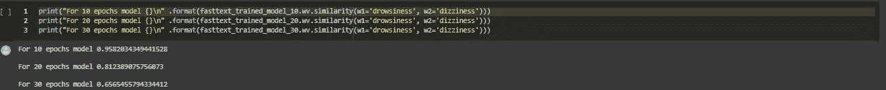

# 健康科学的简单自然语言处理项目

> 原文：<https://medium.com/analytics-vidhya/simple-natural-language-processing-projects-for-health-sciences-part-2-how-to-train-fasttext-word-d46a391e37b0?source=collection_archive---------13----------------------->

## 第 2 部分:如何在标准治疗指南上训练 fastText 单词嵌入)

本教程是针对从事自然语言处理的健康科学领域人士的系列教程中的第二篇。第 1 部分[此处](/@oyewusiwuraola/simple-natural-language-processing-projects-for-health-sciences-how-to-extract-and-summarize-53ea2e7b3f1d)。
这些原则是一般原则，任何人都可以遵循这一思路，数据集只是健康科学领域特有的。

在本教程中，我们将:

尼日利亚 2008 年[标准治疗指南](https://apps.who.int/medicinedocs/documents/s17035e/s17035e.pdf)

查看在 3 个不同时期(10，20，30)对该特定文本训练快速文本嵌入模型的效果，默认值为 5

查找基于训练模型生成的语义相似的单词。

使用训练好的模型挑选出一系列不匹配的单词。

计算两个单词之间的相似度。

使用 PCA 对一些语义相似的单词进行降维后创建可视化(大部分代码片段来自 Usman Malik 的文章

合作笔记本[这里](https://github.com/WuraolaOyewusi/Simple-Natural-Language-Processing-Projects-for-Health-Sciences/blob/master/fastText_for_Standard_treatment_guideline.ipynb)。单元格输出未被清除，因此可以跟踪每个代码片段的输出。

什么是标准治疗指南？

标准治疗指南(STGs)列出了特定卫生系统中人们所经历的常见健康问题的首选药物和非药物治疗方法。因此，它们代表了促进治疗有效和经济有效的处方的一种方法。
*卫生管理科学与世界卫生组织。2007.药物和治疗委员会培训课程*

什么是 fastText？

**fastText** 是由[脸书](https://en.wikipedia.org/wiki/Facebook)的 AI 研究(FAIR)实验室[【4】](https://en.wikipedia.org/wiki/FastText#cite_note-4)[【5】](https://en.wikipedia.org/wiki/FastText#cite_note-5)[【6】](https://en.wikipedia.org/wiki/FastText#cite_note-6)打造的用于学习[单词嵌入](https://en.wikipedia.org/wiki/Word_embedding)和文本分类的库。该模型允许创建[非监督学习](https://en.wikipedia.org/wiki/Unsupervised_learning)或[监督学习](https://en.wikipedia.org/wiki/Supervised_learning)算法，用于获得单词的矢量表示。脸书提供 294 种语言的预训练模型。[【7】](https://en.wikipedia.org/wiki/FastText#cite_note-7)fast text 使用[神经网络](https://en.wikipedia.org/wiki/Artificial_neural_network)进行单词嵌入。*2019 年 12 月，维基百科*

文本在网上下载，索引和附录被删除，从 pdf 到文本的提取是使用 Python Tika 完成的。文本从列表转换为字符串，小写字母和标点符号被删除。
停用词没有被删除，词也没有被词条化(我还没有看到一个好的、容易使用的医学词词条化工具，我还没有准备好让像`gastitis`这样的词作为`gastiti`出现)

使用原始 fastText 库训练 3 个模型，唯一不同的因素是时期(10，20，30)，每个模型训练所用的时间记录在代码片段中。模型被保存为。bin 文件

为了便于使用，模型是使用 [gensim](https://radimrehurek.com/gensim/models/fasttext.html) 的 FastText 实现加载的。

这是词汇在训练后的样子。很高兴我不用进行标记化，fastText 处理了这个问题

检查与“头晕”相似的前 5 个词，这是一种常见的医学症状和副作用。所以我们希望它能被预测为类似于其他症状和词汇，比如困倦，昏厥可能是头痛

`print(“For 10 epochs model{}\n” .format(fasttext_trained_model_10.wv.most_similar([“dizziness”], topn=5)))`

`print(“For 20 epochs model{}\n” .format(fasttext_trained_model_20.wv.most_similar([“dizziness”], topn=5)))`

`print(“For 30 epochs model{}\n” .format(fasttext_trained_model_30.wv.most_similar([“dizziness”], topn=5)))`

3 个模型很好地预测了“困倦”、“晕厥”。
10 个时期的模型在其预测中具有最高的可信度，但是 20 个时期的模型预测了更多的相关词，例如“晕厥”、“昏睡”，
30 个时期的模型也具有良好的预测，但是通过训练多达 30 个时期，性能没有改善。

`For 10 epochs model[(‘drowsiness’, 0.9582035541534424), (‘headache’, 0.936184287071228), (‘dryness’, 0.920276403427124), (‘headaches’, 0.9076910018920898), (‘nausea’, 0.8979116678237915)]`

`For 20 epochs model[(‘drowsiness’, 0.8123891353607178), (‘shortness’, 0.7257866859436035), (‘syncope’, 0.7250152826309204), (‘dryness’, 0.6867588758468628), (‘lethargy’, 0.661155104637146)]`

`For 30 epochs model[(‘drowsiness’, 0.6565455794334412), (‘shortness’, 0.64012211561203), (‘dryness’, 0.5671372413635254), (‘syncope’, 0.5500494241714478), (‘weakness’, 0.5497733354568481)]``

对于疼痛这个词，最相似的词是“疼痛”，“无痛”如预期的那样出现，如果这些词被词条化，它们可能只有词根“疼痛”。
20 个时代模型捕捉到了像“痛苦”、“抱怨”这样的词。酷毙了。30 个时代的模型没有给出一个非凡的结果。

对于“环丙沙星”,模型足够聪明地给出了其他抗生素作为类似的词，20 个纪元有一些细节，如将“环丙沙星”与“每 12”的给药方案之一相关联。在预处理该文本时，由于剂量、药物强度在临床文本中非常重要，因此保留了数字。

在这个例子中，我把“淋病”拼错成了“淋病”。
所有的模型都建议了正确的拼写作为选项，30 个时代的模型甚至建议了物种名称“奈瑟氏球菌”

前 5 个语义相似词的其他有趣例子。

查找不匹配的单词。我试过[“扑热息痛”、“头痛”、“腹泻”、“头晕”]，扑热息痛是唯一的药物，其他都是症状。
3 个模型预测扑热息痛是例外。

这张单子上的所有药物都是抗高血压药。[“氢氯噻嗪”、“呋塞米”、“氨氯地平”]，但前两种是利尿剂，第三种是钙通道阻滞剂。这三个模型都预测第三个是最奇怪的。

“困倦”和“头晕”之间的相似性距离被 10 代模型预测为 0.95，我同意，它们在意义和用途上是接近的。

嗜睡和氨氯地平之间的相似性距离通过 10 个时期模型为大约 0.53。嗜睡是氨氯地平的一个常见副作用。

为了可视化，生成 10 个词的顶部相似词。

使用 sklearn 实现中的主成分分析，将模型训练中使用的 300 个向量降维为两个主成分

单词降维后的图像是什么样子，语义相似的单词彼此接近。

使用主成分分析进行降维后的可视化

我希望你度过了一段美好的时光。和所有机器学习任务一样。更高质量的数据意味着更好的性能。用于此的文本数据是高质量的，因为它是由专业人员整理的标准医疗指南。为了提高模型性能，可以使用更多的数据，如药典、药物处方集、emdex 等其他医学参考资料。其他参数如学习速度、最小字数都可以调整。

对于这个任务，你会同意我的观点，有 10 个时期的模型做得很好，所以节省你的计算。

节日快乐

## 参考资料:

*   [https://www . who . int/medicines/technical _ briefing/TBS/10-PG _ Standard-Treatment-Guidelines _ final-08 . pdf](https://www.who.int/medicines/technical_briefing/tbs/10-PG_Standard-Treatment-Guidelines_final-08.pdf)
*   [https://stack abuse . com/python-for-NLP-working-with-Facebook-fast text-library/](https://stackabuse.com/python-for-nlp-working-with-facebook-fasttext-library/)
*   [https://apps . who . int/medicine docs/docs/s 17035 e/s 17035 e . pdf](https://apps.who.int/medicinedocs/documents/s17035e/s17035e.pdf)