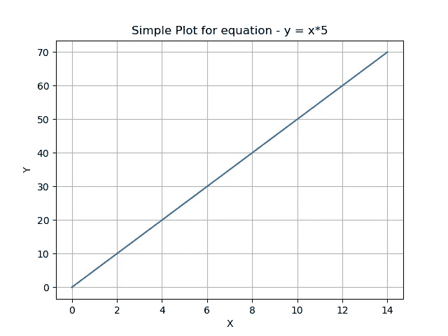
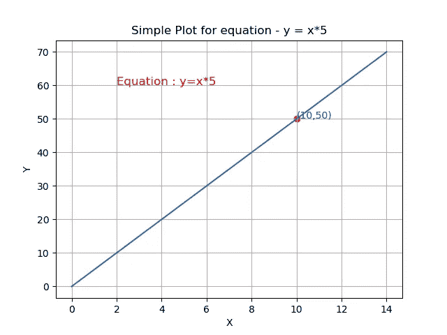

# 初学者使用 Tensorflow 的简单神经网络

> 原文：<https://medium.com/analytics-vidhya/simple-neural-network-for-beginners-using-tensorflow-9dbcd7ba9c18?source=collection_archive---------12----------------------->

资料来源:Tensorflow.org

**张量流:**

Tensorflow 是一个强大的 python 包，易于在各种应用程序上开发和部署。最先进的研究人员使用 Tensorflow 进行研究工作。Tensorflow 为不同流的开发者提供了一个美好的生态系统。比如，机器学习开发者，Web 开发者，App 开发者。这个包已经在很多语言中使用，比如 Python 开发、JavaScript 开发、Swift 开发和 IOS 开发、IOT 开发。

**如何开始使用 Tensorflow？**

**安装**

目前 Tensorflow 支持，64 位 OS，Win 7 或更高版本，Ubuntu 16.04 或更高版本，Mac 10.12.6 或更高版本(不支持 GPU)。支持张量流 Python 版本有，Python 版本 3.5 到 3.7

在 python 中使用 pip python 包管理器安装，

**获得当前稳定安装—** *pip 安装 tensorflow*

**获取不稳定的 tensorflow 最新版本—** *pip 每夜安装 TF*

如果我们把它画出来，这就是方程的样子

**简单神经网络算法:**

所以，方程就是这么简单， **y = x*5** 。我们将借助 Keras 序列模型训练 tensorflow 模型。

1)从 Tensorflow、Pandas 和 Numpy 导入包。**(注意:**忽略未来警告是可选的)。

2)定义具有单层和单个神经元或感知器的模型，它是密集层，并且参数单元表示在该密集层中有多少个感知器。输入形状定义输入数据的维度。

3)用优化器编译模型为 SGD —随机梯度下降，损失函数为均方误差。

4)现在我们的模型准备好了，让我们把训练数据交给模型。在这个例子中，我使用了 CSV 文件中的数据。

5)用 500 个时期来拟合模型，在训练之后，模型能够预测新的 X 值的 Y 值。

数据包含两个值 X 和 y。

此神经网络的数据集

程序的代码，

简单神经网络程序

**结果**

我们知道结果会是 50，但是在训练之后，我们的模型能够预测更接近 50(49.81)。因此，我们为一个简单的方程创建了我们的神经网络。

如果我们画出结果。

**tensor flow 包的优势:**

1.  易于开发和部署。
2.  支持多种语言的集成。
3.  更好的图形计算性能。
4.  易于调试并支持可扩展性。

感谢阅读帖子，希望你喜欢。