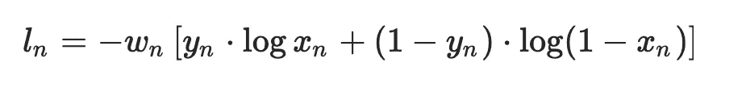
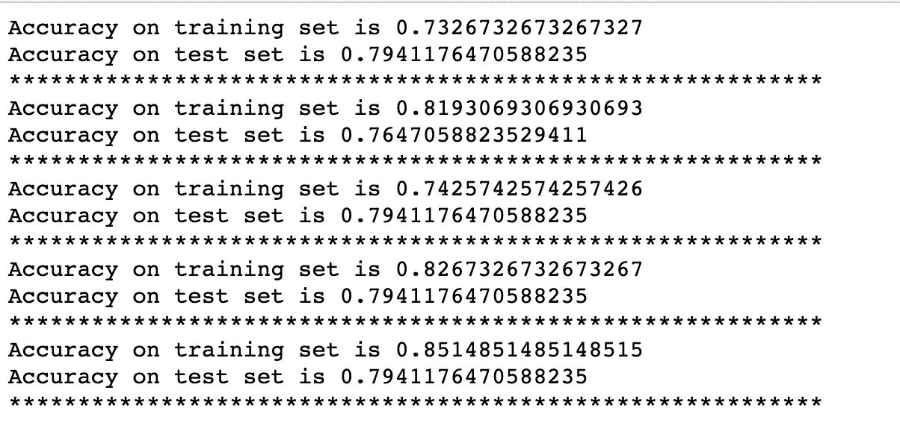

# 用于定制数据集的二进制分类的具有 BCELoss 的简单神经网络

> 原文：<https://medium.com/analytics-vidhya/simple-neural-network-with-bceloss-for-binary-classification-for-a-custom-dataset-8d5c69ffffee?source=collection_archive---------1----------------------->



在我们之前的博客[用 Pytorch](/@bhuvana.kundumani/writing-a-custom-dataloader-for-a-simple-neural-network-in-pytorch-a310bea680af) 为自定义数据集(神经网络)编写数据加载器中，我们看到了如何为数据集编写自定义数据加载器。我们将 [Boston 数据集](https://github.com/bhuvanakundumani/pytorch_Dataloader/tree/master/data)转化为一个分类问题，生成数据批次(数据加载器),准备好输入 pytorch 神经网络架构。在这篇博客中，我们将关注如何在 Pytorch 中使用 BCELoss 来构建一个简单的神经网络。

预处理后的数据集有 12 个特征和 1 个目标变量。我们将有一个具有 128 个神经元的 1 个隐藏层的神经网络。

```
# Simple Neural network input_size = 12
hidden_size = 128
num_classes = 1 
num_epochs = 5
learning_rate = 0.001
BATCH_SIZE_1 = 101 #train_loader as it has 404 observations
BATCH_SIZE_2 = 51 #test_loader as it has 102 observations
```

我们将使用 BCELoss 作为损失函数。BCELoss 创建了一个衡量目标和输出之间的二元交叉熵的标准。你可以在这里阅读更多关于 BCELoss [的内容](https://pytorch.org/docs/stable/nn.html#bceloss)。如果我们使用 BCELoss 函数，我们需要在网络中有一个 sigmoid 层。sigmoid 函数是一种激活函数，更具体地定义为挤压函数。挤压功能将输出限制在 0 和 1 之间的范围内。

```
# Neural Network should have a sigmoid activation function if you are using BCELoss()class LinearModel(nn.Module):
    def __init__(self, input_size, hidden_size, num_classes):
        super(LinearModel, self).__init__()
        self.fc1 = nn.Linear(input_size, hidden_size)
        self.fc2 = nn.Linear(hidden_size, num_classes)
        self.relu = nn.ReLU()

    def get_weights(self):
        return self.weight

    def forward(self,x):
        out = self.fc1(x)
        out = self.relu(out)
        out = F.sigmoid(self.fc2(out)) #sigmoid as we use BCELoss
        return out
```

现在我们已经有了我们的神经网络架构，让我们看看我们的训练和测试功能。

**列车功能**

训练函数具有输入参数——模型、设备、训练加载器和优化器。

```
#TRAINING THE NETWORKdef train(model, device, train_loader, optimizer):
    model.train()
    y_true = []
    y_pred = [] for i in train_loader:

        #LOADING THE DATA IN A BATCH
        data, target = i

        #MOVING THE TENSORS TO THE CONFIGURED DEVICE
        data, target = data.to(device), target.to(device)

        #FORWARD PASS
        output = model(data.float())
        loss = criterion(output, target.unsqueeze(1)) 

        #BACKWARD AND OPTIMIZE
        optimizer.zero_grad()
        loss.backward()
        optimizer.step()

        # PREDICTIONS 
        pred = np.round(output.detach())
        target = np.round(target.detach()             
        y_pred.extend(pred.tolist())
        y_true.extend(target.tolist())

    print("Accuracy on training set is" ,         
    accuracy_score(y_true,y_pred))
```

model.train()告诉程序模型处于训练模式。当我们的网络中有漏失层时，这就变得很重要。默认情况下，PyTorch 神经网络模型处于 train()模式。只要网络中没有掉线层(或者批量归一化)，就不需要担心 train()模式对 eval()模式。但是，我通常在我的训练功能中默认使用它。我们将在测试函数中使用 model.eval()。

我们从 train_loader 加载数据，然后使用`output = model(data.float())`创建模型

由于 train_loader 的批量大小是 101，因此数据和目标将是 shapes -torch。尺寸([101，12])手电筒。大小([101])。输出为火炬形状。大小([101，1])。因此，当我们计算损失时，我们必须使用 target.unsqueeze(1)将目标的形状改为 torch。大小([101，1])

```
loss = criterion(output, target.unsqueeze(1))
```

如果我们不使用 unsqueeze，我们将得到下面的错误- `ValueError: Target size (torch.Size([101])) must be the same as input size (torch.Size([101, 1]))`

我们已经计算了损失函数。然后，我们使用下面的命令进行反向传播和优化。

```
#BACKWARD AND OPTIMIZE
optimizer.zero_grad()
loss.backward()
optimizer.step()
```

我们必须对训练数据集进行预测，以计算训练集的准确性。我们在这里使用准确性作为性能指标。请注意，我们的数据集存在类别不平衡(简单来说，我们对类别 0 有 422 个观察值，对类别 1 有 84 个观察值)，因此这不是本例中的最佳度量。我会在博客上发布一篇关于性能指标的详细文章。

```
# PREDICTIONS
pred = np.round(output.detach().numpy())
target = target.float()
y_true.extend(target.tolist()) 
y_pred.extend(pred.reshape(-1).tolist())
```

在进行预测时，我们需要使用 output.detach()。numpy()，否则我们得到下面的错误- `*RuntimeError: Can't call numpy() on Variable that requires grad. Use var.detach().numpy() instead.*`

因为我们在最后一层有一个 sigmoid 层，所以我们的输出在 0 到 1 的范围内。我们使用 Python 中的 round 函数将这些值四舍五入为 0.0 或 1.0。

在`*y_pred.extend(pred.reshape(-1).tolist())*`中，shape(-1)用于将 pred 的大小从(101，1)转换为(101)，tolist()将数组转换为列表，extend 用于将列表追加到 y_pred。

类似地，在`*y_true.extend(target.tolist()),*` 中，这里不需要整形(-1)，因为我们在形状[101]中已经有了目标。tolist()将 torch 张量转换为列表，extend 用于将列表追加到 y_true。

**测试功能**

测试函数有输入参数——模型、设备和测试加载器。

```
#TESTING THE MODEL
def test(model, device, test_loader):
    #model in eval mode skips Dropout etc
    model.eval()
    y_true = []
    y_pred = []

    # set the requires_grad flag to false as we are in the test mode
    with torch.no_grad():
        for i in test_loader:

            #LOAD THE DATA IN A BATCH
            data,target = i

            # moving the tensors to the configured device
            data, target = data.to(device), target.to(device)

            # the model on the data
            output = model(data.float())

            #PREDICTIONS
            pred = np.round(output)
            target = target.float()
            y_true.extend(target.tolist()) 
            y_pred.extend(pred.reshape(-1).tolist())

    print("Accuracy on test set is" , accuracy_score(y_true,y_pred))
    print("***********************************************************")
```

`*with torch.no_grad()*`停用亲笔签名。因为在测试模式下，我们不会使用 backprop。这也有助于减少内存使用和加快计算速度。

我们从 test_loader 加载数据和目标。使用`*output = model(data.float())*`创建数据模型

我们必须对测试数据集进行预测，以计算测试数据集的准确性。

```
#PREDICTIONS
pred = np.round(output)
target = target.float()
y_true.extend(target.tolist()) 
y_pred.extend(pred.reshape(-1).tolist())
```

请注意，在测试函数中，我们没有使用`*output.detach().numpy()*` ，因为我们处于评估模式，我们在测试函数中使用了`*with torch.no_grad()*`。

创建模型并设置损失和优化器:

以下命令创建一个模型，设置损失到 BCELoss，并使用 Adam 优化器。

```
# Creating model and setting loss and optimizer.
model = LinearModel(input_size, hidden_size, num_classes).to(device)
criterion = nn.BCELoss()
optimizer = torch.optim.Adam(model.parameters(), lr=learning_rate)
```

让我们调用 5 个时期的训练和测试函数，看看我们的模型如何表现。

```
for epoch in range(num_epochs):
        train(model,device,train_loader,optimizer)
        test(model,device,test_loader)
```

下面给出了执行上述命令时的输出。



代码可从 github repo 获得—[https://github . com/bhuvanakundumani/bcevsbcewithlogitsloss . git](https://github.com/bhuvanakundumani/BCEvsBCEWithLogitsloss.git)