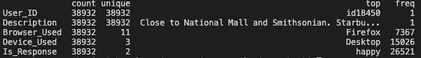
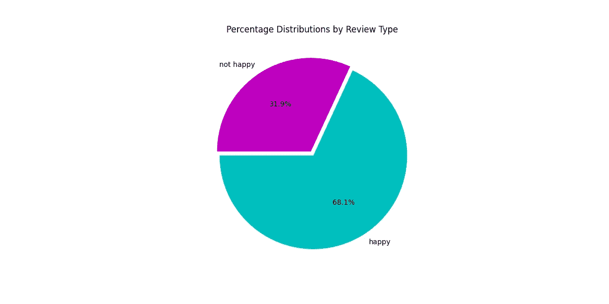

# 简单的 NLP 项目:酒店评论情感分析

> 原文：<https://medium.com/analytics-vidhya/simple-nlp-project-hotel-review-sentiment-analysis-9a772f6170d1?source=collection_archive---------13----------------------->

假设我们打开一个酒店页面，并寻找评论部分。我们会的菲。不同用户编写的一些文本。如果我们使用一些数据科学技术来分析所有的文本并得出评论的结论，会发生什么？我们将使用文本分析从互联网上获取数据信息。这叫做情感分析。

> [**情感分析**](https://en.wikipedia.org/wiki/Sentiment_analysis) (又称**观点挖掘**或**情感 AI** )是指利用[自然语言处理](https://en.wikipedia.org/wiki/Natural_language_processing)、[文本分析](https://en.wikipedia.org/wiki/Text_analytics)、[计算语言学](https://en.wikipedia.org/wiki/Computational_linguistics)、[生物统计学](https://en.wikipedia.org/wiki/Biometrics)对情感状态和主观信息进行系统的识别、提取、量化和研究。情感分析广泛应用于[客户之声](https://en.wikipedia.org/wiki/Voice_of_the_customer)材料，如评论和调查回复、在线和社交媒体以及医疗保健材料，应用范围从[营销](https://en.wikipedia.org/wiki/Marketing)到[客户服务](https://en.wikipedia.org/wiki/Customer_relationship_management)再到临床医学。

情感分析是自然语言处理(NLP)的一个领域，它建立了一个识别和提取文本形式观点的系统。酒店点评的数据例子我们可以从 [Kaggle](https://www.kaggle.com/anu0012/hotel-review) 得到。

# 加载数据

首先，我们应该将数据加载到我们的项目中。

```
import pandas as pdtrain_df = pd.read_csv(“train.csv”)test_df = pd.read_csv(“test.csv”)
```

# 探索性数据

让我们执行一个快速的探索性数据。

描述列车数据帧:

```
print(train_df.describe().transpose())
```



现在显示两类考核的百分比分布。

```
import matplotlib.pyplot as pltplt.figure(figsize=(12,6))plt.title("Percentage Distributions by Review Type")g = plt.pie(round(train_df.Is_Response.value_counts(normalize=True)*100,2),explode=(0.025,0.025), labels=round(train_df.Is_Response.value_counts(normalize=True)*100,2).index, colors=["c","m"],autopct="%1.1f%%", startangle=180)plt.show()
```



# 预处理数据

为了适应模型，我们只需要描述列，所以我们应该使用 drop 函数删除不相关的列。

```
train_df.drop(columns = ['User_ID', 'Browser_Used', 'Device_Used'], inplace = True)
```

因为我们处理的是文本数据，所以清理数据是这里的重要部分。我们对文本数据进行基本的清理，例如转换成小写字母，去掉方括号，去掉数字和标点符号。我们像这样设置函数

```
def text_clean_1(text):
    text = text.lower()
    text = re.sub('\[.*?\]', '', text)
    text = re.sub('[%s]' % re.escape(string.punctuation), '', text)
    text = re.sub('\w*\d\w*', '', text)
    return text
cleaned1 = lambda x: text_clean_1(x)def text_clean_2(text):
    text = re.sub('[‘’“”…]', '', text)
    text = re.sub('\n', '', text)
    return text
cleaned2 = lambda x: text_clean_2(x)
```

也是为了解构文本

```
def decontract_text(text):
# specific
    text = re.sub(r"won\'t", "will not", text)
    text = re.sub(r"can\'t", "can not", text)
    text = re.sub(r"won\’t", "will not", text)
    text = re.sub(r"can\’t", "can not", text)
    text = re.sub(r"\'t've", " not have", text)
    text = re.sub(r"\'d've", " would have", text)
    text = re.sub(r"\'clock", "f the clock", text)
    text = re.sub(r"\'cause", " because", text)
# general
    text = re.sub(r"n\'t", " not", text)
    text = re.sub(r"\'re", " are", text)
    text = re.sub(r"\'s", " is", text)
    text = re.sub(r"\'d", " would", text)
    text = re.sub(r"\'ll", " will", text)
    text = re.sub(r"\'t", " not", text)
    text = re.sub(r"\'ve", " have", text)
    text = re.sub(r"\'m", " am", text)
    text = re.sub(r"n\’t", " not", text)
    text = re.sub(r"\’re", " are", text)
    text = re.sub(r"\’s", " is", text)
    text = re.sub(r"\’d", " would", text)
    text = re.sub(r"\’ll", " will", text)
    text = re.sub(r"\’t", " not", text)
    text = re.sub(r"\’ve", " have", text)
    text = re.sub(r"\’m", " am", text)
return text
```

把它放在新的栏目里

```
train_df['cleaned_description'] = train_df['Description'].apply(lambda x: decontract_text(x))train_df['cleaned_description'] = train_df['cleaned_description'].apply(lambda x: text_clean_1(x))train_df['cleaned_description'] = train_df['cleaned_description'].apply(lambda x: text_clean_2(x))
```

我们可以知道前三个数据的区别

```
print('Original:\n', train_df['Description'][:3])
print('\n\nCleaned:\n', train_df['cleaned_description'][:3])Original: 
0 The room was kind of clean but had a VERY stro… 
1 I stayed at the Crown Plaza April — — April -… 
2 I booked this hotel through Hotwire at the low…
Cleaned: 
0 the room was kind of clean but had a very stro… 
1 i stayed at the crown plaza april april th… 
2 i booked this hotel through hotwire at the low…
```

# 模特培训

现在，在 sklearn 中，我们使用 train_test_split 对训练数据执行 80–20 拆分，以获得拟合模型所需的训练和测试数据集。

```
from sklearn.model_selection import train_test_splitx, y = train_df['cleaned_description'], train_df['Is_Response']
x_train, x_test, y_train, y_test = train_test_split(x, y, test_size=0.1,random_state=42)print(f'x_train: {len(x_train)}')
print(f'x_test: {len(x_test)}')
print(f'y_train: {len(y_train)}')
print(f'y_test: {len(y_test)}')x_train : 35038
x_test  : 3894
y_train : 35038
y_test  : 3894
```

现在，我们找到预测值。我们将使用 tfidf 矢量器，通过将清理后的文本转换为 TF-IDF 特征矩阵来提取特征。对于分类，我们使用逻辑回归。最后，我们通过结合矢量器和分类器创建了一个模型管道。

```
from sklearn.feature_extraction.text import TfidfVectorizer
from sklearn.linear_model import LogisticRegressiontvec = TfidfVectorizer()
clf2 = LogisticRegression(solver = “lbfgs”)from sklearn.pipeline import Pipelinemodel = Pipeline([(‘vectorizer’,tvec),(‘classifier’,clf2)])
model.fit(x_train, y_train)from sklearn.metrics import confusion_matrixpredictions = model.predict(x_test)
confusion_matrix(predictions, y_test)
```

我们可以得到测试的向量

```
array([[2426,  310],
       [ 145, 1013]])
```

# 模型预测法

现在，我们通过计算准确度、精确度和召回率来评估模型。

```
from sklearn.metrics import accuracy_score, precision_score, recall_scorey_pred = model.predict(x_test)print(f'Accurcy: {accuracy_score(y_pred, y_test)}')
print(f'Precision: {precision_score(y_pred, y_test, average="weighted")}')
print(f'Recall: {recall_score(y_pred, y_test, average="weighted")}')Accurcy: 0.9096045197740112 
Precision: 0.9130447094377214 
Recall: 0.9096045197740112
```

准确性是我们的模型的正确预测的分数。从准确度值来看，我们得到了 0.91，这意味着总共 100%的例子中有 91%的正确预测。

您可以通过我的 GitHub 下载数据和 python 代码文档:

[](https://github.com/dwiknrd/medium-code/tree/master/hotel_review_sentiment_analysis) [## dwiknrd/中等代码

### 此时您不能执行该操作。您已使用另一个标签页或窗口登录。您已在另一个选项卡中注销，或者…

github.com](https://github.com/dwiknrd/medium-code/tree/master/hotel_review_sentiment_analysis)