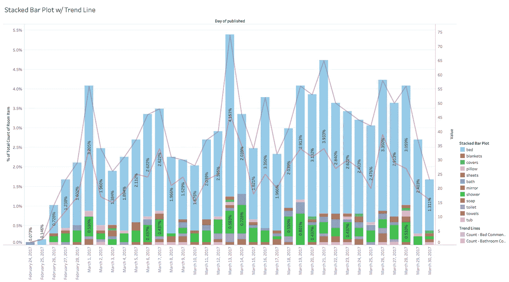

# Python 中的简单文本分析:从评论到见解

> 原文：<https://medium.com/analytics-vidhya/simple-online-review-text-analytics-for-beginners-using-python-c78d34927644?source=collection_archive---------1----------------------->

几秒钟之内，你就可以看到你的产品客户在网上评论中谈论了哪些元素。

# 大规模理解商业评论

企业希望了解他们的客户正在经历的体验类型，以及购物体验的哪些元素是成功或机会所在。在过去，我们可能会派调查员去调查人们在说什么，然后通读几百条来找出关键…