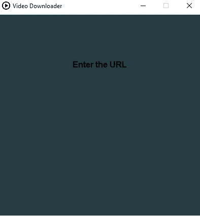
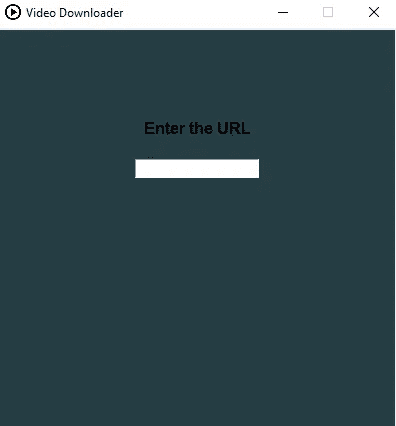
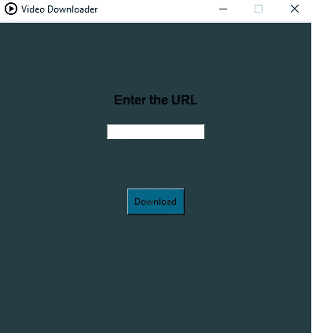
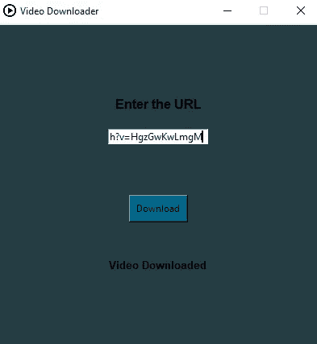

# 简单的基于 python 的 GUI 应用程序，用于下载 YouTube 视频。

> 原文：<https://medium.com/analytics-vidhya/simple-python-based-gui-application-to-download-youtube-videos-d11acd848955?source=collection_archive---------7----------------------->

在本教程中，我将向您展示如何构建一个可以从 YouTube 下载视频的 GUI 应用程序。我们将使用 *tkinter* 包开发我们的 GUI，并使用 *youtube-dl* 从 youtube 下载视频。

基本想法是，该应用程序由一个文本栏组成，用户在这里输入视频的 URL，然后点击“下载”按钮，然后下载视频。下载完成后，应用程序会显示一条消息。

首先，我们从加载所需的包开始:

现在，我们已经成功地加载了所需的包，我们开始创建 GUI 应用程序。我们通过创建一个根小部件来初始化 tkinter，这是一个框架/窗口，我们将在其中附加按钮和文本栏。请记住，只能有一个根部件，并且必须在创建任何其他部件之前创建。

现在，要更改标题栏中的标题和图标图像:

我们可以设置窗口的尺寸:

如果你正确地遵循了上述步骤，只需在你的代码末尾添加 **root.mainloop()** 并运行程序。当我们想运行程序时，我们使用 mainloop()方法。您将看到如下所示的窗口:

让我们添加一个画布到我们的窗口。画布是一个矩形区域，我们可以在其中放置文本和小部件。在下面一行代码中，我们将画布附加到根窗口或父窗口，并给定与根窗口相同的尺寸。我们也给画布一个背景色。

如果我们现在运行这个程序，我们可能会得到如下结果:

现在，让我们在画布上添加一个文本。我们创建了一个标签，它基本上允许我们显示文本和图像。用户不能与标签交互，但只能查看标签。

让我们运行程序。

我们将创建一个文本栏/搜索栏，用户可以输入下载视频的网址。我们使用入口小部件来输入和显示单行文本。

我们会得到这样的结果:

让我们创建一个从 YouTube 下载视频的函数。我们使用 youtube-dl 包来下载视频。我们通过使用 get()获取用户输入的 URL。

我们现在在画布中创建另一个文本，告诉用户视频已经下载。这将在我们的视频下载后显示。

现在是时候创建一个按钮了，当点击这个按钮时，它会指向用户输入的 URL，并从 YouTube 下载视频。我们使用按钮部件，它有文本、背景颜色、命令等参数。命令用于链接单击按钮时将执行的功能。

最后，当我们运行程序时:

当视频被下载后:

给你。您刚刚创建了可以下载 YouTube 视频的安贵应用程序。

上述代码可在我的 Github 帐户中获得:

 [## RohitShubankar/GUI-视频下载器

### 一个简单的基于 python 的 GUI 应用程序，用于从 youtube 下载视频。-RohitShubankar/GUI-视频下载器

github.com](https://github.com/RohitShubankar/GUI-Video-Downloader) 

如果任何人有任何问题/意见，随时联系我这里或邮件:rohit.shubankar@gmail.com

谢谢你