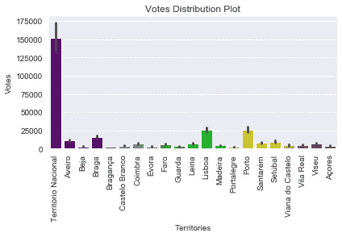
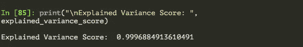
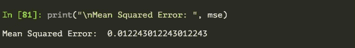
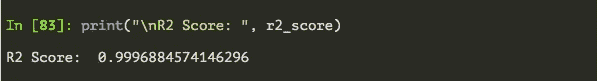

# 简单回归分析:葡萄牙 2019 年选举结果

> 原文：<https://medium.com/analytics-vidhya/simple-regression-analysis-portugal-2019-election-results-745ad4da5765?source=collection_archive---------17----------------------->

最后我的 [**随机数据集(link)生成器**](/@shraddha.anala/randomized-link-generator-for-datasets-f46342b5033) 在连续分类问题后输出一个回归任务。这一次，数据集是[**实时选举结果**，](https://archive.ics.uci.edu/ml/datasets/Real-time+Election+Results%3A+Portugal+2019)任务是预测 2019 年葡萄牙议会选举后有多少议员在地区/国家一级当选。

照片由 [Joakim Honkasalo](https://unsplash.com/@jhonkasalo?utm_source=medium&utm_medium=referral) 在 [Unsplash](https://unsplash.com?utm_source=medium&utm_medium=referral) 上拍摄

> 数据集的确认:
> 
> 努诺莫尼斯(2019)实时 2019 年葡萄牙议会选举结果数据集。arXiv

# **关于数据集:**

该数据集包含 28 个属性，涉及地域、选票和选民信息以及记录数据时的时间戳。

描述选举结果的演变，最后一栏，“最终授权”是当选的议员人数和我们必须预测的目标变量。

# **教程:**

通常，第一步包括清理数据，因为有 2 个特征变量；地区和政党(名称)，这是绝对的，我们将对它们进行编码。但首先，一些探索性的数据分析，以获得见解。

按地区分配选票

可以看出，似乎绝大多数选民都来自“Territorio Nacional”或国家领土，尽管当我试图用谷歌搜索这个词来看看它是指一个地区还是一个省时，我没有找到。

无论如何，这是你如何在 seaborn 绘制这个分布图。

**现在继续编码:**

在预处理之后，剩下要做的就是分成训练/测试子集，然后像我下面做的那样建立模型。

然后根据度量标准评估模型性能。由于这是一个回归模型，我们将计算均方差、R2 得分和解释方差得分。

> 均方误差和 R2 分数解释了回归线与数据点的接近程度。解释方差得分是模型解释观察中遇到的可变性的能力的度量。

以下是决策树回归器的指标:

模型的解释方差得分

模型的均方误差

模型的 R2 分数

这就是了。有一个回归任务是一个非常需要的节奏变化，看看回归分析，看看如何用不同的指标评估模型性能是非常有趣的。

请在下面留下任何建议、问题和进一步澄清的要求，下周见。

***感谢阅读，机器学习快乐！***