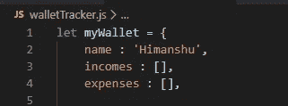
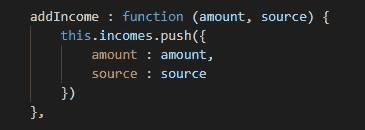
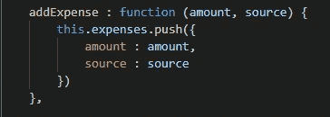
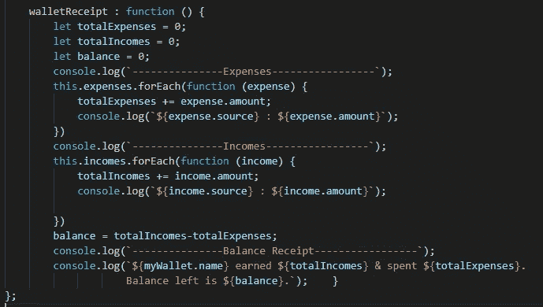
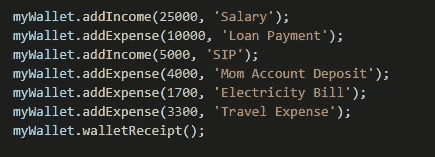
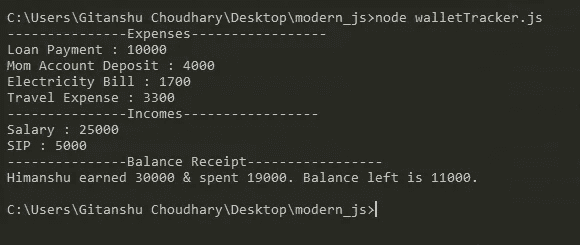

# 现代 JavaScript 中简单而冷静的“钱包追踪器”

> 原文：<https://medium.com/analytics-vidhya/simple-sober-wallet-tracker-in-modern-javascript-28bca451d4f?source=collection_archive---------12----------------------->

演职员表:Dribbble 上的 Cas Prins 的“钱包”

> 大家好，我是 Gitanshu Choudhary，作为一名 JavaScript 爱好者，我正在写我的第二个关于“媒体”的技术故事。

在这个故事中，我们将创建一个名为“Wallet Tracker”的现代 JavaScript 应用程序，其接口在 Cmder 上实现。

***Info-Pinch:***Cmder 读作“Commander”是一个预配置的软件包，它为你提供了一个令人敬畏的终端模拟器，也是你在 Windows 上拥有的最好的 shell。

O 我们的应用将基于简单而关键的 JavaScript 元素，例如:

*   功能/方法
*   数组
*   目标
*   内置数组函数
*   环

“Wallet Tracker”将由实现其功能的三种主要方法组成:

1.  第一种方法将用于增加用户钱包中的收入流量。
2.  第二种方法将用于从用户的钱包中添加费用流。
3.  第三种方法将用于计算用户钱包中的余额，并显示所有收入和支出交易的列表及其描述/来源。

“One 人军”，

在我们的应用程序中，所有的逻辑代码都存储在一个名为“myWallet”的对象中。

从初始化基本的键-值对到创建逻辑方法，一切都被嵌入到一个对象中。

3 键-值对，

我们将创建 3 个键值对来初始化我们的应用程序。

1.  第一个密钥被命名为“name ”,它将包含钱包持有者的姓名。
2.  第二个键是“incomes”，它作为一个数组存储属性为“amount”和“source”的对象。
3.  第三个键是“expenses”，它作为一个数组来存储属性为“amount”和“source”的对象。

3 个键值对

3 动态方法、

我们将创建 3 个方法来动态处理上面定义的 3 个键值对。

F 我们将创建的第一个方法称为 addIncome(amount，source ),其中“amount”将存储现金流入，而“source”存储关于该存款的描述。

addIncome()方法

我们将创建的第二个方法名为 addExpense(amount，source ),其中“amount”将存储现金流出量，而“source”存储关于这次提款的描述。

addExpense()方法

我们将要创建的第三个方法叫做 walletReceipt()，它没有参数。在这种方法中，我们将计算以下内容:

*   **总费用:**使用 forEach()循环，我们将计算用户花费的总费用&还将打印所有取款及其描述的列表。
*   **总收入:**使用 forEach()循环，我们将计算用户获得的总收入&还将打印所有存款及其描述的列表。
*   **Balance :** 使用上述循环的返回值，我们将计算钱包中剩余的余额。我们将打印一份最终报表，显示用户的“姓名”以及他/她的费用、收入和余额的最终值。

walletReceipt()方法

最后，我们将通过调用语句来调用这些方法来展示我们的应用程序的功能。

呼叫语句

我们应用程序的输出将显示为:

输出

在结束时，我们已经成功地创建了我们的“钱包追踪器”应用程序，使用了简单但主要的纯现代 Javascript 元素。

# 通过公共 GitHub gist 链接附在代码下面。

> 如果你喜欢我的努力，请通过轻拍拍手(最多 50 次)来鼓励这个故事。
> 
> 我感谢你的支持。
> 
> 谢谢大家！