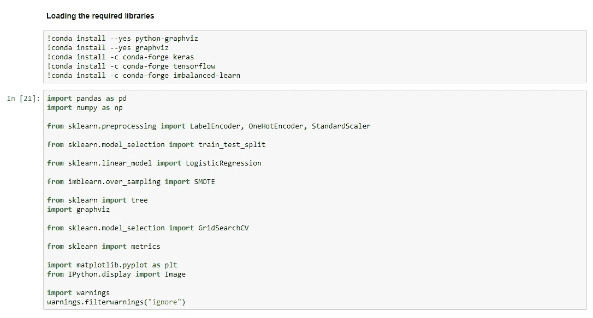
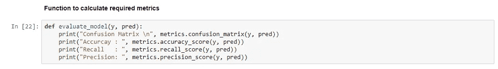
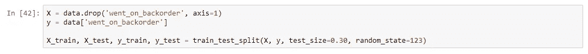
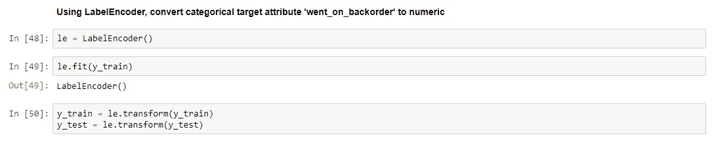
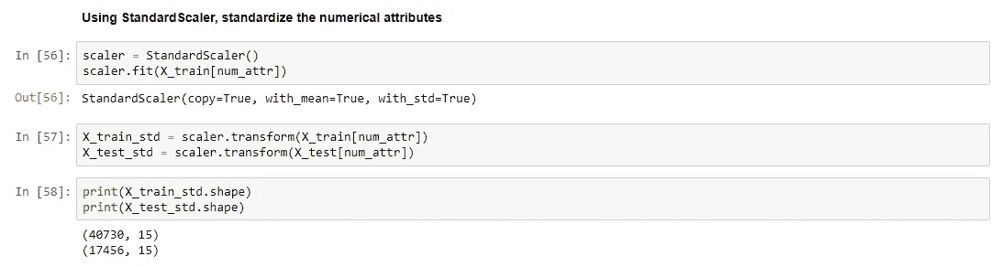
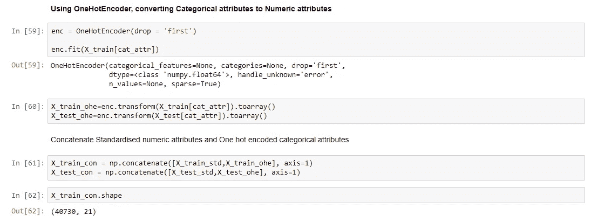
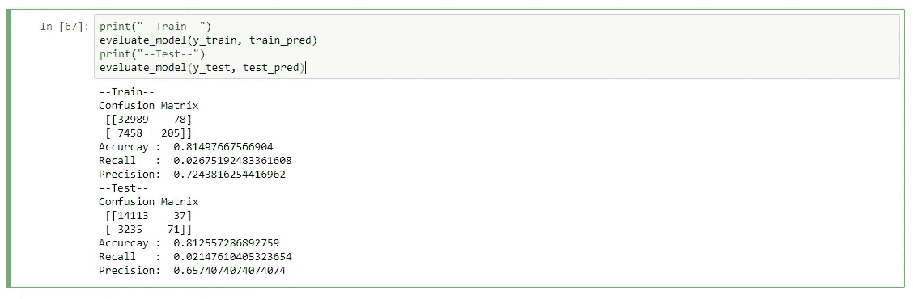
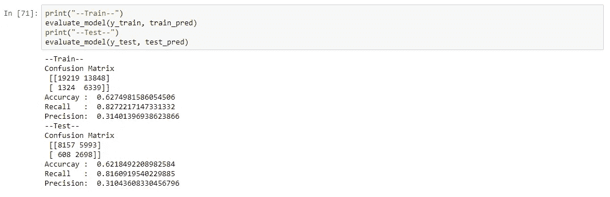
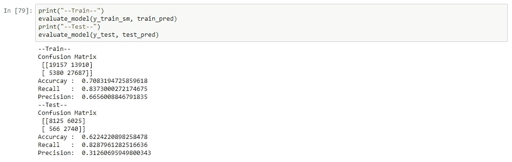
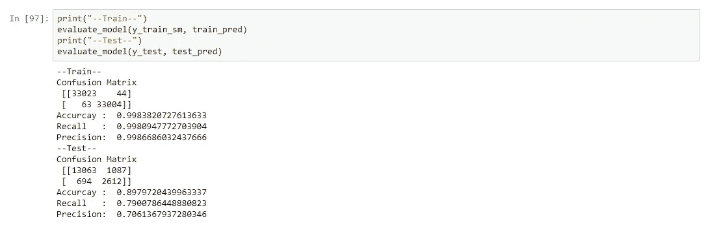

# 逐步提高机器学习模型性能的简单步骤

> 原文：<https://medium.com/analytics-vidhya/simple-steps-to-improve-machine-learning-models-performance-progressively-822445304a99?source=collection_archive---------10----------------------->


Jukan Tateisi 在 [Unsplash](https://unsplash.com?utm_source=medium&utm_medium=referral) 上拍摄的照片

所以，你已经建立了你的第一个学习模型，比方说在给定的数据集上把一幅图像分类为狗或猫。但是它的性能远不能让你满意。您的下一个常见步骤将是操作扩充数据集或立即切换到其他分类模型，而无需花费进一步的努力来深入诊断当前模型的能力。

然而，另一种可能是，你错过了对现有模型进行微调以最佳适应数据集的巨大机会。我们应该避免在没有完全探索现有模型的学习能力的情况下就匆忙决定在模型之间进行切换。

我想提出一个直观而有效的关于延期交货的案例研究来说明上面强调的观点。

## 什么是延期交货？

*延期交货*是暂时缺货的产品，但是客户可以根据未来的库存下订单。延期交货通常表示客户对产品或服务的需求超过了公司的供应能力。延期交货有好有坏。强劲的需求可以推迟订单，但次优的计划也可以。

典型的延期交货受多种因素影响，典型的数据属性如下所示:

```
sku - Random ID for the product

national_inv - Current inventory level for the part

lead_time - Transit time for product (if available)

in_transit_qty - Amount of product in transit from source

forecast_3_month - Forecast sales for the next 3 months

forecast_6_month - Forecast sales for the next 6 months

forecast_9_month - Forecast sales for the next 9 months

sales_1_month - Sales quantity for the prior 1 month time period

sales_3_month - Sales quantity for the prior 3 month time period

sales_6_month - Sales quantity for the prior 6 month time period

sales_9_month - Sales quantity for the prior 9 month time period

min_bank - Minimum recommend amount to stock

potential_issue - Source issue for part identified

pieces_past_due - Parts overdue from source

perf_6_month_avg - Source performance for prior 6 month period

perf_12_month_avg - Source performance for prior 12 month period

local_bo_qty - Amount of stock orders overdue

deck_risk - Part risk flag

oe_constraint - Part risk flag

ppap_risk - Part risk flag

stop_auto_buy - Part risk flag

rev_stop - Part risk flag

went_on_backorder - Product actually went on backorder. This is the target value.

     Yes or 1 : Product backordered

     No or 0  : Product not backordered
```

现在，我们将实现众所周知的常规步骤，在建模之前探索、清理和分割数据。

1.  加载所需的库和数据。



2.为模型性能评估确定正确的误差度量。我们选择了召回率作为我们的性能评价指标。



3.通过可视化进行探索性数据分析，以便更好地理解数据。

4.将所有属性转换为适当的数据类型。

5.处理缺失数据。

6.将数据分为训练集和测试集。



7.使用 *LabelEncoder* 将分类目标属性转换为数字。



8.使用 *StandardScaler* 到*标准化数值属性。*



9.使用 *OneHotEncoder* 到将分类属性转换为数字属性。



## 模型构建策略

因为我们要满足一个分类任务，所以使用逻辑回归作为我们增强的基础模型是我们的第一特权。然后，我们将根据观察结果采取渐进的决定性行动。

步骤 1:(简单逻辑回归)



逻辑回归模型性能

可以看出，回忆是非常低和差的。这主要是由于分类不平衡的典型情况，即 81%的记录不是延期交货记录。

步骤 2:(类权重平衡的逻辑回归)



逻辑回归中的类权重平衡

重量平衡后，召回率有所提高，但它极大地影响了模型的准确性。准确性和召回率并不是完全独立的，我们需要进行一定的权衡来有效地管理它们。

步骤 3:(带上采样的逻辑回归)



逻辑回归中的上采样

在这个阶段，回忆在准确性没有变化的情况下有所提高。对于给定的数据集，我们已经达到了逻辑回归的极限。此外，我们需要切换到其他分类模型以获得更好的性能。

第四步:(决策树)



这似乎是一个可以接受的结果，或者它可以作为 GridSearchCV 与决策树相结合的一个经验步骤进行进一步的尝试。

## 结论

上述案例研究强调了采取简单而有效的步骤以渐进方式提高机器学习模型性能的重要性。

我真诚地希望所有狂热的数据科学和机器学习爱好者会发现它非常有趣，并有动力亲自尝试一下。案例研究中使用的数据集可以从这里的[获得](https://drive.google.com/open?id=1BrCi7U-GZ5COV_uNI_-civCsgLQJzIel)。