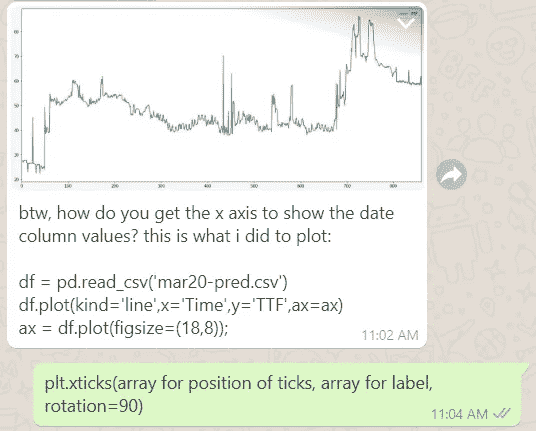
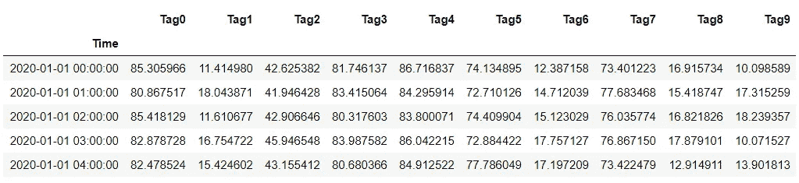
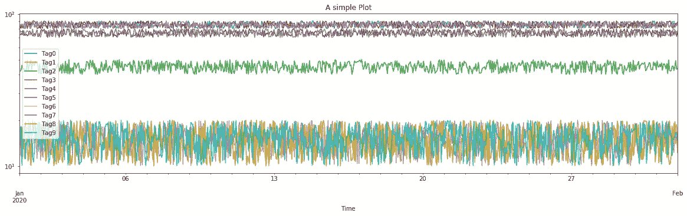
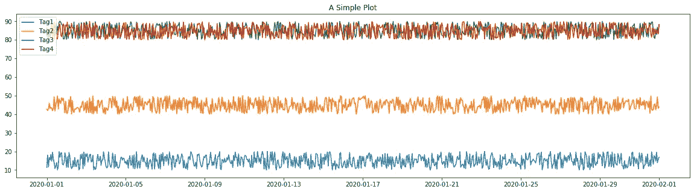
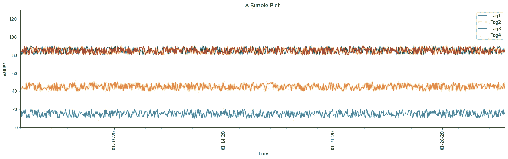
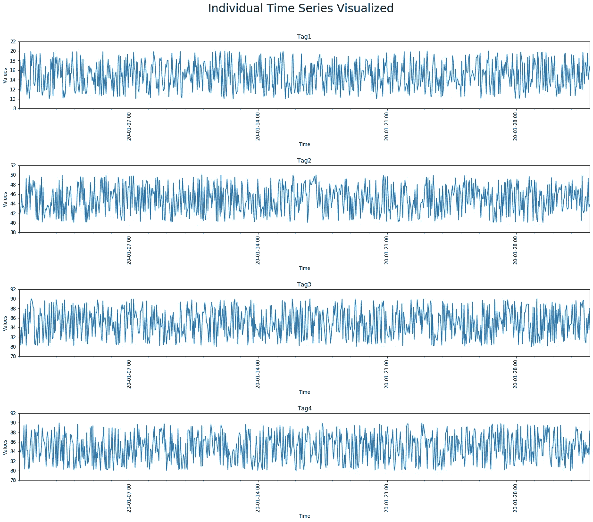

# 用 Python 可视化时间序列数据的简单模板

> 原文：<https://medium.com/analytics-vidhya/simple-templates-for-visualizing-time-series-data-in-python-84cc9cf15443?source=collection_archive---------16----------------------->

我最近在工作中经常使用时间序列数据集，这使得在数据探索过程中需要频繁的可视化，以至于我为它开发了一个例程。我想我应该分享我的过程，希望其他人也能从中受益。



前几天，我的同事请求帮助标记他的地块。

我假设读者对 [pandas](https://pandas.pydata.org/) 、 [matplotlib](http://matplotlib.org) 和 [NumPy](http://numpy.org) 有基本的了解，并且你已经使用这些库有一段时间了。

**A .进口**

```
import osimport pandas as pd
import numpy as np
import datetimeimport matplotlib.pyplot as plt
import matplotlib.dates as mdates
```

**B .数据集**

因为我们使用的是时间序列数据集，所以数据集应该包含一个时间列，其中包含名为`Time`或`date`等的时间戳。，以及每个预测值的其他列。如果您没有要处理的时间序列数据集，您可以对模拟数据集运行以下代码(这也是我们将在本文中处理的数据集):

```
import pandas as pd
import numpy as np# generate a range of dates 
date_rg = pd.date_range(start = '1/1/2020',
                        end = '2/1/2020',
                        freq = 'H')# for each column in our mock dataset, we will sample n random
# numbers within a certain range
n = len(date_rg)# set this to your prefered number of columns excluding the time column
m = 10# creating the dataset
A = {'Time': date_rg}
for j in range(m):
    low = random.randint(0, 10) * 10
    high = low + 10
    A['Tag' + str(j)] = np.random.uniform(low=low, high=high, size=(n,))df = pd.DataFrame(A)# saving the dataset
df.to_csv('Basic_Time_Series_Dataset.csv', index = False)
```

我们将数据集上传为 pandas dataframe，并使用以下代码将 time 列设置为索引:

```
import pandas as pd# Path to your dataset
df_path = 'Basic_Time_Series_Dataset.csv'# Uploading dataset
df = pd.read_csv(df_path,
                parse_dates = ['Time'],
                index_col = ['Time']
                )
```

默认情况下，pandas 会将时间列中的值视为字符串。在`pd.read_csv`中设置`parse_date`将它们转换成`[datetime](https://docs.python.org/3/library/datetime.html)`对象。这很重要，因为我们希望在绘制数据时考虑日期之间的持续时间。`index_col`将时间列设置为数据帧的索引。

如果由于时间戳的格式而无法解析时间列，那么可以使用其他方法。首先，上传没有上述两个附加参数的数据集:

```
df = pd.read_csv(df_path)
```

然后，使用下列方法之一:

🌸方法一:使用`pd.to_datetime` [🔗](https://pandas.pydata.org/pandas-docs/stable/reference/api/pandas.to_datetime.html)

```
df.index = pd.to_datetime(df['Time'])
```

🌸方法二:使用`datetime.strptime` [🔗](https://www.journaldev.com/23365/python-string-to-datetime-strptime)

是一个非常有用的模块，它提供了处理日期和时间的类。

```
import datetimedf.index = df['Time'].apply(
    lambda x: datetime.datetime.strptime(x, '%Y-%m-%d %H:%M:%S')
)
```

我们要做的下一件事是从数据帧中删除时间列:

```
df.drop('Time', axis = 1, inplace = True)
```

确保修改就地完成，这样我们就不必给 df 重新分配数据帧的新版本。将`axis`设置为 1 告诉该方法沿着列搜索一个名为“Time”的值。

使用`df.head()`查看数据框的前五行:



**C .模板**

我们希望将生成的图形保存在一个公共文件夹中，并且希望仅在尚未创建文件夹时才创建该文件夹，例如第一次创建时:

```
import osoutpath = 'figs'
if not os.path.exists(outpath): 
    if not os.path.exists(outpath):
        os.mkdir(outpath)
```

我们将为每个图形命名一个唯一生成的名称，这样新图形在保存时不会替换旧图形。为此目的创建时间戳是一个很好的解决方案:

```
import datetimeTS = datetime.datetime.now().strftime('%Y%m%d%H%M%S')
```

`datetime.datetime.now()`返回代表当前时间的 datetime 对象。`strftime`将日期时间对象转换成指定[格式](https://www.journaldev.com/23365/python-string-to-datetime-strptime)的字符串。将所有这些放在一起，我们有以下基本模板来保存您自动生成的每个图形:

```
import matplotlib.pyplot as pltplt.figure()df.plot()TS = datetime.datetime.now().strftime('%Y%m%d%H%M%S')
fname = '%s.png' % TS
plt.savefig(os.path.join(outpath, fname), bbox_inches = 'tight')
plt.show()
```



一个简单的情节。

`plot`是`pandas.DataFrame`的一种方法，它可以让你快速绘制出数据框中任何可用的数据。默认情况下，该函数在后端使用 matplotlib，因此您必须包含常规导入才能正常工作。您还可以使用许多参数来快速调整绘图的外观，例如使用元组`figsize`来设置绘图的维度，或者如果您想要以对数比例绘图，则使用布尔值`logy`。文档列出了一堆你可以使用的其他参数。在从`df`调用`plot`后，您还可以使用`pyplot`功能进一步定制您的图形，如设置标题、刻度标签等。

就个人而言，我喜欢使用`pyplot`函数而不是`df.plot`函数，因为它给了我更多的灵活性。因此，我向您展示了一些代码模板，其中包含我在可视化时间序列数据集时通常使用的所有常见定制:

📈**模板 1**

绘制数据帧子集的简单代码，包括标题和图例。您可以在第一行的`df_tmp`处设置要可视化的子集。

```
df_tmp = df.iloc[:, 1:5]plt.figure(figsize = (20, 5))for j in df_tmp:
    X = df_tmp.index
    Y = df_tmp[j].values
    plt.plot(X, Y, label = j)

plt.title('A Simple Plot')
plt.legend(loc = 'upper left')TS = datetime.datetime.now().strftime('%Y%m%d%H%M%S')
fname = '%s.png' % TS
plt.savefig(os.path.join(outpath, fname), bbox_inches = 'tight')
plt.show()
```



📈**模板 2**

这个模板使用了[面向对象的方法](https://realpython.com/python-matplotlib-guide/#understanding-pltsubplots-notation)。这个方法给了我们进一步定制 x 标签记号的灵活性(这里有很好的资源:[🔗](https://brohrer.github.io/matplotlib_ticks.html) [🔗](https://www.earthdatascience.org/courses/use-data-open-source-python/use-time-series-data-in-python/date-time-types-in-pandas-python/customize-dates-matplotlib-plots-python/))。与上一个模板相比，这个模板的主要改进是它将 x 轴上的主要刻度设置为每 1 周一次，将次要刻度设置为 1 天一次。

```
import matplotlib.dates as mdatesdf_tmp = df.iloc[:, 1:5]fig, ax = plt.subplots(figsize = (20, 5))for j in df_tmp:
    X = df_tmp.index
    Y = df_tmp[j].values
    ax.plot(X, Y, label = j)ax.legend(loc = 'upper right')# Set title and labels for axes
# Set the limits of the x-axis
# Set the limits of the y-axis so that the legend would not overlap with the plots
ax.set(xlabel = 'Time',
       ylabel = 'Values',
       title = 'A Simple Plot',
       xlim = [df_tmp.index[0], df_tmp.index[-1]],
       ylim = [ax.get_yticks()[0], ax.get_yticks()[-1] + 30]
      )# Define the date format
date_form = mdates.DateFormatter("%m-%d-%y")
ax.xaxis.set_major_formatter(date_form)# Ensure a major tick for each week
ax.xaxis.set_major_locator(mdates.WeekdayLocator(interval=1))
# Add minor ticks representing the days
ax.xaxis.set_minor_locator(mdates.DayLocator())
# rotate the labels 90 degrees
ax.tick_params( axis="x", labelrotation = 90)TS = datetime.datetime.now().strftime('%Y%m%d%H%M%S')
fname = '%s.png' % TS
plt.savefig(os.path.join(outpath, fname), bbox_inches = 'tight')
plt.show()
```



📈**模板 3**

在单独的图中可视化每个时间序列。

```
df_tmp = df.iloc[:, 1:5]# We are going to plot each column on a separate plot
r = df_tmp.shape[1]# pass r in plt.subplots to set the number of plots in our figure
fig, ax = plt.subplots(r, 1, figsize = (20, r * 4))# adjust distances between each plot in the figure
fig.tight_layout(pad = 10)# 
date_form = mdates.DateFormatter("%y-%m-%d %H")# when we create more than 1 subplots, a numpy array of axes objects is returned
# we access each using the counter i
i = 0
for j in df_tmp:
    X = df_tmp.index
    Y = df_tmp[j].values
    ax[i].plot(X, Y, label = j)

    # all the common customizations
    ax[i].set(xlabel = 'Time',
       ylabel = 'Values',
       title = j,
       xlim = [df_tmp.index[0], df_tmp.index[-1]],
       ylim = [ax[i].get_yticks()[0], ax[i].get_yticks()[-1]]
      )
    ax[i].xaxis.set_major_formatter(date_form)
    ax[i].xaxis.set_major_locator(mdates.WeekdayLocator(interval=1))
    ax[i].xaxis.set_minor_locator(mdates.DayLocator())
    ax[i].tick_params( axis="x", labelrotation = 90)

    i += 1# Set main title
fig.suptitle('Individual Time Series Visualized', position = (0.5, 0.98), fontsize = 24)TS = datetime.datetime.now().strftime('%Y%m%d%H%M%S')
fname = '%s.png' % TS
plt.savefig(os.path.join(outpath, fname), bbox_inches = 'tight')
plt.show()
```



好了，暂时就这样了。当我想出新的模板时，我会经常更新这个帖子。希望对你有帮助！:-)