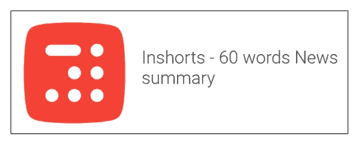
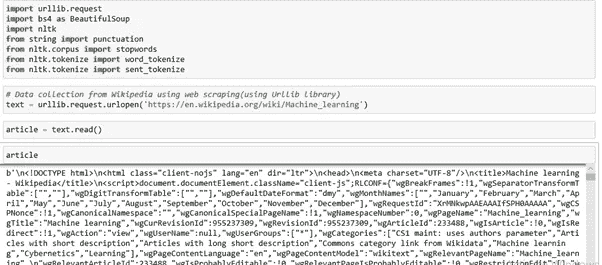
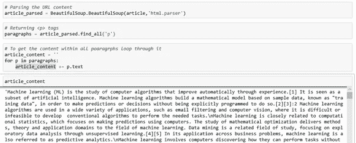
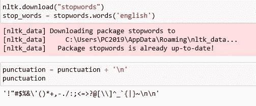
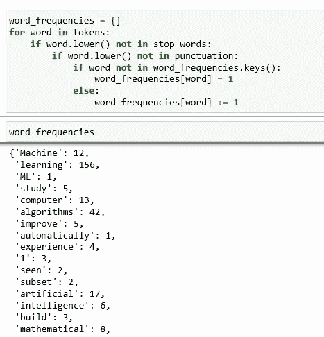
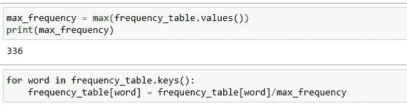
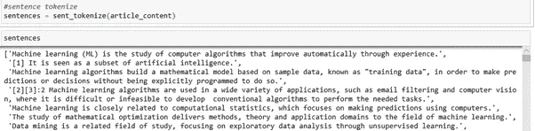
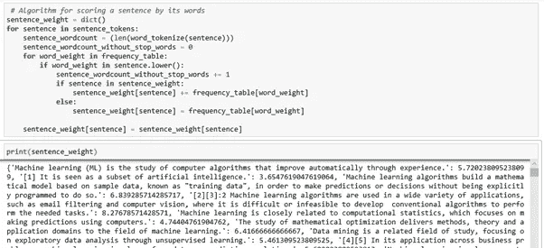
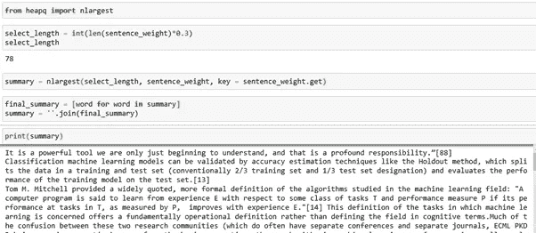
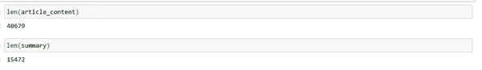

# 使用 NLTK 的简单文本摘要

> 原文：<https://medium.com/analytics-vidhya/simple-text-summarization-using-nltk-eedc36ebaaf8?source=collection_archive---------3----------------------->

**简介**

文本摘要是在保留关键信息内容和整体含义的同时缩短长文本片段，以创建代表文本中最重要或最相关信息的子集(摘要)的过程。

**自动文本摘要示例**

文本摘要问题的一个例子是新闻文章摘要，它试图从给定的文章中自动产生摘要。有时，一个人可能对从单个源文章生成摘要感兴趣，而其他人可以使用多个源文章(例如，同一主题的一组文章)。这个问题叫做多文档摘要。一个相关的应用是摘要新闻文章。想象一下一个系统，它自动地将一个给定主题的新闻文章(从网络上)收集在一起，并以摘要的形式简明地表示最新的新闻。一个例子是名为 inShorts 的应用程序，它将新闻文章总结为 60 个单词。

**为什么文本摘要很重要**

文本摘要的重要用途是，

可以通过花最少的时间从非结构化文本数据中获取最多的信息。

以增强文档的可读性。

可以消除多余的，无关紧要的文字，并提供所需的信息

加速信息搜索的过程

**两种不同的文本摘要方法**

**基于提取的摘要:**这里，内容是从原始数据中提取出来的，但是提取出来的内容没有经过任何修改。简而言之，我们从原文中识别出重要的句子或关键短语，并且只从文本中提取那些。

在机器学习中，提取摘要通常涉及权衡句子的基本部分，并使用结果来生成摘要。

**示例:**

**汇总前**

约翰和约瑟夫乘出租车去参加城里的晚会。在聚会中，约翰晕倒了，被紧急送往医院。

**汇总后**

约翰和约瑟夫参加聚会。约翰火速赶往医院。

**基于摘要的摘要:**这里，文本的摘要可以不同于原始文本，这与基于提取的摘要形成对比，在基于提取的摘要中，仅使用存在的现有句子。使用先进的深度学习技术来生成新的摘要。

示例:

**总结前**

约翰和约瑟夫乘出租车去参加城里的晚会。在聚会中，约翰晕倒了，被紧急送往医院。

**汇总后**

约翰参加聚会后住院了。

在本文中，我们将使用基于抽取的摘要，通过使用 NLTK 工具包挑选具有最大重要性分数的句子来形成摘要。

**维基百科文章的文本摘要**

让我们为在 https://en.wikipedia.org/wiki/Machine_learning 的[维基百科文章中找到的信息创建文本摘要器，它将给出机器学习的摘要。](https://en.wikipedia.org/wiki/Machine_learning)

**额外收获** : Python 3，NLTK 工具包

**创建文本摘要的步骤**

1)使用网络抓取从维基百科收集数据(使用 Urllib 库)

2)解析数据的 URL 内容(使用 BeautifulSoup 库)

3)数据清理，如删除特殊字符、数值、停用词和标点符号。

4)标记化——创建标记(单词标记和句子标记)

5)计算每个单词的词频。

6)计算每个句子的加权频率。

7)选择 30%权重最高的句子来创建摘要。

**1)** **使用网络抓取从维基百科收集数据(使用 Urllib 库)**

使用 Urllib 库从 Wikipedia 页面获取数据，该库将连接到页面并检索 HTML。

我们将使用 urllib.request 实用程序中的 urlopen 函数来打开网页。然后，我们将使用 read 函数来读取抓取的数据对象。

**2)**解析数据的 URL 内容

这个原始文本由 HTML 标签组成，需要使用 BeautifulSoup 库进行解析，以获得

(段落)标签中的内容。

find_all 函数用于返回 HTML 中出现的所有

元素。通过使用。文本使我们能够只选择在

元素中找到的文本。

**3)** **标记化&数据清理**

从 NLTK 工具包导入停用词，从字符串库中导入标点符号。

停用词是任何语言中的一组常用词。例如，在英语中，“the”、“is”和“and”很容易成为停用词。在 NLP 和文本挖掘应用程序中，停用词用于消除不重要的词，使应用程序能够专注于重要的词。

**创建频率表**

Word 对整个文本进行标记。我们必须用关键字作为单词，用单词重复的次数作为值来创建字典。

然后用所有单词的出现次数除以最频繁出现的单词的频率，如下所示:

**将文章分词成句子**

为了将 article_content 分成一组句子，我们将使用 nltk 库中的内置方法。

4) **寻找句子的加权频率**

为了评估文中每个句子的得分，我们将分析每个术语的出现频率。在这种情况下，我们将根据单词给每个句子打分；也就是说，增加句子中每个重要单词的频率。

5) **概要的创建**

使用 nalargest 库获得前 30%的加权句子。然后加入它以获得最终的摘要文本。

检查文本摘要前后的文本长度。

文本的单词长度在摘要之前是 40679，在摘要之后是 15472。

**结论**

这篇文章解释了总结维基百科文章的简单方法，我的建议是删除任何其他文章并检查它是如何总结的。请不要忘记鼓掌。感谢阅读。

参考:[https://en . Wikipedia . org/wiki/Automatic _ summary #应用](https://en.wikipedia.org/wiki/Automatic_summarization#Applications)

github:[https://github . com/diva karpm/NLP/blob/master/Text _ summary/Text _ summary . ipynb](https://github.com/DivakarPM/NLP/blob/master/Text_Summarization/Text_Summarization.ipynb)