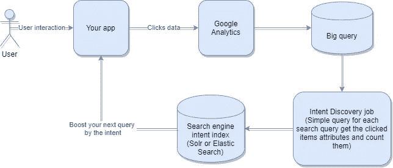

# 让您的客户找到他们正在寻找的东西|提取搜索查询意图的简单方法| Bigquery | Solr

> 原文：<https://medium.com/analytics-vidhya/simple-way-to-extract-search-query-intent-in-search-engine-bigquery-solr-c049fb5b4592?source=collection_archive---------19----------------------->

大多数现代搜索引擎，如 **solr** 和 **elastic search** 在运行搜索查询时使用 **TF-IDF** 之类的统计方法来计算相关性。这种方法的主要问题是它依赖于文档中的单词和标记，而这些单词和标记并不总是反映用户在查询中想要什么。
在电子商务网站上尤其如此，因为文档不会有冗长的描述和文本分析方法，像 **BM25** 和 **TF-IDF** 不会单独工作。
例如，当您的文档中有以下文档时，有人可能会搜索 ***iPhone*** :

*   苹果 **iPhone** 8 plus
*   ***iPhone 保护套***8 plus/***iPhone****7 plus*

*有了这些文档，您的引擎将匹配**封面**，因为它的词频是 **2** ，而不是**手机**的 **1** 。但是，你的客户需求和商业逻辑通常意味着**他想要手机**。
这个问题通常可以通过**手动查询规则**解决。然而手动发现查询规则**是一个困难的问题**并且需要很多努力。幸运的是，我们可以利用**查询意图发现方法来生成自动查询规则**。*

# *基本信息*

*在我们继续之前，我们必须谈谈什么是查询规则，什么是查询意图。*

***查询规则**是当我们运行特定查询时**修改搜索引擎行为**的规则。例如，我们可以制定一个规则，当客户搜索 iPhone 时，将提升手机类别。查询规则的问题在于，您需要一位业务专家来创建和跟踪这些规则。*

***搜索查询意图**是一个宽泛的术语，意思是**描述客户在网站上搜索某样东西时的意思的信息**。我们可以将其描述为一组关于搜索查询的元数据。例如，对于 iPhone 查询，它可以是一组移动电话类别和苹果品牌。*

*现在，如果我们可以发现查询意图，那么我们就可以**创建一个规则来增强意图属性**。这里的问题是找到意图。
通常人们使用机器学习技术来寻找查询意图。在本文中，我们将描述一个简单的没有 ML 的方法，它可以被用作意图发现的第一个版本。*

# ***解决方案***

*为了回答用户在搜索 **iPhone** 时的意图，我们可以跟踪他点击时结束的**项目。我们可以使用谷歌分析来捕捉用户点击，然后使用它来发现如下意图:***

1.  *使用 Google Analytics 捕获用户的搜索查询和文档点击，并将其存储在 Google Big query 上。*
2.  *运行一个作业，该作业将定期运行查询以获取用户的搜索查询和用户已单击项目的属性，然后按这些属性进行分组，并统计每个属性的点击次数。*
3.  *在你的搜索引擎上创建一个新的索引(solr 或 elastic search ),用它们的属性和计数来索引搜索查询。*
4.  *当您得到一个新的查询时，只需通过对属性做一个方面并对计数求和来搜索您的索引。*
5.  *按数量对你的属性进行排序，得到最上面的几个。*
6.  *现在，这组属性和它们的流行度计数将成为这个查询的目的。*
7.  *向您的主搜索查询添加一个 boost 查询，根据您已经获得的属性字段进行 boost。*

*为了进一步说明这个想法，你可以查看下图。*

**

# *进一步说明*

*   *这不是意图发现的唯一用例，还有许多其他用例。因此，如果你有一个大网站，拥有意图发现系统是一个好主意。*
*   *尽管这是一个简单的方法，但无论如何最好还是拥有它，因为它可能是其他更复杂方法的基础。例如，收集的查询和属性数据可以用作机器学习意图发现解决方案的学习数据。*
*   *这种方法的一个问题是很难找到新查询的意图，因为在意图索引上没有文档。然而，使用方面将有助于从类似的查询中收集意图。例如，如果您有来自男性时尚类别的男鞋的意向，并且阿迪达斯鞋有阿迪达斯品牌的意向，那么您可以发现阿迪达斯男鞋将来自具有阿迪达斯品牌的男性时尚类别，因为我们正在对指数做一个方面，并对属性的总体流行度计数进行求和。*

*不幸的是，如果你有一个有偏见的指数，这并不总是有效的。例如，当我们在查询中使用阿迪达斯这个词时，你可能会有很多阿迪达斯品牌的女性时尚产品，使其比男性时尚产品更受欢迎。幸运的是，您可以通过在计算项目数时考虑 IDF(逆文档频率)来解决这个问题。换句话说，如果某个属性值存在于许多搜索查询意图中，则通过对该属性值进行折扣。*

*在本文中，我们讨论了如何以简单的方式获取查询意图。如果你喜欢它，请鼓掌，并关注我，获取更多的搜索和信息检索文章。*