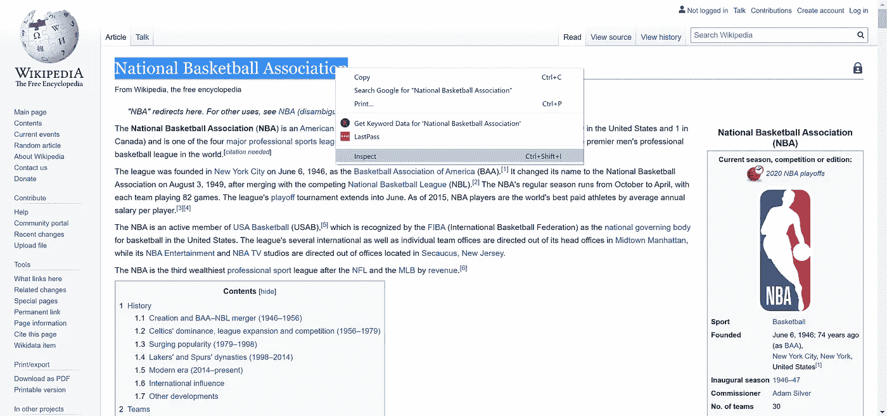
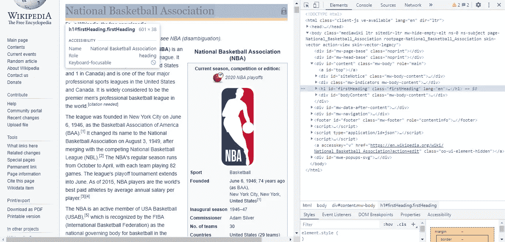
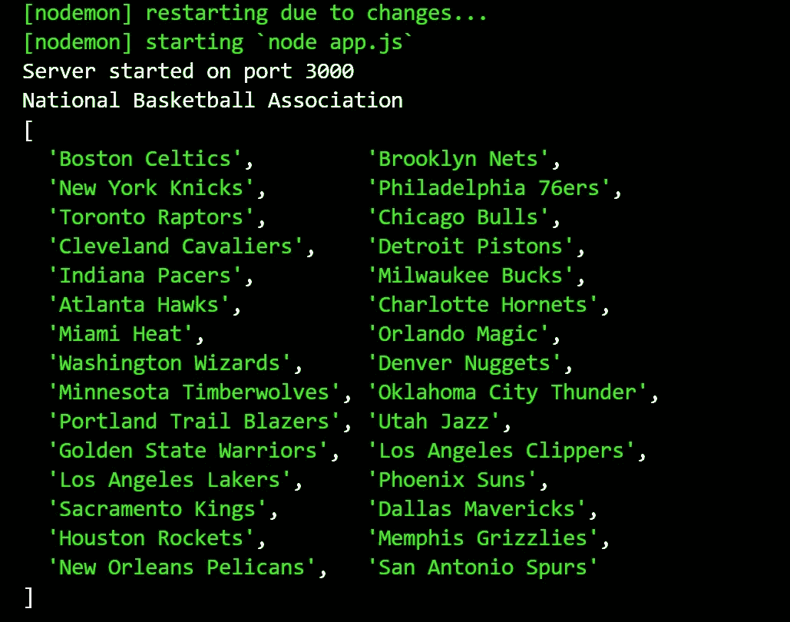

# 使用 Node.js 的简单网页抓取教程

> 原文：<https://medium.com/analytics-vidhya/simple-web-scraping-tutorial-with-node-js-9ea8ac3b2476?source=collection_archive---------8----------------------->

## 了解如何使用 Node.js、Express、Axios 和 Cheerio 轻松地从任何网页获取数据(不需要 API)。


照片由 [**DiversityQ**](https://diversityq.com/coding-course-looks-to-improve-diversity-and-inclusion-in-tech-1509189/)

我们有无数的理由想要使用来自网络上不同种类的网页的特定数据，但是我们实际上不知道如何将该特定数据用于我们的个人目的，尤其是在缺乏适当的 API 的情况下。
对我们来说幸运的是，有一个伟大而简单的解决方案，不使用任何 API，叫做网络抓取。

在本教程中，我将介绍通过使用 Node.js、Express、Axios 和 Cheerio 抓取网页，将相关信息和数据从网上获取到您手中所需的所有基本步骤。

# 等等，网络抓取到底是什么？

网络抓取是一种奇妙的技术，它允许我们直接从网页的 HTML 中提取数据，而不需要使用正式的 API。

有很多不同的方式来抓取 web，通过 JavaScript 或 Python 等编程语言以及 Cheerio、Soup 和 Puppeteer 等库来抓取 web 是可能的。

# 整个过程分 3 步

网页抓取的整个过程可以通过三个简单的步骤来解释:

1.  第一步是理解并找到你想从特定网页中抓取的数据的相应 HTML 标签。
    为此，你需要检查同一个网页的 HTML 代码(例如使用 Chrome DevTool)并找到这些 HTML 标签。
2.  第二步是选择您想用来编码的编程语言，以及您的 web 抓取应用程序的相应库，在我们的例子中是 Node.js、Express 和 Cheerio，并通过设置与我们之前提到的第一步相同的 HTML 标记来抓取数据。
3.  最后一步是从网页接收所需的数据(即通过 Axios 请求)，正如我们在第二步中所做的那样，通过 Cheerio 库加载它，并根据需要使用它。

今天，在我们简短的例子中，我们将从维基百科的一篇文章中收集所有 NBA 球队的列表。

通过学习我将在本教程中学习的例子，你将会学到所有的技巧和窍门，成为一名专业的收集数据的专家。


照片由[**makeameme.org**](https://makeameme.org/meme/let-the-fun-441qbn)拍摄

# 让我们从基础开始

网页抓取主要基于对 HTML 标签、jQuery、JavaScript 的理解。
因此，我们必须了解我们将需要哪些 HTML 标签来提取我们想要的所有数据。
为此，我们将使用 **Chrome DevTools** 。

让我们打开下面的[维基百科链接](https://en.wikipedia.org/wiki/National_Basketball_Association)，然后通过右键单击我们想要提取的元素(数据)
(在我们的例子中，是文章的标题)来打开 Chrome dev tools
，然后单击‘inspect’(见下文)。



照片由 [**维基百科**](https://en.wikipedia.org/wiki/National_Basketball_Association) 提供

现在，我们在 Chrome DevTools 中，可以看到网页的 HTML 代码。



照片由 [**维基百科**](https://en.wikipedia.org/wiki/National_Basketball_Association) 提供

如果仔细观察，可以清楚地看到,`<h1>`标记是浅蓝色的，这意味着这是我们专门检查过的元素标记(文章的标题)。


照片由 [**Unsplash**](https://unsplash.com/photos/MSN8TFhJ0is) 拍摄

# 真正的交易

现在，在我们理解了网页抓取的基本步骤，并且找到了我们需要的所有标签之后，我们终于可以创建我们的网页抓取应用程序了。

*   重要提示——如果你以前从未安装过`npm`,你应该先安装。

# a.启动一个新项目

为我们的 web scraping 应用程序项目创建一个新文件夹，并根据您的意愿命名。在项目的文件夹中，创建一个名为`app.js`的新文件。
您可以通过单击鼠标右键来完成，也可以使用命令行创建一个新文件，键入以下内容:

```
touch app.js
```

现在，我们应该安装并要求我们今天将要使用的依赖项——Express、Axios 和 Cheerio。
为此，请打开命令行并键入以下行:

```
npm install --save express axios cheerio
```

然后，在`app.js`文件中请求我们刚刚安装的依赖项，并发起一个`get`请求，如下所示:

```
const express = require("express")
const axios = require("axios")
const cheerio = require("cheerio")app.const app = express();app.set("view engine");app.use(express.static(__dirname + "/public"));app.get("/", function(req, res) {})
```

# b.使用 Axios 创建请求

现在，在我们创建了一个新项目、安装了依赖项并需要它们之后，是时候使用 Axios 创建我们的第一个请求了。

*   出于澄清的目的，Axios 接收一个 URL 作为输入，并返回一个承诺(解决或拒绝)。
*   如果你不知道 Promise 是如何工作的，你可以很容易地在谷歌或 youtube 上找到许多关于它的解释和教程。

好，让我们回到我们的例子。
在`get`请求中，使用 Axios 创建一个请求，将我们的 Wikipedia URL 作为输入，然后，使用 Cheerio，我们将加载响应的 HTML(网页的 HTML)。

*   注意，Cheerio 实现了核心 jQuery 的子集。Cheerio 从 jQuery 库中移除了所有的 DOM 不一致和浏览器缺陷，展示了它真正华丽的 API。

```
axios.get("[https://en.wikipedia.org/wiki/National_Basketball_Association](https://en.wikipedia.org/wiki/National_Basketball_Association)")
.then((response) => {
    const html = response.data;
    const $ = cheerio.load(html);
```

*   如你所见，我使用了一个箭头函数。
    如果您不明白箭头函数是如何工作的，只需用以下代码行替换它:

```
.then(function(response) {
```

恭喜你。我们已经使用 Axios 成功接收了文章的 HTML 代码，剩下我们要做的唯一事情就是提取我们想要使用的相关数据，通过使用`$`符号指定准确的 HTML 标签。

```
let title = $("#firstHeading").text();
let teams = [];
for (let i = 0; i < 30; i++) {
   teams.push($('td > b > a', html)[i].attribs.title);
}
```

通过使用`$`符号(查询选择器)，我们成功地获取了文章的标题元素，即具有一个 id 为`#firstHeading`的。
此外，我们使用了`.text()`方法来提取同一元素中的文本。

现在，为了获取所有 NBA 球队的列表，我们创建了一个`for`循环，该循环遍历 30 个`<td>`元素，并获取它们的每个具有`title`属性的`<a>`子元素，并将它们存储在我们创建的名为`teams`的`array`变量中。

# c.把所有的放在一起

完美！现在让我们将整个代码打包在一起，并显示我们的结果:

```
const express = require("express")
const axios = require("axios")
const cheerio = require("cheerio")app.const app = express();app.set("view engine");app.use(express.static(__dirname + "/public"));app.get("/", function(req, res) {
 axios.get("[https://en.wikipedia.org/wiki/National_Basketball_Associ       ation](https://en.wikipedia.org/wiki/National_Basketball_Association)")
.then((response) => {
    const html = response.data;
    const $ = cheerio.load(html);
    const title = $("#firstHeading").text();
    const teams = [];
    for (let i = 0; i < 30; i++) {
       teams.push($('td > b > a', html)[i].attribs.title);
    }
    console.log(title);
    console.log(teams);res.send(teams);
})
```

输出:



# 摘要

基本上，我们刚刚使用 Node.js、Axios 和 Cheerio 创建了一个简单的 web 抓取应用程序。我们应该永远记住，我们可以随心所欲地使用我们获取的数据！

我相信你现在可能明白了，网络抓取是多么简单。正如我之前说过的，你可以使用网络抓取从互联网上的几乎任何网页中提取几乎任何数据。你唯一需要做的就是遵循我们今天学到的三个简单步骤。

感谢您的阅读，

诺姆·卡尼奇