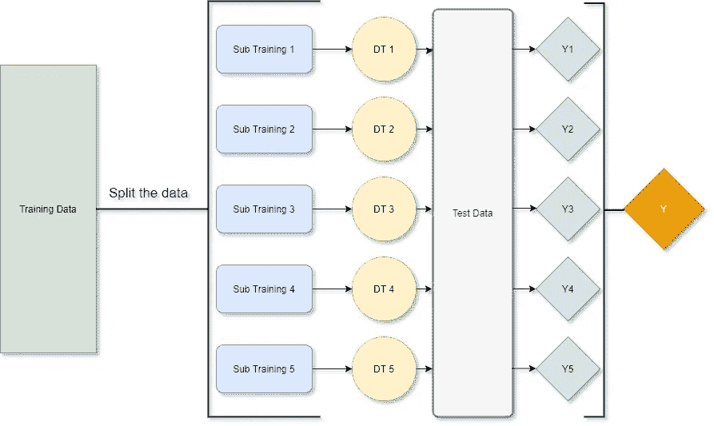

# 简单加权平均集成|机器学习

> 原文：<https://medium.com/analytics-vidhya/simple-weighted-average-ensemble-machine-learning-777824852426?source=collection_archive---------4----------------------->

这是一个关于如何应用加权平均集成来提高预测分数的演练。

> ***本博客的目的***
> 
> 上周，我的一个机器学习课堂作业要求我们通过组合来自各种算法的预测来执行集合预测。我发现这个话题很吸引人。但是网上能简单解释这个概念的资料并不多。所以，我决定写这篇博客给那些正在尽我最大努力寻找**一个简单的解决方案**的人们。
> 
> 在我对这个主题的研究中，我发现在线文章中有许多不同的风格和方法来实际执行预测模型的加权平均。如果你觉得你想更多地了解这个主题，并想更深入地研究他们的演示背后的算法和数学原理，我鼓励你做更多的研究，并阅读那些发表的关于加权平均集成应用的论文。
> 
> 我在网上找到的一篇论文很好地解释了如何在一个案例中应用加权平均系综，这篇论文是由 Nivedhitha Mahendran 和他来自多所大学的队友们完成的。你可以通过这个[链接](https://www.ncbi.nlm.nih.gov/pmc/articles/PMC6891280/)找到文章。

# 内容表

[*简介&一般用法*](#48b7)

[*案例走查*](#d3c0)

[*结论*](#2f01)

# **简介&一般用法**

## 不要把鸡蛋放在一个篮子里

平均集成或加权平均集成的基本思想是通过聚集来自多个不同分类器的预测来减少总误差。基本原理是:我们首先假设每个分类器在训练和预测中都会犯不同的错误。然后，我们生成一组具有多种多样性的分类器，并将它们的输出组合在一起。因此，在我们进行汇总后，最终预测的总误差会有所下降。

这真的很像多元化的概念:你不要把鸡蛋放在一个篮子里。当你将资金投入股市时，你会希望建立一个包含不同行业项目的投资组合。如果一个部门表现不佳，损失将由其他部门的收益来平衡。遭受重大财务损失的风险将会降低。

## 背后的简单数学

假设您有一组五个分类器。假设分类器都是独立的，你会发现它们每个都可能产生 0.2 的误差。集成分类器在一个实例上出错的情况是 5 个分类器中至少有 3 个一起出错(多数投票)。因此，错误预测的概率计算如下:

5 中 3 的组合出问题是 10；

5 中 4 的组合出问题是 5；

而 5 个都出问题的组合就是 1。

如您所见，总误差从 0.2 降至 0.058；然而，当您将更多的分类器添加到组合中时，您应该会遇到瓶颈，错误减少的趋势将趋于平稳。

## 如何直观地实现一个

通常有两种方法。

首先，在训练数据的多个不同子集上训练相同的分类器(例如，决策树)，这导致多个不同的模型(DT1、DT2、DT3、…)。然后，用这些模型预测测试数据，并对结果进行平均(图 1.1)。

图 1.1 蒋金航绘制

第二，你可以用整个训练集训练多个不同的(越多样化越好)分类器，并对结果取平均值(图 1.2)。

图 1.2 蒋金航绘制

点击[此处](#2b07)返回页首。

# 案例走查

## 数据

我用一个五年前发生在 Kaggle 上的案例比赛作为例子，你可能会在这里找到所有的数据和案例描述[。](https://www.kaggle.com/c/homesite-quote-conversion)

基本上，我们需要预测哪个 Homesite 的客户将购买给定的报价。目标变量是二进制的，要么是 0(未购买)，要么是 1(报价已转换)。

我将跳过所有的数据清理部分，因为这不是我们在这个博客的重点。我最终的训练数据有 65000 行× 596 列。我最终的测试数据有 173836 行× 595 列。所有的分类变量都被转换成数字数据。在预测概率和观察目标之间的 ROC 曲线下的[区域对提交进行评估。](http://en.wikipedia.org/wiki/Receiver_operating_characteristic)

## 密码

在这种情况下，我实现了五个模型:

***KNN、MLPC、XGBoost、决策树、随机森林***

我将在不调整任何参数的情况下比较单个分类器和集成分类器之间的结果。

**第一步**:加载所有的库和包(使用“pip install*package _ name*来安装您没有的分类器)

**第二步**:用我们的训练数据拟合每个模型

图 2.1 显示了每个分类器基本性能的 Kaggle 分数。

图 2.1 单个模型的性能

**第三步**:测试平均值和加权平均值法

图 2.2 显示了集合方法的 Kaggle 分数:

图 2.2 集合方法的 Kaggle 分数

如你所见，加权平均集成在这个案例竞争中胜过所有其他分类器。ROC 得分从最差表现(KNN)上升了大约 0.38，这是一个巨大的跳跃。加权平均集成方法甚至优于我们的最佳个体模型(XGB 分类器)0.045。这在任何情况下的竞争中都是一个显著的增加，尤其是当卡格勒人总是喜欢推动极端的时候。

此外，在这段代码中，我根据经验手动为模型分配权重。如果你想知道什么是权重的“最优”决策，这里有一个超参数调整你的集成的指南:[超参数调整 Python 中的加权平均集成](https://jinhangjiang.medium.com/hyperparameter-tuning-the-weighted-average-ensemble-in-python-cff2100f0832)。

点击[此处](#2b07)返回页首。

# 结论

这只是一个关于使用多个不同模型执行加权平均集合预测的超级简单的演练。正如我上面所说的，组合越多样化，结果可能就越好。一个例子是:您可以在组合中添加一些线性回归模型，这样线性回归就有可能捕捉到变量之间的线性关系。

然而，有时候事情并不是这样发展的。这只是五年前的一个例子。许多五年前看起来很难的问题今天会看起来容易得多，因为市场上刚刚出现了更具挑战性的问题。在我处理的一些案例中，无论我尝试多少种不同的权重组合，这种技术都无法超越我最好的个人模型。尽管如此，这个技巧总是帮助我避免过度适应的好方法。

***请随时与我联系***[***LinkedIn***](https://www.linkedin.com/in/jinhangjiang/)***。***

# 相关阅读

[超参数调谐 Python 中的加权平均系综](https://jinhangjiang.medium.com/hyperparameter-tuning-the-weighted-average-ensemble-in-python-cff2100f0832)