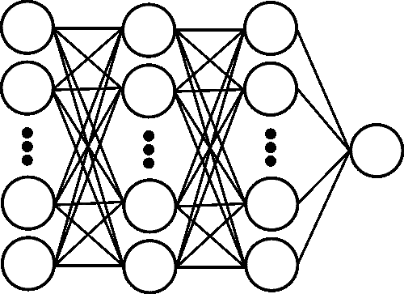
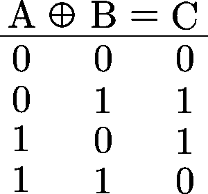
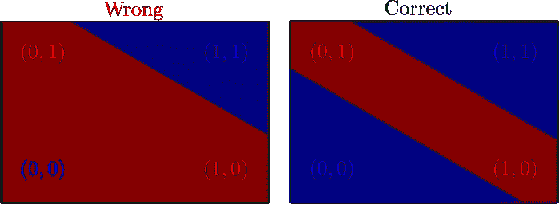

# Keras 中神经网络的最简单介绍

> 原文：<https://medium.com/analytics-vidhya/simplest-introduction-to-neural-networks-in-keras-c6ce8d666461?source=collection_archive---------14----------------------->

## 解决非线性异或问题



神经网络是一种非常有用的工具，可以用来解决许多不同性质的问题，因为它是一种通用的近似方法，T2。在这个世界中，一个好的开始方法是使用一个众所周知的简单神经网络库: [**Keras**](https://keras.io/)

在本文中，将展示解决机器学习和神经网络中最简单的问题之一的最简单的方法。

# 异或问题

首先，XOR 是一个**逻辑运算**，可以用下面的真值表来定义:



异或的真值表。

在给定输入 *A* 和 *B* 的情况下，当情况**不是线性问题**时，使用神经网络来学习该函数如何生成答案 *C* 的巨大动机出现了。

以教导的方式，为了理解说 XOR 问题不是线性的意味着什么，从几何学上看，用笛卡尔平面中的一条**单线**来分隔答案 *0* 和 *1* 是**不可能的:**



这个问题需要不止一条线来聚类答案，它是一个非线性问题。

因此，在实践中，将验证单个神经元( [*感知器*](https://en.wikipedia.org/wiki/Perceptron) ) **不能**解决问题，但是 [DNN](https://en.wikipedia.org/wiki/Deep_learning) **可以**。

# 我们来编码吧！

为了解决这个问题，使用了 **Keras** 神经网络库和 [**numpy**](https://numpy.org/) ，它们都可以使用 **pip** 下载，如下所示:

```
pip install **keras** pip install **numpy**
```

因此可以开始导入这些库:

```
**import** numpy **as** np
**from** keras.models **import** Sequential
**from** keras.layers.core **import** Dense, Dropout, Activation
**from** keras.optimizers **import** SGD
```

为了**训练**神经网络系统，需要定义什么将是**输入向量**和对应的对输入进行分类的**输出向量**。

对于这个问题，输入向量 *x* 被定义为所有 *A* 和 *B* 的可能性，每个可能性有 *1 位*，输出向量 *y* 作为异或答案(查看**真值表**中的 *C* 变量)，

```
x = np.array([[**1**,**0**], [**1**,**1**], [**0**,**1**], [**0**,**0**]])
y = np.array([[**1**], [**0**], [**1**], [**0**]])
```

之后，现在可以描述将用于训练系统的**架构**。由于我们希望简单，我们将比较一个单神经元(*感知器*模型)与一个**两个 ReLU 隐层 DNN** 与 **8** 神经元:

```
model = Sequential()
model.**add**(Dense(**8**, input_dim=**2**))
model.**add**(Activation('**relu**'))
model.**add**(Dense(**8**))
model.**add**(Activation('**relu**'))
model.**add**(Dense(**1**, activation='**sigmoid**'))
```

为了**编译**Keras 模型，损失函数被定义为**二元** **交叉熵**，并且**随机梯度下降**作为**优化器**，以 **0.1** 作为*学习率*系数:

```
sgd = **SGD**(lr=0.1)
model.**compile**(loss='**binary_crossentropy**', optimizer='**sgd**')
```

为了完成实现，使用**1000**历元和**批量 1** 到**拟合**模型:

```
model.**fit**(x, y, epochs=**1000**, batch_size= **1**)
```

要查看实现是否正确，可以让系统**预测**期望的答案:

```
predictions = model.**predict**(x)
**print**(predictions)
```

因此，**的完整代码**将是:

```
"""
Created on Fri Feb 21 02:01:40 2020[@author](http://twitter.com/author): Matheus Farias
"""#importing libraries**from** keras.models import Sequential
**from** keras.layers.core **import** Dense, Dropout, Activation
**from** keras.optimizers **import** SGD
**import** numpy **as** np #defining the input and output training vectorsx = np.array([[**1**,**0**], [**1**,**1**], [**0**,**1**], [**0**,**0**]])
y = np.array([[**1**], [**0**], [**1**], [**0**]]) # defining the keras modelmodel = Sequential()
model.**add**(Dense(**8**, input_dim=**2**))
model.**add**(Activation('**relu**'))
model.**add**(Dense(**8**))
model.**add**(Activation('**relu**'))
model.**add**(Dense(1, activation='**sigmoid**')) # compiling the keras modelsgd = **SGD**(lr=0.1)
model.**compile**(loss='**binary_crossentropy**', optimizer='**sgd**') # fitting the keras model on the training vectors
model.**fit**(x, y, epochs=**1000**, batch_size= **1**) # predicting the desired answerspredictions = model.**predict**(x)
**print**(predictions)
```

# 结果

输出精度如下所示:

```
[[0.9876364 ]
 [0.02138409]
 [0.9333476 ]
 [0.02856272]]
```

这证明了**这个非线性模型解决了问题**。

现在，让我们看看单个神经元，例如，一个线性模型能否解决这个问题。为此，使用了以下模型:

```
model = Sequential()
model.**add**(Dense(1, activation='**sigmoid**'))
```

对于这种新模型，输出精度如下所示:

```
[[0.5178774 ]
 [0.49577093]
 [0.48331842]
 [0.5054262 ]]
```

验证这个问题**不能用线性模型**解决。