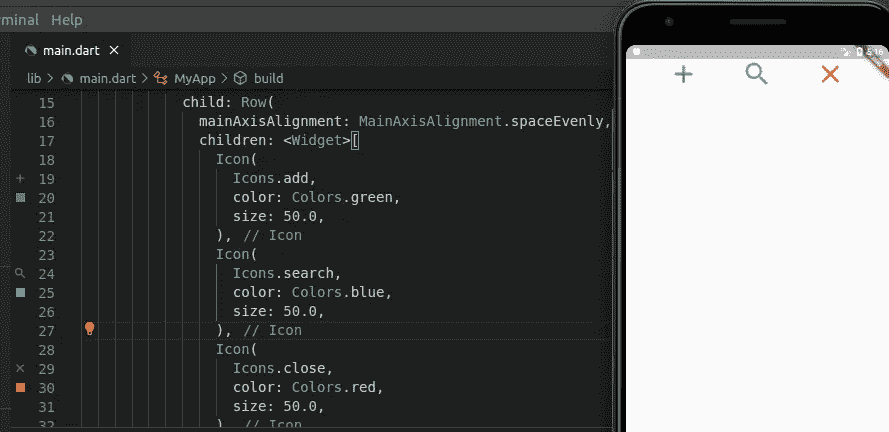
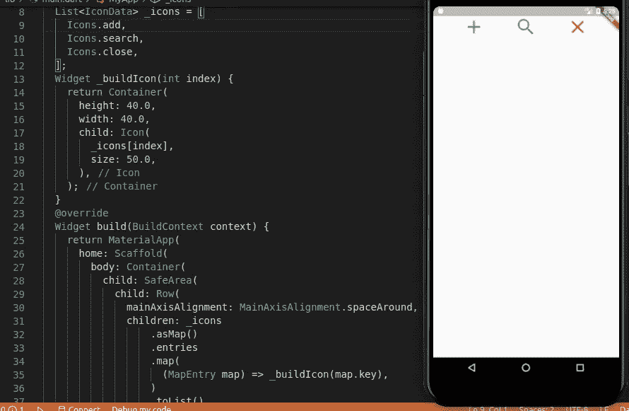

# 在 flutter 中动态创建图标的最简单方法。

> 原文：<https://medium.com/analytics-vidhya/simplest-way-to-create-icons-dynamically-in-flutter-66e0b10984c6?source=collection_archive---------7----------------------->


使用 flutter 时，我们有时需要创建许多具有相似属性的图标。虽然有许多方法可以做到这一点，但我们总是希望使用最佳实践和更有效的方式来编码。让我们看看我们如何能做它。

最简单的方法之一是使用“图标”小工具，在我们的应用程序上绘制图标。下面是一个代码片段，展示了如何按照惯例来做这件事:-

```
return Container(
  child: Row(
   mainAxisAlignment: MainAxisAlignment.spaceEvenly,
   childern: <Widget>[
      Icon(
      Icons.add,
      size: 50.0,
      color: Colors.green,
      ),
      Icon(
      Icons.search,
      size: 50.0,
      color: Colors.blue,
      ),
      Icon(
      Icons.close,
      size: 50.0,
      color: Colors.red,
      ),
    ],
  ),
)
```



如果你想在你的应用程序中添加一些固定数量的图标，这种方法完全没问题。但是如果我们想在不同的容器中有超过 5 个图标呢？如果你想修改图标的一个属性，比如颜色或大小，该怎么办呢？有很多方法可以做到这一点。我发现一个非常有用和简单的方法是使用列表、函数和映射。

使用这种技术，我们只需定义一个创建图标的函数，就可以一次添加多个图标。

为了更容易理解，首先我们创建一个“IconData”列表，它指定了我们想要创建的图标。然后我们创建一个函数，并编写一些我们想要应用到图标上的属性。然后我们把列表做成一个映射，这样我们就可以隐式地遍历列表。让我们先看看列表的代码。

```
List<IconData> _icons = [ 
// The underscore declares a variable as private in dart.Icons.add,
Icons.search,
Icons.close,
];
```

我们已经完成了列表的创建，我们可以添加任意多的图标，但是为了保持这个例子的简单，我在这里只展示了 3 个。下一步是创建一个功能，将建立我们的图标。

```
Widget _buildIcon(int index){
  return Container(
    height: 40.0
    width: 40.0
    child:
      _icons[index],
      size: 50.0,
    )
}
```

我们将把列表中图标的索引传递给函数。在下一步的一行或一列中，我们将把列表转换成地图。使用 map 的目的是使用 iterate 遍历列表项。让我们看看代码

```
return Container(
  child: Row(
    mainAxisAlignment: MainAxisAlignment.spaceAround,
    children: _icons.asMap().entries.map(
      (MapEntry map) => _buildIcon(map.key
    ),
  ).toList(),
),
```



在这里，entries()为我们提供了一个迭代器，我们可以在上面迭代，map()采用了一个匿名函数，在该函数中，我们将 MapEntry 作为引用单个条目的参数进行传递，该函数使用匿名函数中传递的 map 的“key”参数调用 our _buildIcon()。最后，我们再次将该映射转换为一个小部件列表，Row()将接受该列表作为其子对象。这将返回一个包含列表中图标的行。

你可能会觉得这比前一个代码多，但这是一种动态的方式，当我们有多行不同的图标时，这种方式使我们免于“硬编码”。在这种情况下，我们只需要创建另一个图标数据列表，并在函数中传递它，另一行图标就准备好了。你也可以在任何你喜欢的地方应用这个技巧。我希望这篇文章对你有所帮助。

thisArticle ==“发现有用”？hit claps()& & save article():comment below()；