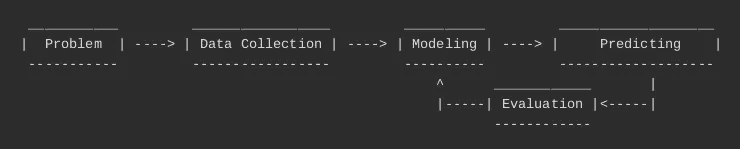

# 使用 Apache 预测 IO 简化机器学习开发流程

> 原文：<https://medium.com/analytics-vidhya/simplify-machine-learning-development-process-with-apache-prediction-io-bbf85e950933?source=collection_archive---------22----------------------->

> 等级:**前进**
> 
> 源代码:[https://github . com/Adrian 3ka/shared-article/tree/master/fraud-detection-model](https://github.com/adrian3ka/shared-article/tree/master/fraud-detection-model)
> 
> 先决条件:
> - **朴素贝叶斯**
> - **Scala** 编程语言
> -**Java**
> -**Docker**
> -**Spark**， **Elasticsearch** ， **Hadoop** (这是可选的，但如果能在生产层面上设置自己的环境就好了)
> - **函数式编程，**

在这个时代，我们实际上有很多问题可以通过机器学习模型来解决。几乎每个问题都有相同的发展周期。在工程开发生命周期中，我们有一个流行的方法来向用户交付我们的产品，叫做 scrum。长话短说 scrum 是一个框架，在这个框架中，人们可以解决复杂的适应性问题，同时富有成效和创造性地交付尽可能高价值的产品。构建机器学习应用程序也有自己的开发生命周期。让我们在下一节抓住它。

建立一个机器学习模型有它自己的模式，在这里我们按照步骤进行:

*   **问题**:通常这部分是来自用户的问题，需要使用自动化程序来解决。自动化程序可以是硬编码系统、规则引擎、可靠的数据管道，还具有已经从数据管道已经提供的属性的分析中导出的模型。作为工程师，我们应该按照正确的顺序正确地构建系统(注意不要在早期阶段过度设计)
*   **数据收集**:正如我之前告诉你的，我们只能先建立一个模型，如果我们已经有一个好的管道。对于这一章，我不会向你解释如何用最佳实践建立一个好的管道。这需要另一篇文章才能解释清楚。因此，您可以保持关注，以全面了解如何构建一个良好的机器学习管道及其模型。基本上，这部分是收集用于建模步骤的数据。
*   建模:如果你(作为工程师)已经决定我们的系统已经准备好进入这一步，这就是开发的一部分。通常，数据收集可能需要 2-3 个月的时间，以确保数据已经稳定且收集良好。因此，我们可以掌握它(不要构建我们在早期阶段无法掌握的模型)。在这一部分中，我们可以与数据科学家一起详细说明，或者作为一名工程师，您可以通过做一个黑盒开发系统来定义自己的模型。实际上，黑盒是一个不错的系统，我会在另一篇文章中介绍它。关于黑盒的一个简单的中间环节是你开发一个模型，你真的不需要知道盒子(系统)内部的计算，但是它会神奇地为你定义一个伟大的输出。
*   **预测**:每个机器学习模型的目标都是预测具有相关/相同属性的其他数据输入的结果(包括评分、分类、标记等)。预测输入参数，实际上包括转换为正确的数据类型。例如，我们使用朴素贝叶斯作为模型预测器。您应该将枚举数据类型转换为数值(int / double)数据类型，以便预测器可以很好地处理它。这种方法称为编码，编码可以分为 ***一热编码*** 或 ***数据类型编码*** 。

> **一次热编码**:将示例枚举器中不可操作的数据类型转换为可操作(机器可读)的数据类型。这种编码试图将数据集中值的可能性转换为二进制模式。在示例中，有一个数据类型 CustomerPreferenceEnum 作为电子商务行业环境中模型的一个属性。我们希望建立一个模型来预测将出售给当前登录用户的潜在商品。客户首选项的可能性包括:
> 
> -音乐
> 
> -技术
> 
> -运动
> 
> 这些是不可分级变量(也许在某些行业中是可分级的)，所以我们应该使用一个热编码对其进行编码。背后的基本原因我们不能说音乐高于科技或体育，这只是一个偏好问题。
> 
> ***数据类型编码*** :这些属性在其上下文中是可分级的。这种编码会将数据编码成标准的数字类型。在示例中，我们有 CustomerLoyaltyLevelEnum 数据类型。可能性包括:
> 
> -基本
> 
> -银的
> 
> -黄金
> 
> -铂金
> 
> 我们可以将其编码为基本(1.0)、银(2.0)、金(3.0)、铂(4.0)。

> 为了清楚起见，我将尝试举一个关于客户属性的例子:
> 
> -客户年龄账户(整数):8 个月
> 
> -客户工资(整数):8.000.000
> 
> -客户忠诚度级别(CustomerLoyaltyLevelEnum):银牌
> 
> -客户偏好(CustomerPreferenceEnum):技术
> 
> 因此，根据上面的数据，我们可以将其编码为 JSON 格式:

```
{
  "ageAccount": 8,
  "salary": 8000000,
  "loyaltyLevel": 2.0,
  "preferenceMusic": 0,
  "preferenceTechnology": 1,
  "preferenceSport": 0
}
```

> 正如我们看到的，我们应该使用二进制模式对偏好进行编码，因为它是不可分级的。如果您将该值标记为可分级值，模型会以不同的方式处理它。

*   **评估**:应该对每个模型进行评估，以提高其性能和准确性。在此阶段，我们尝试分析当前模型。之后，我们将尝试(重新)建模，以达到最高的准确性。

从上面的解释中，我们可以得出结论，该模式可以构建成下面的流程图:



机器学习开发生命周期

由于我们已经找到了开发模式，我们可以使用 Apache Prediction IO 作为要使用的开发框架

为了解决我们目前的现实生活问题，因为 Apache 预测 IO 适应这种模式使用了 **DASE** 模式。

*   **【D】**数据源和数据准备器:数据源从输入源读取数据，并将其转换成所需的格式。数据准备程序对数据进行预处理，并将其转发给模型训练算法。
*   **【A】**算法组件:算法组件包括机器学习算法及其参数设置，确定如何构建预测模型。
*   erving:服务组件接受预测查询并返回预测结果。如果引擎有多个算法，服务器会将结果合并为一个。此外，可以在服务中添加特定于业务的逻辑，以进一步定制最终返回的结果。
*   **【E】**评价指标:评价指标用数值分数量化预测精度。它可用于比较算法或算法参数设置。

在本例中，我们尝试根据已经从种子数据源收集的数据(无论是来自数据库、excel、文本文件还是其他任何东西)为我们的公司构建欺诈检测模型。本案想侦破转账骗局。也许我们可以说，转账骗局是指欺诈者伪装成一个虚假的慈善机构，与不知情的受害者联系，说服他们将钱作为捐款转移到不存在的慈善机构的银行账户。

在我们进行下一步之前(我保证这是最后一篇很长的专门解释),最好对朴素贝叶斯有一点了解，因为我们想用它作为我们的预测模型。朴素贝叶斯是一种构造分类器的简单技术:将类别标签分配给问题实例的模型，表示为特征值的向量，其中类别标签来自某个有限集。不存在用于训练这种分类器的单一算法，而是基于共同原则的一系列算法:所有朴素贝叶斯分类器假定给定类变量，特定特征的值独立于任何其他特征的值。例如，如果一个水果是红色的，圆形的，直径大约 10 厘米，那么它可以被认为是苹果。朴素贝叶斯分类器认为这些特征中的每一个都独立地影响该水果是苹果的概率，而不考虑颜色、圆度和直径特征之间的任何可能的相关性。

回到主题，假设一位专业数据科学家已经决定我们的模型由 5 个参数组成，或者我们可以说它是 5 个特征。这些是:

*   事务速度[ **transactionVelocity** ]:在上一个会话或窗口中发生了多少事务。
*   交易总值[ **gtv** ]:交易中发生的任何金额的总和，无论是现金收入还是现金支出。
*   相关账户合计[ **relatedAccount** ]:在这种情况下，我们可以说是上一个窗口交易中的相关账户。
*   账户月龄[ **账户月龄** ]:这些特征表明账户已经在我们的平台上存在了多长时间。
*   卡类型[ **卡类型** ]:这些特征告诉用户卡的类型是[ **银** / **金** / **白金**

# 软件开发工具包(Software Development Kit)

我将尝试覆盖 scala 语言的预测 IO SDK，因为目前预测 IO 只在 Scala 语言中可用。如果你已经有 java 编程语言的经验，加分，因为我们在 java 中的类/包可以在 scala 语言中重用。

# 代码解释

在 PredictionIO 中，我们应该定义文件`engine.json`来定义我们想要使用的算法及其超参数，以及要运行的主引擎类。这个框架需要的另一个文件是`template.json`文件，它包含关于运行指定模型的最低 pio 版本的信息。

好的，让我们从已经在`engine.json`中定义的主类开始。在`FraudDetectionModelEngine`中，我们应该覆盖`EngineFactory`类中的`apply`函数。

```
def apply() = {
    new Engine(
      classOf[DataSource],
      classOf[Preparator],
      Map("naive" -> classOf[NaiveBayesAlgorithm]),
      classOf[Serving])
  }
```

正如我们已经看到的，组件包括:

*   **DataSource** :这个类的职责是提供事件资源中已经存在的数据。数据源从事件服务器的数据存储中读取数据，然后数据准备程序为朴素贝叶斯算法准备 *RDD【标签点】*。
*   **准备人**:数据准备人是发生预处理动作的地方。例如，一个人可能想要从训练数据中移除一些非常受欢迎的项目，因为她认为这些项目可能无法帮助找到个人的口味，或者一个人可能有一个项目黑名单，她想要在将训练数据馈送给算法之前从训练数据中移除这些项目。至于代码，`prepare`方法只是将评级从 *TrainingData* 传递到 *PreparedData* 。
*   **算法图**:引擎要使用的可用算法。`naive`来自`engine.json`文件，它驻留在`algorithms`属性中。每个算法类，例如`NaiveBayesAlgorithm`类应该覆盖`train`和`predict`函数。正如我们从它的名字所期望的那样，它们将完成训练和预测模型的工作，为了更好地理解幕后的情况，您必须学习朴素贝叶斯算法(如果您刚刚开始学习这一部分，您可以在上面的部分找到简单的解释)。
*   **服务**:服务组件是后处理发生的地方。例如，如果用户有超过 20 亿的交易，我们希望将决策作为`SUSPICIOUS`返回给客户端。在这种情况下，您可以将它与您的硬编码规则或来自业务或非工程用户的任何其他规则引擎结合起来。相信我，这种情况会存在于现实生活中的例子。

# 模型培训和部署

我知道你已经想跳到主要部分了，所以你可以从我已经准备好的 docker 开始。只需运行下面的命令:

```
docker run -it -p 8001:8000 -p 7071:7070 adrian3ka/pio:0.0.2 /bin/bash
pio-start-all
```

请等待 10 到 30 秒，让发动机先预热。如果过早检查，可能会得到一些错误消息。要检查发动机是否准备就绪，您可以:

```
pio status
```

上述命令的预期结果是:

```
[INFO] [Management$] Your system is all ready to go.
```

pio 引擎已经启动后，我们就可以开始导入数据了。在我们继续之前，最好先了解一下将要导入的数据。数据保存在`data/data.txt`文件中。每行代表一个事件及其结果。在示例中:

```
FRAUDSTER,10 165000000 1 3 GOLD
```

根据以上数据，您可以说事务处理具有属性:

*   交易速度`10`
*   gtv `165000000`
*   相关账户`1`
*   会计`3`
*   卡片类型`GOLD`

是来自`FRAUDSTER`用户的交易。

在我们进入源代码解释和数据集导入之前，我们应该首先准备好环境:

```
export FRAUD_MODEL_KEY=fraud-detection-modelpio app new FraudDetectionModel --access-key=${FRAUD_MODEL_KEY}pio app list
```

返回到该目录的主机(您的计算机)文件夹。首先我们需要用下面的命令构建 Scala jar:

```
sbt package
```

使用下面的命令将包括 Jar 在内的所有源代码复制到 Docker:

```
docker container ls # copy paste the container id to the next line
export SPARK_CONTAINER_ID=bc07c00d3370
docker cp ./ ${SPARK_CONTAINER_ID}:/fraud-detection-model
```

要将所有数据导入服务器，我们可以运行以下命令:

```
cd fraud-detection-modelpython data/import_eventserver.py --access_key $FRAUD_MODEL_KEY
```

要检查导入是否成功，请执行下面的命令:您可以通过 curl 获得所有数据:

```
curl  -X GET "http://localhost:7070/events.json?accessKey=$FRAUD_MODEL_KEY&limit=-1" | jq
```

在我们确保正确获取所有事件后，我们可以前进到下一步，即训练和部署模型。您可以通过键入以下命令来简单地部署它:

```
pio build --verbose
pio train
pio deploy
```

要检查是否正确构建和训练了引擎，我们可以通过打开一个新标签，让 docker 之外的本机笔记本电脑/服务器上的 *curl* 进行验证。

下面的卷曲应返回**欺诈者**:

```
curl -H "Content-Type: application/json" -d \
'{ "transactionVelocity":10, "gtv":165000000, "relatedAccount":1, "accountAge": 3, "cardType": "GOLD" }'\
http://localhost:8001/queries.json
```

下面的卷曲应该返回**安全**:

```
curl -H "Content-Type: application/json" -d \
'{ "transactionVelocity":1, "gtv":450000, "relatedAccount":1, "accountAge": 9, "cardType": "SILVER" }' \
http://localhost:8001/queries.json
```

下面的卷曲应返回**可疑**:

```
curl -H "Content-Type: application/json" -d \
'{ "transactionVelocity":4, "gtv":135000000, "relatedAccount":1, "accountAge": 96, "cardType": "PLATINUM" }' \
http://localhost:8001/queries.json
```

下面的 curl 应该返回**可疑的**，实际上它是返回**安全的**，但是我们在`Serving`组件中添加了一些硬编码的规则

```
curl -H "Content-Type: application/json" -d \
'{ "transactionVelocity":6, "gtv":2000000001, "relatedAccount":6, "accountAge": 108, "cardType": "PLATINUM" }' \
http://localhost:8001/queries.json
```

因此，从上面的模型中，我们可以尝试一些其他的可能性，你应该提供更多的数据以获得更好的结果。因此，从这里开始，您已经可以部署和构建自己的模型了。我认为它现在已经足够长了，我将在另一篇文章中讨论单元测试和评估部分。

参考资料:

*   https://www.scrum.org/resources/what-is-scrum 于 2020 年 7 月 12 日进入。
*   https://predictionio.apache.org/号于 2020 年 7 月 12 日进入。
*   https://en . Wikipedia . org/wiki/Naive _ Bayes _ classifier #:~:text = In % 20 statistics % 2C % 20Na % C3 % AFve % 20 Bayes % 20 classifiers，the % 20 simplest % 20 Bayes % 20 network % 20 models 于 2020 年 7 月 12 日访问。