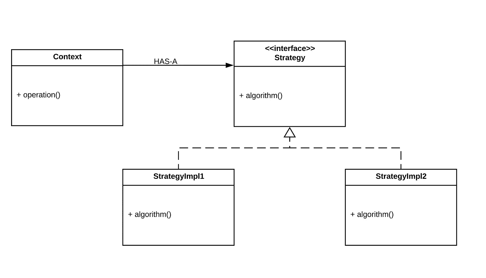
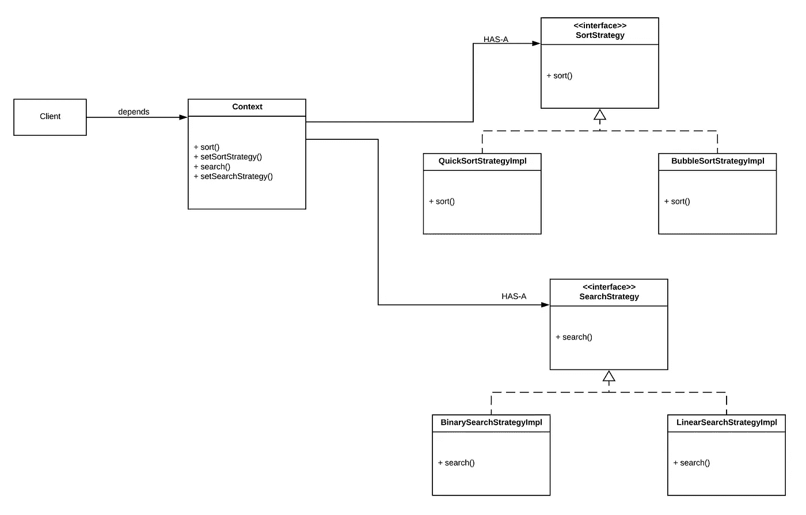

# 使用 Lambda 表达式简化策略模式

> 原文：<https://medium.com/analytics-vidhya/simplify-strategy-using-lambda-expression-40195d1445ea?source=collection_archive---------1----------------------->


照片由[JESHOOTS.COM](https://unsplash.com/@jeshoots?utm_source=unsplash&utm_medium=referral&utm_content=creditCopyText)在 [Unsplash](https://unsplash.com/s/photos/strategy?utm_source=unsplash&utm_medium=referral&utm_content=creditCopyText) 上拍摄

# 1.介绍

策略设计模式是软件开发世界中使用最广泛的模式之一。在本文中，我们将学习策略设计模式，何时使用，何时不使用，我们如何利用该模式使我们的设计更加灵活？我们将看到一个例子，说明如何在有和没有 lambdas 的情况下实现它。

# 2.战略设计模式

## 2.1 定义

为了节省你搜索维基百科的时间，下面是定义:

> **策略模式**(也称为**策略模式**)是一个[行为](https://en.wikipedia.org/wiki/Behavioral_design_pattern) [软件设计模式](https://en.wikipedia.org/wiki/Design_pattern_(computer_science))，它允许在运行时选择一个[算法](https://en.wikipedia.org/wiki/Algorithm)。代码不是直接实现单个算法，而是接收运行时指令，以决定使用哪一组算法。策略让算法独立于使用它的客户端而变化。

策略模式的思想是定义一个算法家族，将不同的封装到不同的类中，并使它们的对象在上下文中可以互换。此处的“变化”是指:可能会因不断发展的需求而随时间发生变化。

## 2.2 UML 图



策略设计模式的 UML 类图示例

`Context`类不实现任何策略(算法)。相反，它维护一个对`Strategy`接口的引用。`Context`类不关心那些算法的实现。它只知道能执行那些算法！

`StrategyImpl1`和`StrategyImpl2`实现`Strategy`接口，意思是实现并封装一个算法。

## 2.3 何时使用/避免策略模式

当您想要:

*   在一个对象中使用不同的算法，并且能够在运行时从一种算法切换到另一种算法。
*   对客户端隐藏算法的无关实现细节。通过使用依赖注入机制，实现在运行时被注入到客户端。
*   用一行方法调用替换大量的条件语句。请注意，委托在这里起着重要的作用，因为这一行方法将在运行时基于引用类型调用适当的实现([动态分派](https://en.wikipedia.org/wiki/Dynamic_dispatch)！).
*   用合成代替继承

当你的算法很少改变时，避免使用策略模式，没有必要用伴随模式而来的新类和接口来过度设计程序

## 2.4 行动中的经典战略

在这个例子中，我将向您展示如何用 Java 实现经典的策略模式。这个例子模拟了一个使用各种算法(或策略)对列表进行排序和搜索的虚拟程序。从这里开始是我们的小演示的类图:



注意，`Client`类依赖于`Context`和一些策略实现(我没有画 we，因为我们不想在这里有意大利面条)。这是我们演示的实现(虚拟):

输出:

```
List sorted using Bubble sort implementation
list is binary searched
---------------
List sorted using Quick sort implementation
list is linearly searched
```

`Context` 类只依赖于声明策略的接口、`SortStrategy`和`SearchStrategy`。它不关心那些接口的实现。`BubbleSortStrategyImpl`和`BinarySearchStrategyImpl`分别是实现这些接口的类。正如我们之前所说，它们实现并封装了策略(算法)。

例如，在第 75 行，这些实现被客户端注入到`Context`类中。所以当我们在运行时调用`context.sort(list)`和`context.search(“b”)`时，上下文将知道执行哪个实现(多态性)。

注意类`Context`公开了 setters，让客户端在运行时替换与上下文相关的策略实现(记住:策略让算法独立于使用它的客户端而变化)。

假设我们有另一个需求来添加另一个排序或搜索策略实现，我们可以通过实现适当的策略接口来添加它，而无需更改任何现有的代码。**可以看到，策略设计模式推广了开放/封闭原则**。

# 3.Lambda 表达式和策略模式

## 3.1 概述

Lambda 表达式改变了 Java 的世界，我们可以有效地使用 lambda 表达式来避免编写大量礼仪性的代码。

就策略设计模式而言，我们不必创建类的层次结构。相反，我们可以将接口的策略实现作为 lambda 表达式直接传递给上下文。

## 3.2 战略简化

上面的代码很冗长，对于一个简单的算法来说，它有很多仪式。我们可以利用 lambda 表达式来减少代码的冗长。使用 lambda，我们可以在一组函数对象中实现不同版本的算法，而不会用额外的类来增加代码。

在这个演示中，我们将重构代码以使用 lambda 表达式来避免创建自定义接口和类。这是重构的实现(虚拟)代码:

注意我没有创建任何接口，因为我使用了来自`java.util.function`包的功能接口。

输出与之前相同。但是需要注意的重要一点是，我并没有创建类和接口来实现这个策略。我所使用的是用`[Consumer](https://docs.oracle.com/en/java/javase/11/docs/api/java.base/java/util/function/Consumer.html)`和`[Function](https://docs.oracle.com/en/java/javase/11/docs/api/java.base/java/util/function/Function.html)`接口组合`Context`类，并且我已经创建了 setters，所以我可以在运行时改变策略行为。

在客户端，我将实现([函数对象](https://en.wikipedia.org/wiki/Function_object))传递给`Context`类。

# 4.结论

在本文中，我们看到了策略设计模式的定义，以及如何使用它来提高设计的灵活性。我们还学习了策略模式的经典实现，以及使用 Java 8 特性的实现。在下一篇文章中，将会有更多的核心 Java。敬请期待！

请在下面的评论中告诉我们你的想法，别忘了分享哦！