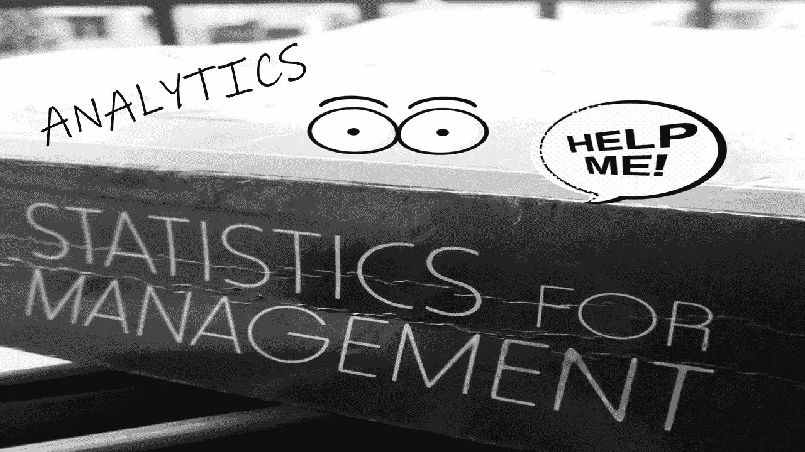
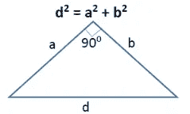

# 简化对日常事件的分析

> 原文：<https://medium.com/analytics-vidhya/simplifying-analytics-from-day-to-day-event-2b57a64275e?source=collection_archive---------13----------------------->

Rohan，Charan 和 Sanju 正在读一所城市学院(不是 A 级学院)的 MBA。而 Rohan 的数学高于平均水平，他在一所私立工程学院完成了工程设计。查兰和桑吉对数学这门学科怕得要命。分析作为行业中所需的重要技能之一出现，并在几家大公司获得了大量使用相同技术的新闻，这使他们对这个主题垂涎三尺，但问题在于理解这个主题。Rohan 可以在某种程度上掌握一些与这个主题相关的东西，如果给予适当的指导和更多关于这个主题的积极接触，他可以提高，但其他两个朋友在讲座中数羊，几乎只给了梦想在公司担任传统角色的希望。

查兰和三菊的生活到底出了什么问题？他们不懂数学/统计是不是犯了罪？也许不是，至少我不这么认为，我觉得他们失去了兴趣并放弃了，因为他们因为害怕数学和统计学而无法理解基础知识。都是同样的人问在现实生活中没见过(a + b ) 2 的用法。至少我找到了同样的用法，它帮助我得到了 17 的平方的值，除了把它放大——

很多人会嘲笑这个例子，但我发现这很有用，因为我不能长时间记忆东西，所以我可能要花更多的时间来找出 17 的平方的值，但我明白了。下次当有人问你这些数学公式的用法时，你可以回答他们，它们在生活中不利的条件下使用，也许你没有让自己陷入生活中的困境，因为你没有冒险，所以你问我这些问题。玩笑归玩笑，让我们以一些日常生活事件为例，尝试理解分析的应用，然后参考其商业应用。

在去同之前，让我们更熟悉什么是方程；让我们不要遵循书本上的定义。方程式是任何现象或事件结果的数学表示。让我们以一种更幼稚的方式来探究它，许多人在他们的学校里已经研究过什么是毕达哥拉斯定理:

要找出你房间的对角线长度，你需要用给定的公式拟合你房间两边的长度。所以，如果你知道你房间两个相邻边的长度，你就可以求出你房间的对角线长度。电视、笔记本电脑、手机等屏幕的尺寸。在不同的网站是对角线长度，所以你知道你可以用这些长度做什么。

许多人都知道抛硬币的概率理论。扔硬币是一个事件，它的结果用概率公式或概率方程来表示

Head 概率= Head 结果数/总结果数

可以看出，一个事件如何能够用数学形式来表示，以预测其结果。我们不要想我们是如何得到公式的，因为推导公式是完全不同的部分，让我们把它留给数学家和该领域的专家，并专注于如何将他们的发现应用到现实生活中，否则许多分析专家会称之为模型。

让我们采取简单的回归，并把它的应用与我们生活中的一些事件和决策结合起来。在继续之前，让我们试着用一种简单的方式来回答为什么使用回归？它的用途是建立一个模型或公式，试图预测一个结果，因为有几个原因会影响结果，就像扔硬币的结果会受到硬币两边的影响，或者直角三角形对角线的长度取决于其他两边的长度。在简单(二项式或多项式)回归中，我们可以通过建立一个数学方程来建立结果和影响它们的因变量之间的关系，所有这些都包含在其中。

您一定见过这个等式，它最常见的形式是

我们知道，健康人的体重受食物摄入量、锻炼时间、饮水量、睡眠时间等因素的影响。如果我说，一个简单的生活事件，如测量你的体重随运动时间、食物摄入量、水摄入量、睡眠时间等的变化，可以用数学方程的形式来表示，你会怎么想？让我们不要混淆，而是将这个体重与之前的毕达哥拉斯定理和抛硬币概率的公式联系起来。所有方程的左手边都代表结果，或者我们想知道的抛硬币后的结果，三角形对角线的长度，在我们最后的回归案例中，是体重，用 y 表示。右手边包含所有变量的值，直接影响 X1 表示的结果。 X2……就像三角形两条相邻边的长度，硬币的两面，在最后一种情况下，它们是锻炼时间、食物摄入量、水摄入量、睡眠时间，还可以有更多，你包含的变量越多，方程就越长，获得更准确结果的机会就越大，但可能会变得更复杂。 你一定在想 C，a，b，c …是什么，C 被称为常数，a，b，c…被称为系数，这是我们在前面描述的统计工具中处理数据后得到的。

那么如何做到这一点呢？你需要在一定的时间内每天测量并记下你的体重——比如 6 个月，以及其他变量的值，如运动时间、食物摄入量、水摄入量、睡眠时间。现在，您可以使用任何统计工具(如 SPSS)或编程工具(如 python，R)收集的这些数据，但最简单的方法是使用 Microsoft Excel。互联网上有很多博客和视频，你可以在那里学习如何使用这些工具进行回归，你只需要按照显示的方法去做，不需要你的大脑为此进行太多的练习。这些工具就像机器一样，你向它们输入数据，如果操作得当，它们会向你输出这些数学方程或模型。运行这个过程后，你会发现你的体重与其他活动之间的简单关系，这种关系直接影响你的体重，如最后一个等式 Y = C + a*X1 所示…..你会得到 C，a，b，C 的值…

你会发现最有趣的事情是，如果你已经能够正确地建立方程，那么你可以预测你的体重与那些考虑的可靠活动的变化。你可以看到这里的乐趣，并可以使用这个方程或模型来控制你的体重在未来。如果你将学习逻辑回归，那么你可以建立一个模型，这将有助于了解你自己的购买决定，你可以准确地了解哪个因素更影响你购买任何产品。如果你有 Y 和 X1，X2 的过去的数据，你可以从你的生活中预测许多这样的事情，也就是说，你知道要找什么，以及影响那个要求的是什么。

现在，一个管理者如何在组织的日常工作中运用这些技能呢？

销售经理可以建立一个回归方程，用几个影响产品销售的变量来预测其产品的销售，例如肥皂的销售受价格、竞争对手的价格、折扣、免费供应、可用性等的影响。现在你知道 Y 或者产量是销售额，其他描述的东西是因变量。建立模型后，他可以使用数学公式预测不久的将来的销售额。有许多这样的技术和理论可以用来开发模型，以预测他们的产品是否会被购买，可以确定应该报什么价格，他们的目标细分市场喜欢的产品特征应该是什么，等等。

任何投资公司都可以使用分析来建立这样的模型，以预测股票市场的运动，并决定是否投资任何公司，不同的财务模型可以帮助您以更符合逻辑的方式做出财务决策。

人力资源经理可以建立一个模型来了解培训需求，该模型基于为了解员工生产率等而建立的模型。他们是否会加入他们的组织或拒绝提供，类似的模型，以预测保留和更多。

即使在重要的大型拍卖中，购买或离开的决定也是由分析指导的，还记得大联盟中球员的拍卖吗？许多球员、球队、教练也在使用分析工具来改进比赛。

你一定注意到了一些公司如何根据你过去的搜索在网上给你的搜索添加一些广告，以及一些公司如何根据你的要求给你的屏幕添加广告。一些服务和产品的价格在他们的网络应用程序中是如何随时间变化的？你是否嗅到了分析在其中的重要作用？

当数据量很小时，可以使用 Excel 和 SPSS 等工具，但当处理大量数据时，就需要使用更高级的工具，如 Python、R、SQL 等。现在认为这些数据是由计算机使用这些分析工具收集和操纵的，这里出现了机器学习和人工智能。你在要求你的计算机或机器用收集到的数据集给你一个解决方案。这就是世界正在变成的样子。

这些解释和例子可能有助于减少对数学、统计、数字和大公式的恐惧。如果它真的帮助你大致了解了在分析中可以做些什么，那么不要停下来探索更多关于这个领域的知识，从统计开始。如果读完这篇文章后，你的恐惧减少了一丁点，那么相信我，你可以克服这个问题上的许多障碍。你只需要避开犹豫，继续探索，信息就在你的指尖，在这个世界上。下次当你开始考虑任何事件的任何结果时，也要花更多的时间去考虑影响它们的因素/变量，这样你在做决策时会更有分析性。

如果你还怀疑，那么从这个开始——你需要通过你右手的输入变量找到你左手的输出。