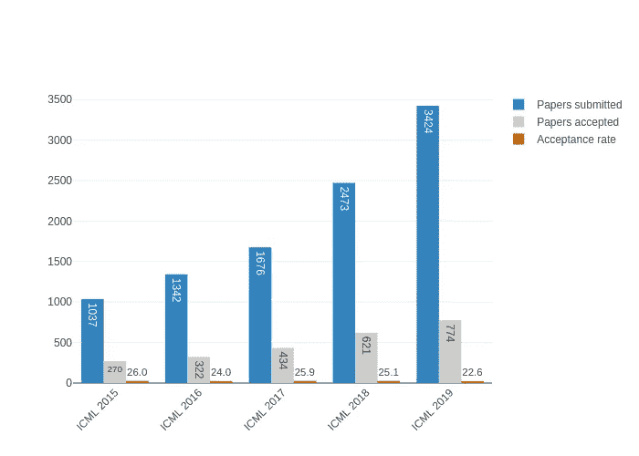
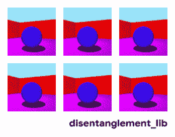
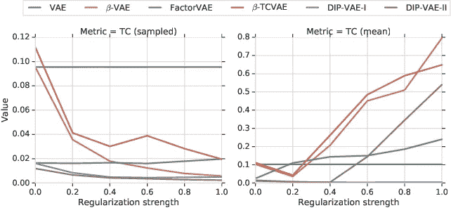
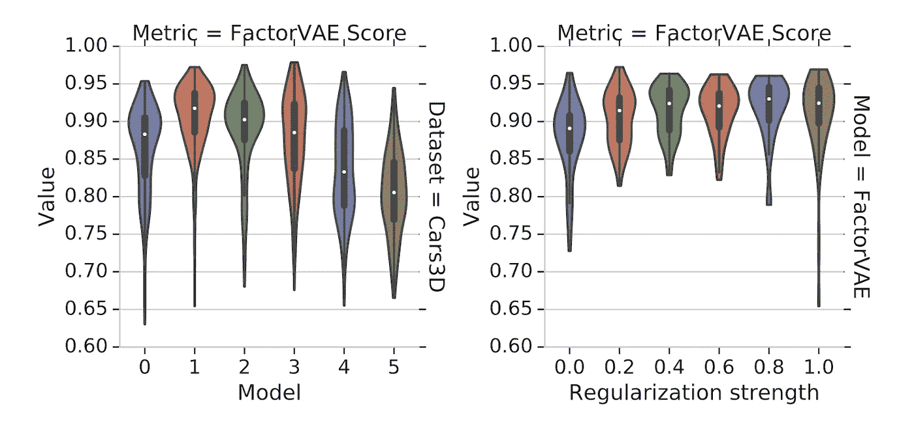
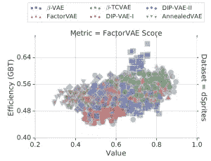

# 简化谷歌人工智能在 ICML 2019 年关于无监督学习的最佳论文

> 原文：<https://medium.com/analytics-vidhya/simplifying-google-ais-best-paper-at-icml-2019-on-unsupervised-learning-70694ff4a7a4?source=collection_archive---------0----------------------->

# 介绍

吸引该领域顶尖大脑的[机器学习大会](https://www.analyticsvidhya.com/datahack-summit-2019/?utm_source=blog&utm_medium=simplifying-google-ai-best-paper-icml-2019)全球屈指可数。一个这样的会议，我是一个狂热的追随者，是机器学习国际会议(ICML)。

来自顶级[机器学习](https://courses.analyticsvidhya.com/courses/applied-machine-learning-beginner-to-professional?utm_source=blog&utm_medium=simplifying-google-ai-best-paper-icml-2019)研究公司的人，如谷歌人工智能、脸书、优步等。一起展示他们的最新研究。这是任何数据科学家都不想错过的会议。

上周在美国南加州举行的 2019 年 ICML 奥运会上，记录以令人震惊的方式被打破。收到的论文数量和会议接受的论文数量都打破了以往的记录。看看这些数字:

一个精心挑选的评委小组负责从这份名单中选出最好的论文。获得这个最佳论文奖是一个很有声望的成就——研究界的每个人都为之奋斗！

解密这些来自 2019 年 ICML 的最佳论文让我大开眼界。我喜欢浏览这些论文并分解它们，这样我们的社区也可以参与机器学习中最热门的事情。

在这篇文章中，我们将看看 2019 年 ICML 大会上谷歌人工智能的最佳论文。人们非常关注无监督学习，所以有很多东西需要解开。让我们开始吧。

***你也可以在这里查看我的文章***[***【ICLR 2019 最佳论文】***](https://www.analyticsvidhya.com/blog/2019/05/best-papers-iclr-2019/) ***。***

# 2019 年 ICML 最佳论文奖授予:

我们的主要关注点是谷歌人工智能团队的第一篇论文。因此，让我们看看谷歌为我们的社区提出了什么。

*注意:在深入本文之前，您应该了解某些无监督的深度学习概念。如果你需要快速复习，我建议你先浏览下面的指南:*

让我们首先了解什么是无纠缠的表示。以下是谷歌人工智能对这一概念的简洁而简单的定义:

> 理解高维数据，并以无监督的方式将这些知识提取为有用的表示的能力，仍然是深度学习中的一个关键挑战。解决这些挑战的一种方法是通过解开表征*，模型捕捉给定场景的独立特征，如果一个特征发生变化，其他特征不受影响。—谷歌人工智能*

正如论文所言，在表征学习中，人们通常假设现实世界的观察 **x，**像图像或视频，是通过两步生成过程生成的:

*   第一步包括从分布 *P(z)* 中取样多元潜在随机变量 *z* 。直观上，这个随机变量对应于观察值变化的语义上有意义的因素
*   在第二步中，从条件分布 *P(x|z)* 中采样观察值 *x*

换句话说，映射到高维观察空间的低维实体可以用来解释高维观察。

# 本文的目的

> *本研究的目的是指出未来工作的改进领域，以使无监督的解缠结方法更好。*

作者发布了**一项针对七个不同数据集的可重复的大规模实验研究，其中包括 12，000 个经过训练的模型，涵盖了最著名的方法和评估指标。**

目前还没有一个被广泛接受的正式的概念。因此，关键的直觉是，一个清晰的表示应该将数据中不同的、信息丰富的因素分开。

# 当前最先进的方法

当前最先进的无监督解纠缠学习方法主要基于变分自动编码器(VAEs)。在潜在空间上假设一个特定的分布 *P(z)* ，然后使用深度神经网络来参数化条件概率 *P(x|z)* 。

类似地，使用变分分布 *Q(z|x)* 来近似分布 *P(z|x)* 。然后通过最小化负对数似然的合适近似值来训练该模型。

# 本文对该领域的贡献

谷歌人工智能研究人员已经挑战了该领域普遍持有的假设。我将他们的贡献总结如下:

*   当前的方法和它们的归纳偏差在一个可重复的大规模实验研究中进行了调查，该研究采用了一个用于无监督解缠结学习的合理的实验方案。研究人员:
*   实施了 6 种最新的无监督解缠结学习方法
*   从零开始创造了 6 个解决方法
*   在七个不同的数据集上训练了超过 12，000 个模型
*   他们发布了一个新的库**distanglement _ lib**来训练和评估解开的表示。由于结果的产生需要大量的计算工作，该团队还发布了超过 10，000 个经过训练的模型，这些模型可以用作未来研究的基线

*shapes 3d 数据集的地面真实因素的可视化:地板颜色(左上)、墙壁颜色(中上)、对象颜色(右上)、对象大小(左下)、对象形状(中下)和摄像机角度(右下)*

*   谷歌人工智能团队考虑的所有方法都被证明是有效的，可以确保聚合后验概率(被采样)的各个维度不相关。然而，他们观察到表征的维度(取平均值)实际上是相关的
*   他们没有发现证据表明所考虑的模型可以作为随机种子以无监督的方式可靠地学习解开的表示
*   **超参数似乎比模型选择更重要。**此外，即使我们被允许跨数据集传递良好的超参数值，如果无法访问真实标签，训练有素的模型似乎也无法被识别
*   对于所考虑的模型和数据集，团队无法验证解开对下游任务有用的假设

# Google AI 提出的实验设计

我从报纸本身中摘录了这一节。如果你有任何疑问，你可以在文章下面的评论区联系我，我很乐意为你解答。

**考虑方法**:

所有考虑的方法都用某种正则化方法来增加 VAE(变分自动编码器)损失。

*   **β-VAE** 在普通 VAEs 的 KL 正则化子前面引入了一个超参数来限制 VAE 瓶颈的容量
*   **anneal advae**逐渐增加瓶颈容量，以便编码器可以一次专注于学习一个变化因素(对小重构误差贡献最大的因素)
*   **因子**和 **β-TCVAE** 分别惩罚对抗性训练或易处理但有偏差的蒙特卡罗估计的总相关性
*   **迪普-VAE-I** 和**迪普-VAE-II** 都惩罚聚合后验概率和分解后验概率之间的不匹配

**考虑的指标:**

*   **BetaVAE** 度量将解缠结测量为线性分类器的准确度，该线性分类器预测固定变化因子的指数
*   **互信息间隙(MIG)** 为每个变化因素测量在 *r(x)* 中最高和第二高坐标之间的归一化互信息间隙
*   里奇韦&莫泽尔的**解纠缠度量计算通过标准化学习表示的每个维度的重要性获得的分布的熵，用于预测变异因子的值**

**数据集:**

*   在**颜色-图案**中，形状用随机颜色着色
*   在**噪声-图像中，考虑噪声背景上的**白色形状
*   最后，在 **Scream-dSprites** 中，背景被替换为随机颜色阴影中的随机补丁，该随机颜色阴影是从著名的**Scream 绘画**中提取的:

*尖叫绘画*

# 关键实验结果

这是让每个数据科学家都兴奋不已的部分！研究人员通过回答一系列问题展示了他们的成果。

*基于采样(左)和平均表示(右)的拟合高斯图的总相关性，针对颜色-深度和方法(除 AnnealedVAE 外)的正则化强度绘制。随着正则化强度的增加，采样表示的总相关性降低，而平均表示的总相关性增加*

*   **解开指标有多一致？**
*   除了模块性之外，所有的解缠结指标似乎都是相互关联的。但是，不同数据集之间的相关性水平会发生变化
*   **不同的模型和超参数对解纠缠有多重要？**
*   无监督模型的解缠结分数受到随机性(以随机种子的形式)和超参数的选择(以正则化强度的形式)的严重影响。目标函数似乎影响较小

*(左)Cars3D 上每种方法的因子得分。模型是缩写的(0=β- VAE，1=FactorVAE，2=β-TCVAE，3 =迪普-VAE-I，4 =迪普-VAE-II，5=AnnealedVAE)。分数严重重叠。(右)Cars3D 上不同正则化强度的 FactorVAE 模型的 FactorVAE 分数分布。*

*   **有可靠的选型食谱吗？**
*   无监督模型选择仍然是一个未解决的问题。度量和数据集之间好的超参数的转移似乎不起作用，因为似乎没有无监督的方式来区分目标任务上好的和坏的随机种子
*   就学习的样本复杂性而言，这些解开的表征对下游任务有用吗？
*   虽然本节的实证结果是负面的，但也应谨慎解读。毕竟，我们在前面的章节中已经看到，本研究中考虑的模型无法可靠地产生清晰的表示。因此，如果考虑一组不同的模型(例如，半监督或完全监督的模型)，本节中的结果可能会发生变化

在 dSprites 上学习 GBT 下游任务的 FactorVAE 分数的统计效率。

# 结束注释

谷歌人工智能团队继续钉钉其机器学习研究。他们继续关注最新的进展，今年的机器学习国际会议。

选择的第二篇论文是基于如何在高斯过程回归中得到更好的结果，您可以通过本文提供的链接查看这篇论文。

在下面的评论区让我知道你对谷歌人工智能研究论文的看法。继续学习！

你也可以在分析 Vidhya 的 Android 应用上阅读这篇文章

*原载于 2019 年 6 月 20 日*[*【https://www.analyticsvidhya.com*](https://www.analyticsvidhya.com/blog/2019/06/simplifying-google-ai-best-paper-icml-2019/)*。*