# 使用矩阵简化多元回归

> 原文：<https://medium.com/analytics-vidhya/simplifying-multivariate-regressions-using-matrices-8bb45cd4241b?source=collection_archive---------15----------------------->

**什么是多元回归？**

多元回归是统计学家用来表达一个因变量( *Yᵢ* 和几个自变量( *X₁ᵢ、X₂ᵢ、X₃ᵢ、…)之间关系的工具。Xₖᵢ* 。通常，多元回归模型可以表示为:

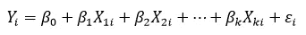

Yᵢ的被称为回归者，Xᵢ的被称为回归者。εᵢ是相关误差，该术语用于量化回归中未观察因素的影响。 *β* 代表回归系数，即有助于我们理解 *Y* 和 *X* 之间关系的参数。 *k* 代表回归中的回归变量或因变量的数量。 *i* 表示与回归量、回归量和误差项相关的特定观察值。这里，我们假设每个变量都有 *n* 个观测值。

> *需要注意的初步要点:*
> 
> *一、变量集，很简单，就是指一组变量。所以，Y，X，β，ε都是变量集。变量是变量集的一个元素。X₁、X₂、X₃、β* ₀ *、β₁、β₂等。都是变量。y 和* ε *也是变量。它们可以被认为是只有一个变量的变量集。最后，观察是指该集合中特定变量的值。X₁₁、X₂₁、Y₁、Y₂、* ε *₂等。都是观察。*
> 
> *二。计量经济学中使用的符号通常不同于统计学中使用的符号。当我们将回归变量表示为 X* ᵣₛ时，r *表示特定变量，s 表示该变量的观察值。例如，X* ₅₄ *表示与第 5 个回归量相关的第 4 个观察值。*

由于需要拟合大量数据，处理多元回归可能会变得非常困难。因此，矩阵经常被用来简化数据合并和各种数学运算。

现在，我们准备用矩阵来表示回归！

让我们从用观测向量代替变量开始:

1) *Y* :

在 *Y* 的矩阵符号中，我们用行来表示观察值，用列来表示变量。在我们的回归中只有一个因变量。所以列数是 1。假设有 *n 个*观测值与 *Yᵢ* 相关联。然后，行数将为 *n* 。所以，我们必须有一个( *n)* x(1)矩阵。该矩阵可以表示为:

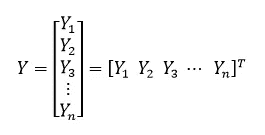

2) *β* :

我们遵循类似的过程。然而，这一次我们使用行来表示变量。这里， *β* 表示我们希望知道的参数。对 *β* 进行观察是没有意义的。很简单，它是一组我们想要计算的未观察到的量。所以，列的数量，也就是观察值的数量，是 1。我们交换 *β* 和 *Y* 中的符号的原因将在我们构建最终的矩阵方程时变得清晰。

那么，我们有 k 行 1 列吗？没有。请注意，我们的模型中也有一个 *β* ₀。所以，我们要估计的参数个数是 *k* +1。因此，我们将得到一个具有 *k* +1 行和 1 列的矩阵，即一个( *k* +1)x(1)矩阵。该矩阵表示为:

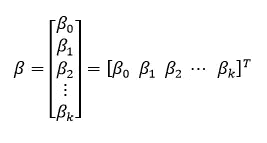

3) X:

我们遵循与用于 *Y* 相同的符号过程。列代表变量，行代表与每个变量相关的观察值。这次不像 *Y* ，我们有很多变数。总共有 *k X* 。但是，我们引入了一个更多的 *X* ,这样我们就有一个 *X* 对应一个 *β* 。让这个 *X* 成为 *X₀ᵢ* 。因此，我们实际上是在用以下内容替换我们的原始模型:

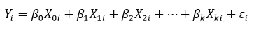

为了找回我们原来的模型，我们总是可以用 unity 替换 X₀ᵢ。既然我们已经将每个 *β* 与一个 *X* 相关联，那么对于每个变量就有 *k* +1 个变量和 *n* 个观察值。这给了我们一个( *n)* x( *k* +1)矩阵:

*注意:不要将 Xᵣₛ与 r* ᵗʰ *行和 s* ᵗʰ *列混淆。记住，在计量经济学中，r 是变量，s 是观测值。*

4) *ε* :

为 *ε* 开发矢量矩阵的过程与 *Y* 几乎相同。这里，我们对每组变量只有一个 *ε* 。因此，我们必须有一个单列矩阵。由于我们对 *ε* 有 n 个观察值，我们有 n 行，给我们一个( *n)* x(1)矩阵。该矩阵显示为:

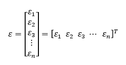

现在，我们已经为每个变量集开发了矩阵，我们可以将它们放在一个简单的方程中，以获得我们的回归模型。使用的公式为:

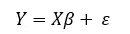

其中 *Y、X、β和ε* 是上面讨论的矩阵。

对于矩阵乘法，关键是第一个矩阵的列数等于第二个矩阵的行数，我们已经用 *X* 和 *β保证了这一点。*因此，在推导 *β* 的矩阵符号时，可以看到轻微的迂回。

上述等式将帮助我们正确分配数据集值和运行多元回归。为了更好地理解等式的工作原理，让我们插入矩阵:

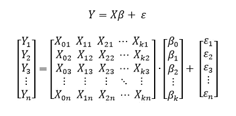

关于进一步解决:

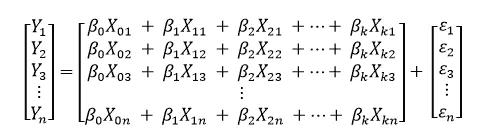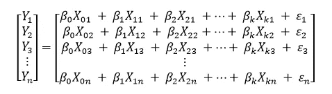

在求和符号中:

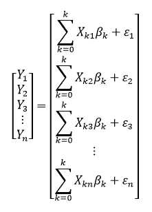

现在，如果我们将 every 与另一个矩阵中的相应项进行比较，我们可以验证一般情况下:

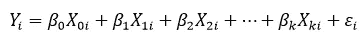

因此，我们已经成功地使用矩阵来简化多元回归。

通过对矩阵方程的数学处理，我们可以得到普通的最小二乘(OLS)估计。这个过程将在我接下来的几篇文章中详细描述！