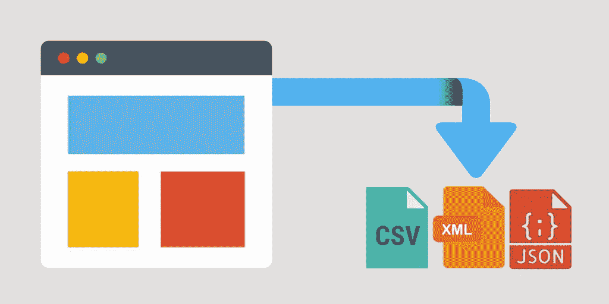
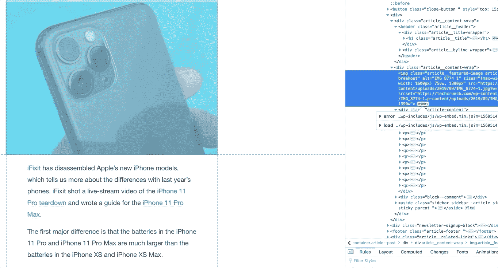

# 用 Python 实现简单的 Web 抓取

> 原文：<https://medium.com/analytics-vidhya/simplistic-web-scraping-with-python-9421735e71fa?source=collection_archive---------14----------------------->



Web 抓取(又名文本挖掘、数据提取、Web 采集、Web 数据提取等。)是一种用于从网站提取数据的方法，这些数据可以进一步处理或存储到特定位置。例如本地硬盘或云存储设备中。

## 但是我们为什么要做这样的事情呢？

假设您有兴趣对新闻文章进行情感分析，以识别和提取观点。或者，您可能希望提取图像来训练您的机器学习模型识别某些图像集。

虽然这些活动可以通过反复手动复制和粘贴来轻松收集...让一个程序或一个脚本为你做这件事不是很好吗？

## **这在 Python 中是如何实现的？**

让我们使用来自 TechCrunch 的[这篇文章来达到这个目的。这个想法是简单地解析网站，从文章中提取标题、内容甚至图像。](https://techcrunch.com/2019/09/22/iphone-11-pro-teardown-reveals-smaller-logic-board-larger-battery/)



TechCrunch 文章

在你的浏览器中(我用的是 firefox)，右键点击网站来检查元素。从那里，您将能够将鼠标悬停在上面，并查看哪些标签对应于文章的哪些部分。

然后，我们可以使用 ***请求*** 将文章加载到 Python 中，并利用 ***bs4*** 解析相关内容。

> 如果您还没有安装库，可以使用下面的 pip 安装*方法*来完成。

```
pip install bs4
pip install requests
```

接下来，我们可以看看如何检索数据:

```
import requests
import bs4r = requests.get(r'[https://techcrunch.com/2019/09/22/iphone-11-pro-teardown-reveals-smaller-logic-board-larger-battery/](https://techcrunch.com/2019/09/22/iphone-11-pro-teardown-reveals-smaller-logic-board-larger-battery/)').textprint(r)
```

这将为您提供一堆格式不良的 html 标签，您感兴趣的元素位于其中的某个地方。(当然，除非内容是由 *JavaScript* 动态生成的，或者包装在 *iFrame* 中)

最后，我们可以使用 ***bs4*** 来定位和提取那些元素。

```
...# Parsing of html elements into a bs4 object
page_source = bs4.BeautifulSoup(r, features='lxml')# Zooming in only on the article itself 
page_data = page_source.find('article', attrs={'class': 'article-container article--post'})# Extracting the interested elements 
article_title = page_data.find('header').find('h1', attrs={'class': 'article__title'}).text
article_images = page_data.findAll('img')
article_content = page_data.find('div', attrs={'class': 'article-content'}).text
```

一旦你将 *html* 解析为一个 ***bs4*** 对象，它主要只是找出你想要*找到*并提取哪些元素标签的问题。

就是这样！

## 有什么问题吗？

这种方法的一些局限性可以在下面找到。这并不详尽，但它提供了入门的基本理解。

1.  没有“一刀切”的解决方案。每个网站的布局是不同的，所以需要为每个目标网站开发一个自定义的刮刀。
2.  一些网站有很强的政策反对网络抓取，如果你被抓到，甚至会禁止你的 IP 地址。一个好的做法是总是检查目标网站是否有任何政策反对网络抓取。
3.  大多数现代网站利用 iFrames 或 T2 来发布动态内容。如果您要寻找的数据来自这样的来源，就需要一种不同的方法(例如，使用 Selenium)。