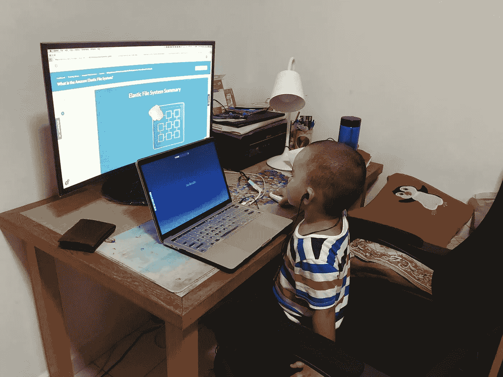

# 教你的孩子逻辑能力:任何孩子都可以编码

> 原文：<https://medium.com/analytics-vidhya/simplistically-easy-any-kid-can-code-2294919a34e?source=collection_archive---------22----------------------->

## 年轻的大脑学习和掌握的速度更快——没有理由阻止孩子学习编程并享受编程的乐趣！

任何孩子都会编码

这是为了让孩子们学习编程的基础知识，并让一些人掌握编程对他们生活的第一直觉。这并不意味着他们会成为无聊的软件开发人员，但是…