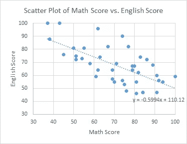
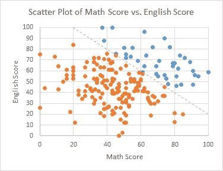
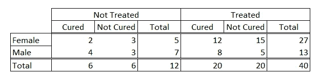
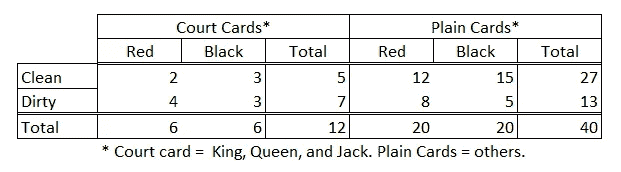
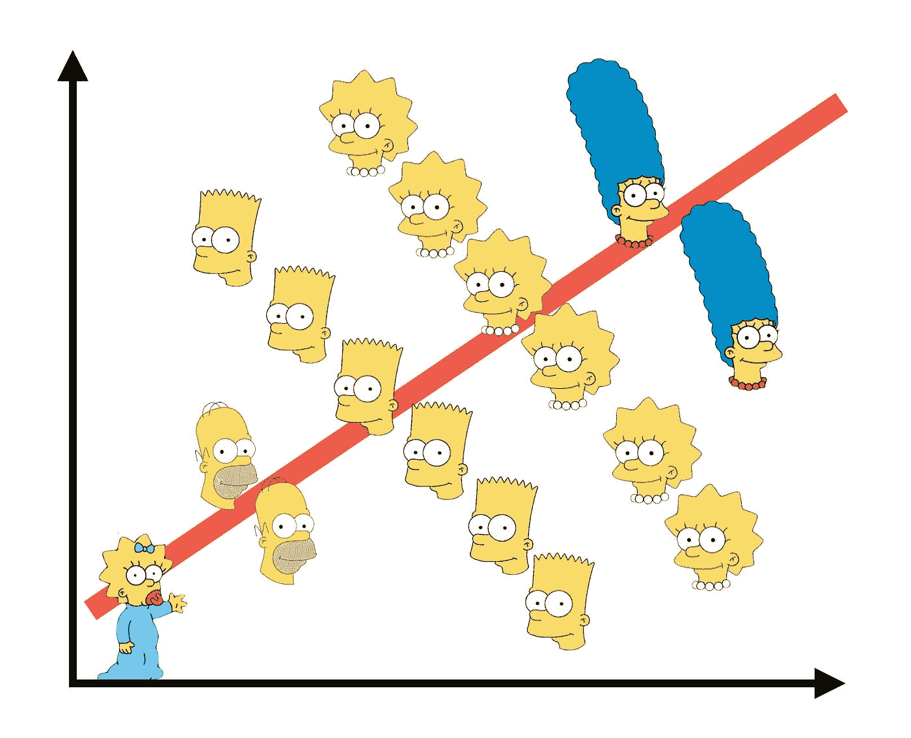
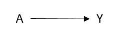
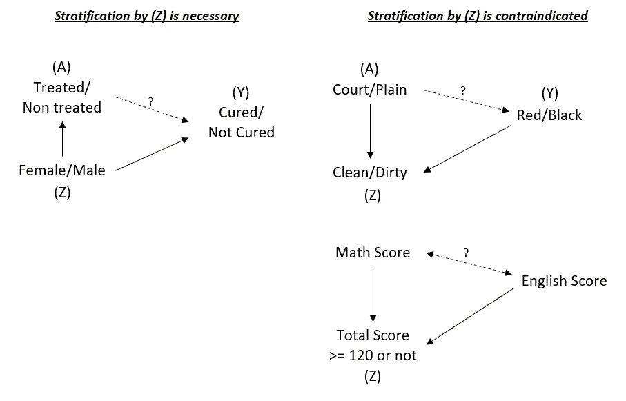
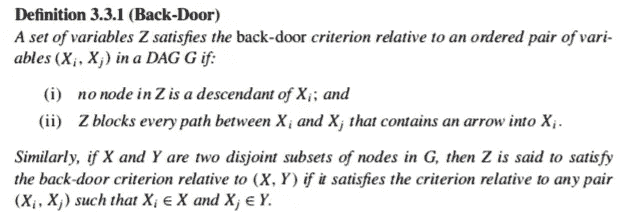

# “辛普森悖论”——当你从分析中得出错误的见解时

> 原文：<https://medium.com/analytics-vidhya/simpsons-paradox-when-you-derive-a-wrong-insight-from-your-analysis-ee488b346427?source=collection_archive---------12----------------------->

## 从选择偏差到因果图，以及如何避免偏差的提示。

由于各种原因，分析可能会有偏差。在这篇文章中，我们将从一个选择偏差的例子开始，来理解偏差的影响。

我们还将比较两个拥有相同数据却导致不同结果的例子，了解什么是**辛普森悖论**。

最后，我们将讨论**后门标准**，以学习如何避免偏见。

# 目录

1.介绍

1.1.选择偏差

1.2.问题 1

1.3.问题 2

1.4.问题 1 和问题 2 有什么不同？

1.5.辛普森悖论

2.因果结构和因果图

3.在数据分析中正确使用因果结构

4.因果图中的后门准则

5.结论

参考

# 1.介绍

## 1.1 —选择偏差

看看下面的散点图。它在比较一些人的数学成绩和英语成绩。

人口的数学分数与英语分数

我们看到数学成绩和英语成绩之间有更强的负(线性)相关性。那么，我们是否可以说*“数学能力高的学生往往英语素养低，反之亦然”*？

真实世界中数学分数与英语分数的散点图

实际上，这些数据是通过以下步骤编造出来的:

1.  独立生成两个服从正态分布的随机数，均值=50，标准差=20，在 0 和 100 处截取。一个是数学成绩，一个是英语成绩。
2.  如果数学成绩+英语成绩> 120，则选择子群体，假设子群体代表数学和英语总分录取的学生。

所以，真正的洞见是“ ***学生的数学能力和英语能力是独立分布的*** ”。我们提到的偏差只来自于灰色虚线上的亚群体趋势，因为选择边界是对角线。

这种偏差叫做 [**选择偏差**](https://en.wikipedia.org/wiki/Selection_bias) 。

这一次偏倚很容易被检测到，因为我们知道有一个整个人群的数据集，并且有一个选择子集的公式，但是**如果我们只有选择的数据而没有注意到它是被选择的，并且不知道选择标准是什么呢？**

为了进一步讨论，我们来看看下面两个有偏差的分析例子。

## *1.2 —问题 1*

**背景:**

> 我们有男性或女性患者接受治疗或未接受治疗的医学观察数据，以及最终预后。

分析#1 的数据

**有点分析:**

女性患者的治愈率:

*   如果未处理 40% (=2/5) < if treated 44% (12/27)

Cured ratio within male patients:

*   if not treated 57% (=4/7) < if treated 62% (8/13)

Cured ration within female or male patients:

*   if not treated 50% (=6/12) = if treated 50% (=20/40)

**问题:**

> *我们能说治疗有效还是无效吗？*

(让我们暂时忘记“统计意义”，只讨论数据的比例！)

**回答:**

> 这种疗法对不同性别的人有不同的效果，但是值得一试。 ***我们应该忽略“总计”行上的比率。***

## 1.3 —问题 2

**背景:**

> *在婴儿玩了一副卡牌后，我们记录了婴儿每种类型和颜色的卡牌弄脏了多少张。*

分析#2 的数据

**一点分析:**

干净牌中的红色比率:

*   如果法院卡 40% (=2/5) < if plain cards 44% (12/27)

Red ratio within dirty cards:

*   if court cards 57% (=4/7) < if plain cards 62% (8/13)

Red ratio within clean or dirty cards:

*   if court cards 50% (=6/12) = if plain cards 50% (=20/40)

**问题:**

> *宫廷牌的比例与颜色有关吗？*

(还是那句话，让我们忘掉‘统计意义’！)

**回答:**

> 与黑色卡片相比，婴儿可能更喜欢红色卡片，但两种颜色的比例是一样的。 ***我们应该忽略单独的“干净”和“脏”行上的比率。***

## 1.4 —问题 1 和问题 2 有什么不同？

你有没有注意到问题#1 和问题#2 的数据表中的数字都是一样的？

所以， **#2 造成了按行分层的选择偏倚，而#1 没有，从我们对被试的了解，我们正确地选择了分析和推导洞察力的方式。我们对学科的知识大概是这样的:**

*   “人们很自然地认为，医学治疗对不同性别的人有不同的效果”，以及
*   “每种颜色和类型的卡片数量是完全独立的(虽然婴儿可能喜欢玩特定的颜色和类型)。”

但是，如果这个案子是我们不知道的呢？

## 1.5 —辛普森悖论

所有这些时尚都是关于“ [**辛普森悖论**](https://en.wikipedia.org/wiki/Simpson%27s_paradox) ”。辛普森悖论最初是在[*对列联表中相互作用的解释中讨论的。*”由爱德华·h·辛普森于 1951 年](http://math.bme.hu/~marib/bsmeur/simpson.pdf)。

基于 2011 年埃尔南、米盖尔·a、大卫·克莱顿和尼尔斯·凯丁的[*《辛普森悖论的解开*》，辛普森悖论给我们的启示是:](https://www.researchgate.net/publication/50939554_The_Simpson's_paradox_unraveled)

> *-统计数据不足以进行分析，因为来自不同因果结构的相同数据应进行不同的分析。*
> 
> *-对于因果推断来说，忽略主题(因果)知识的数据分析是没有希望的。*

(来自[米格尔·埃尔南的推文。](https://twitter.com/_MiguelHernan/status/860542619818106881?s=20))

让我解释一下:

*   **在做数据分析的时候，你得知道题目的因果结构，并且运用得当。否则，你可能会得出错误的见解。**

那么，这意味着什么呢？**什么是因果结构**和**怎样才能‘用得其所’**？让我们在下一节看到它们。

“辛普森悖论”，引用自[RJ·安德鲁斯](https://medium.com/u/53e3ac233f9b?source=post_page-----ee488b346427--------------------------------)的[推特账号](https://twitter.com/infowetrust/status/984536880199876608)

# 2.因果结构和因果图

当人们听到“因果关系”这个词时，你可能会有一些概念，但实际上并不容易正式定义。

Miguel Hernán 的[*因果推理书*定义为，当 A 被拿走和 A 被拿走的结果 Y 不同时,‘A 对 Y 有因果影响’。形式上，A 和 Y 在这里都是*随机变量*。让我们避免进一步复杂的讨论定义，只是相信它代表了所谓的因果关系。详见](https://www.hsph.harvard.edu/miguel-hernan/causal-inference-book/)[*因果推理书*](https://www.hsph.harvard.edu/miguel-hernan/causal-inference-book/)。

因果图是直观表示因果关系的图形。当 A 引起 Y 时，其因果图如下。

显示原因的因果图

# 3.在数据分析中正确使用因果结构

那么，因果关系/图与辛普森悖论的关联是什么，“恰当使用因果结构”的理念是什么？

以上，我说:

*   **在做数据分析的时候，你得知道题目的因果结构，并且运用得当。否则，你可能会得出错误的见解。**

在上面的两个例子中，我们想知道“治疗”(A:原因)和“治愈”(Y:效果)，以及“法庭/普通牌”(A)和“红/黑牌”(Y)之间的因果关系。

把结论放在第一位，当我们想要检测是否有任何因果关系时，我们必须记住以下两条规则:

***规则#1* :我们必须使用使(A)和(Y)都分层的变量(A 和(Y)的上级)。否则，结果会有偏差。**

***规则#2* :我们一定不能用(A)(A 的后代)引起的变量来分层，因为它会引起选择偏差**。**否则，结果会有偏差。**

*(这两条规则后面会用‘后门准则’来概括。不要混淆，因为它们表示相同的东西！)*

看看两个案例的因果图+第一个数学分数和英语分数的例子，我们确信它会产生选择偏差。

问题#1、问题#2 的因果图，以及数学成绩&英语成绩示例。

> *处理示例(问题#1)的图表符合规则#1，因此* ***我们必须按性别对数据进行分层*** *。*
> 
> *王牌示例(问题 2)和数学/英语分数的图表符合规则 2，因此* ***我们不能按干净/脏或总分对数据进行分层。***
> 
> *但是* ***如果仅仅因为数据没有性别信息而没有按性别对问题#1 案例进行分层会怎么样？您的结果仍然有偏差*** *，就像图表中的“总计”行一样。这描绘了* ***关于主题的背景知识对于获得正确见解*** *是多么重要。*

现在，记住问题#1 和问题#2 在展示中有完全相同的值。这意味着我们无法仅从数据中确定我们必须遵循两个规则中的哪一个，唯一的方法是从我们对主题的先验知识中得出因果结构。

我已经写了两次了，如果我们简单地总结一下，

*   **在做数据分析时，你必须知道题目的因果结构，并恰当地使用它。否则，你最终可能会得出错误的见解。)**

由 [Florencia Viadana](https://unsplash.com/@florenciaviadana?utm_source=medium&utm_medium=referral) 在 [Unsplash](https://unsplash.com?utm_source=medium&utm_medium=referral) 上拍摄的照片

# 4.因果图中的后门准则

规则#1 和规则#2 由 Pearl 提出的[“后门标准”的概念概括如下](http://blog.sciencenet.cn/home.php?mod=attachment&filename=Causality_%20models%2C%20reasoning%2C%20and%20inference%5BJudea_Pearl%5D.pdf&id=56698):

摘自朱迪亚·珀尔的《因果关系——模型、推理和推论》

这个定义中的 *X* 就是我们上一节所说的 *A* 的那个。后门准则的要点是**一旦我们通过这个准则识别出 *Z* ，它们立刻成为我们通过**对数据进行分层所需要的变量。

在问题#1 的情况下，如果我们在 *Z* 中不包括性别， *Z* ={}。既然 *Y* ={cured}，就违反了借壳准则中的(ii)。现在，考虑另一个选择，Z*= { gender }，我们可以确认它们满足标准的两个条件。数据**必须按性别**分层。*

*在问题#2 的情况下，如果我们在 *Z* 中包含清洁度， *Z* ={clean}。clean 是*X*= {庭证}的后代，因此这违反了后门规范中的(I)。现在，考虑另一个选择，Z ={}，我们可以确认它们满足标准的两个条件。数据**不得按清洁度**分层。*

**

*汉娜·莫里斯在 [Unsplash](https://unsplash.com?utm_source=medium&utm_medium=referral) 上拍摄的照片*

# *5.结论*

***选择偏差**和**辛普森悖论**是可能从数据分析中得出相反见解的偏差，是每个数据分析都必须担心的。*

*第一步应该始终是"**试图理解主题及其在背景中的因果结构** " — 这是数据分析自动化的厄运:(*

*一旦我们知道了因果关系，当因果结构足够简单时，以下两个规则可以给出一个简单的扫描来知道哪些变量应该用于分层。*

****规则#1* :我们必须使用使(A)和(Y)都分层的变量(A 和(Y)的上级)。否则，结果会有偏差。***

****规则#2* :我们一定不能用(A)引起的变量(A 的后代)来分层，因为它会引起选择偏差。否则，结果会有偏差。***

*在更复杂的情况下，我们应该考虑**后门标准**来确定分层变量。*

# *参考*

*[“列联表中相互作用的解释”，作者 E. H. Simpson](http://math.bme.hu/~marib/bsmeur/simpson.pdf)*

*[【链接打开 PDF】《因果关系——模型、推理和推论》，作者朱迪亚·珀尔](http://blog.sciencenet.cn/home.php?mod=attachment&filename=Causality_%20models%2C%20reasoning%2C%20and%20inference%5BJudea_Pearl%5D.pdf&id=56698)*

*[亚当·凯莱赫的《如何纠正选择偏差》。](/@akelleh/how-do-you-correct-selection-bias-d781a9b12de2)*

*[《因果推理书》作者米格尔·埃尔南](https://www.hsph.harvard.edu/miguel-hernan/causal-inference-book/)*

*[“从因果和统计推断中的选择偏差中恢复”, Elias Bareinboim，Jin Tian，Judea Pearl](http://ftp.cs.ucla.edu/pub/stat_ser/r425.pdf)*

*[《辛普森悖论被解开》作者米盖尔·埃尔南、大卫·克莱顿、尼尔斯·凯丁](https://www.researchgate.net/publication/50939554_The_Simpson's_paradox_unraveled)*