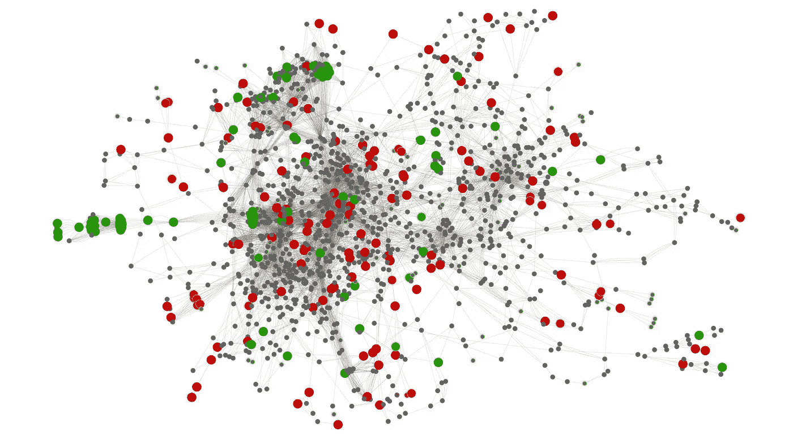
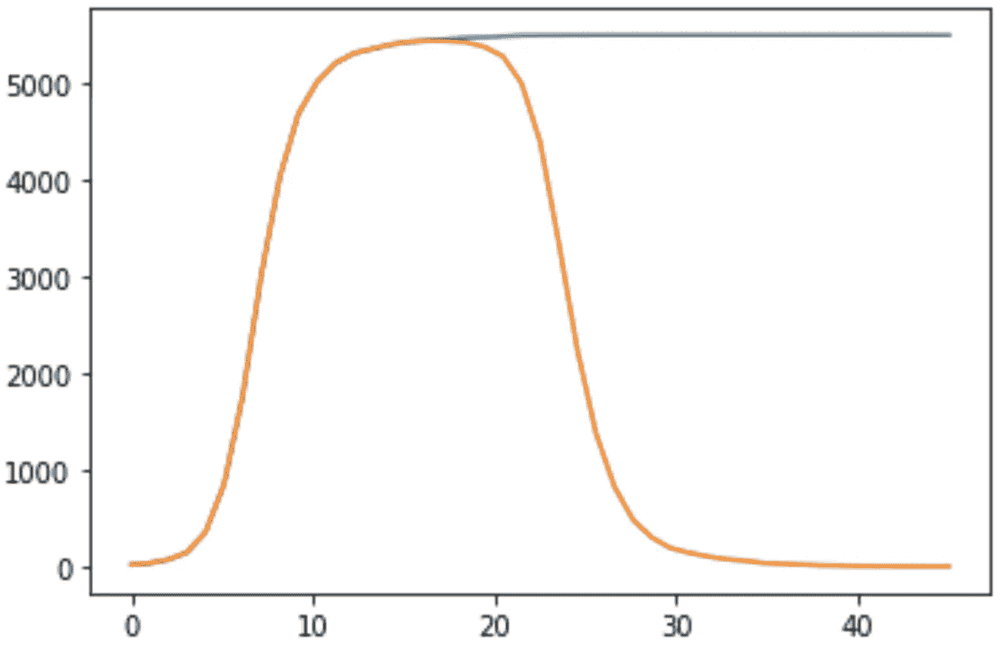
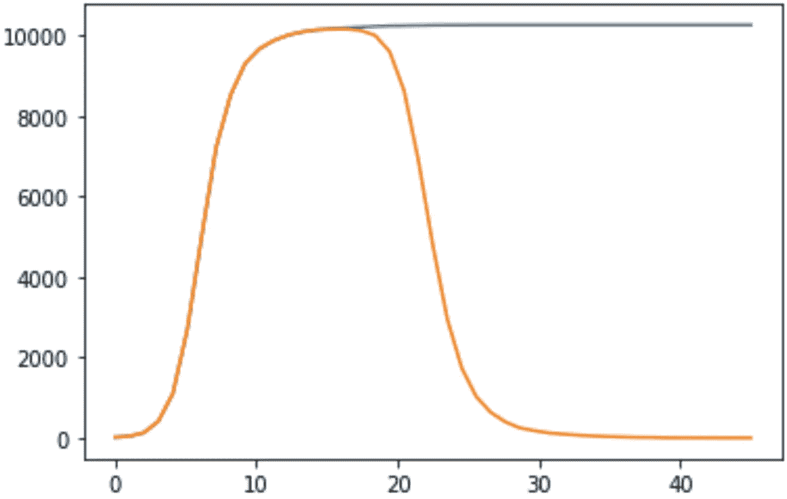

# 用 Python 模拟一种传染病

> 原文：<https://medium.com/analytics-vidhya/simulate-an-infectious-disease-with-python-22ca556a77d8?source=collection_archive---------18----------------------->

## 我将用 Python 展示一个简单而强大的传染病模拟器。然后，我将分析输出数据，并讨论如何将其用于更好地制定抗击流行病的决策

图片来源:blog.equinix.com

如今，由于冠状病毒，围绕传染病的数学建模有很多炒作。最广为人知的是[爵士模型](https://en.wikipedia.org/wiki/Compartmental_models_in_epidemiology#The_SIR_model)。尽管对现实的描述过于简单，但结果确实“表现”得像一个真正的疫情。在这篇文章中，我不会讨论任何现有的数学模型，但建议另一种方法来模拟传染病的人口。政府可以使用这种工具来研究处理疾病的不同策略，此外，还可以尝试预测疾病本身的特性(我将在文章结尾讨论这一重要部分)。

**我们开始吧。**模拟器的目的是模拟传染病在人群中的行为。类似于预测传染病传播的数学模型，它是现实的简化模型。正如你将看到的，我认为它包含了一个更复杂的行为。

# 模拟器的基本假设

*时间* ***步***——你可以把它想成一个小时、一天、一个月——只要是一个时间单位都没关系。模拟正在逐步进行。

***随机性*** —这是很重要的一部分。正如您将看到的，模拟器中有一些部分是随机的(您可以确定正态分布的 *mu* 属性。当然也欢迎你选择其他发行版)。这一点很重要，因为正如现实本身一样，存在随机事件。

一个生病的公民 ***移除*** (被感染的公民要么被治愈要么死亡)不会再生病——这是大多数模型中的基本假设。

公民之间的 ***联系*** 的含义是他们身体接触，因此可以相互传染。每两个模拟实体(或公民)之间的连接是两者之一——它们要么没有连接(不会在物理上看到彼此)，要么连接。如果他们连接在一起，有两种选择:
他们属于同一个*集团*——意味着他们是同一个公民群体的一部分，这个群体中每个个体的所有物理连接只与群体中的其他个体相连(你可以把这想象成一种隔离),或者他们以“常规”的方式连接(即在我们的模拟器中随机形成的连接，每一方都可以连接到其他公民)

您可以在代码中找到更多的假设(或硬编码的概率)。

# 传染病

在我们的模拟中，人们正在与传染病作斗争。我们模拟器中的疾病有 4 个参数:

*infection_prob* :健康公民因身体接触而被患病公民感染的概率
*average_life_span* :移除
*is_sick* 前疾病具有传染性的平均时间(步数):默认情况下，公民未被感染
*计数器*:计数步数(时间)

# 社区中的公民

我们需要在模拟社区中模拟一个公民。我们公民的主要参数是:

*社区*:该公民所属的社区
*_id* :该公民的 id
*疾病*:该公民可能患有或未患有
*的疾病*:如果为真，则表示该公民要么治愈，要么死亡

# 社区

在我们的模拟器中，社区基本上旨在描述公民之间的联系。参数:
num_of_citizens:社区中的公民数量
average _ physical _ connections:社区中一个公民的平均物理连接(疾病只能通过
被感染的公民与另一个公民的物理连接来传播)
disease:The disease
num _ of _ infected:社区中被感染的公民的初始数量
cliqe_prob:社区中一个公民
的物理连接在一个封闭团体中的概率

# 模拟器

模拟器类非常简单，它主要是一组社区的持有者:

# 个案研究

让我们检查一个具有以下参数的示例:

输出:

橙色:活动案例数，蓝色:总案例数

总病例数为 5502 例，占总病例数的 27.51%。

# 差别小——影响大！

让我们看看当我们只调整一个参数时会发生什么——*clique _ prob*。提醒一下——*clique _ prob*等同于“隔离人口的百分比”。所以， *clique_prob* = 0.9，leets 把它改成 *clique_prob* = 0.8 (80%而不是 90%)，看看会发生什么:

输出:

乍一看，曲线的一般形状可能与前者相似，但是，两者有很大的区别。绝对数字要高得多:被隔离人群的 10%变化，80%而不是 90%，导致 **51.26%** 的人群被感染(！).

这只是一个例子，说明如何使用这个模拟器来研究特定参数(或“行为”)对抗击疾病传播有多重要。世界各地的政府可以利用这种能力来规划更好的疾病防治策略。

# 下一步是什么？

如前所述，模拟器可用于创建合成数据。在我的下一篇文章中，我将尝试利用模拟器生成的合成数据，以便使用神经网络并尝试预测模拟器的参数—更具体地说是***infection _ prob***(多少人口是卫生的)和 ***clique_prod*** (多少人口遵守隔离)。