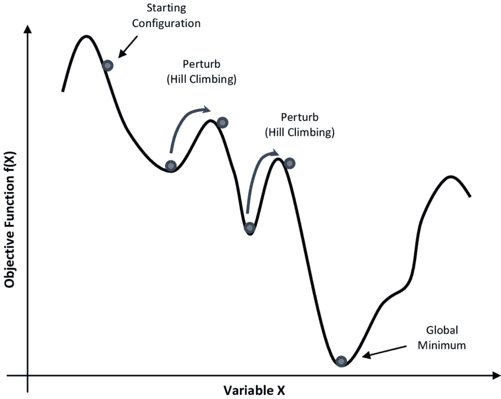
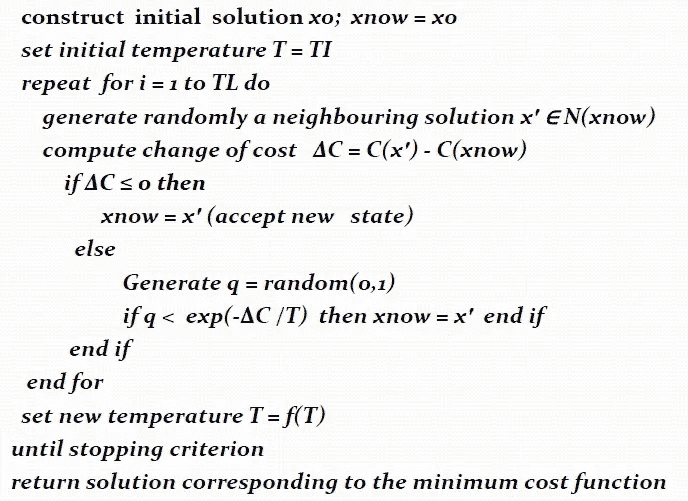

# 模拟退火

> 原文：<https://medium.com/analytics-vidhya/simulated-annealing-869e171e763c?source=collection_archive---------12----------------------->

## 众所周知的优化技术。

**优化算法**是通过比较各种解决方案反复执行的程序，直到获得最佳解决方案。今天使用的优化算法有不同的类型。

*   **确定性方法**
*   **随机方法**
*   **自然灵感技术**

本文研究的是模拟退火技术，它通常是一种随机方法。

> **模拟退火(SA) :** 这是一种概率技术，用于逼近给定函数的全局最优值。

**退火**指的是与热力学的类比，特指金属冷却和退火的方式。模拟退火是一种有效和通用的优化形式。在存在大量**局部最优**的情况下，这有助于找到**全局最优**。模拟退火使用目标函数作为优化问题，而不是材料的能量。

模拟退火的实现非常简单。该算法基本上是一个爬山法，除了不是选择最好的移动，而是选择一个随机的移动。如果选定的移动改进了解决方案，则它总是被接受。否则，算法无论如何都会以小于 1 的概率移动。

图 1 模拟退火图

概率随着移动的不良而指数下降，移动的不良是解恶化的量δe(即能量增加)。

Prob(接受上坡运动)~ 1-exp( deltaE / KT)，其中 k 应该在 0.8 到 0.99 之间。

参数 **T** 也用于确定概率。它类似于温度。在退火系统中。当 T 值较高时，可能会出现上坡运动。随着 T 趋于零，它们变得越来越不可能，直到 algo。像爬山一样。

在一个 **SA** 优化问题中，T 从高开始，并根据退火计划逐渐降低。

> **模拟退火算法**

模拟退火算法

*   SA 区分不同的局部最优解。
*   SA 是一种无记忆算法，该算法不使用在搜索期间收集的任何信息
*   SA 是一种迭代改进算法。

> **应用**

*   电路划分和布局
*   图形划分
*   图像处理
*   超大规模集成电路:布局，布线
*   硬件/软件分区
*   复杂产品结构下资本产品的策略调度
*   基于事件的学习情境。

> **优点:**

*   可以处理**任意系统**和**成本函数**
*   统计上**保证**找到一个**最优解**
*   编码相对**容易，甚至对于**复杂的问题****
*   一般给出一个**好的解决方案**。

> **缺点:**

*   对于能量**景观平滑**或者很少有局部极小值的问题， **SA 是大材小用。**
*   用 **1/log(k)** 时间表重复退火非常慢，特别是如果成本函数的计算**很昂贵。**

> **结论:**

*   模拟退火保证了在运行足够大量的迭代时的收敛。
*   当涉及到有许多局部最优解的问题时，模拟退火算法通常优于贪婪算法。

感谢您阅读本文。

[Kelly Sikkema](https://unsplash.com/@kellysikkema?utm_source=medium&utm_medium=referral) 在 [Unsplash](https://unsplash.com?utm_source=medium&utm_medium=referral) 上拍摄的照片