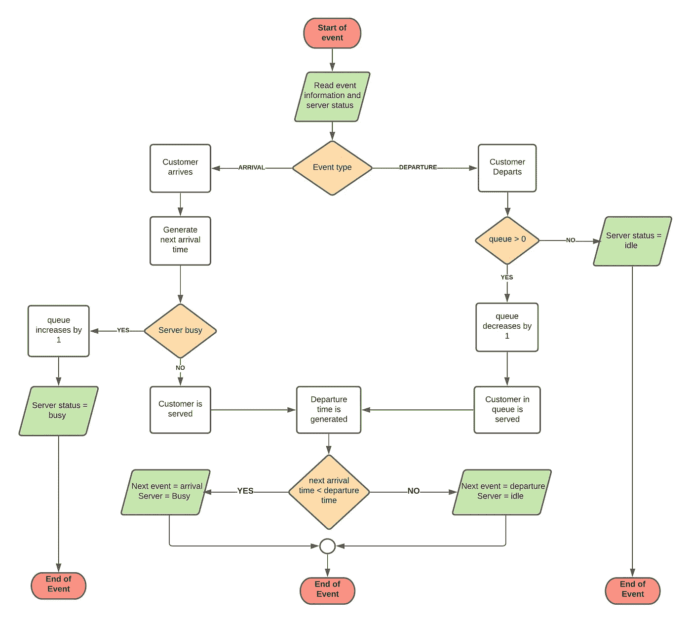
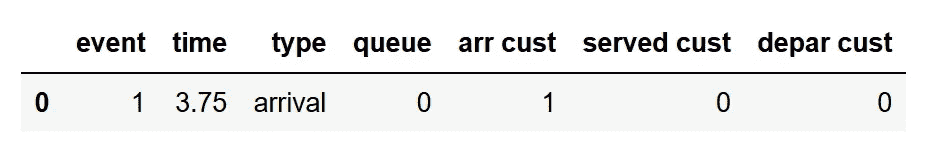
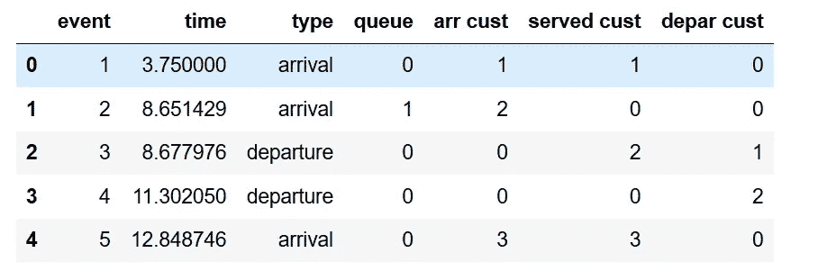
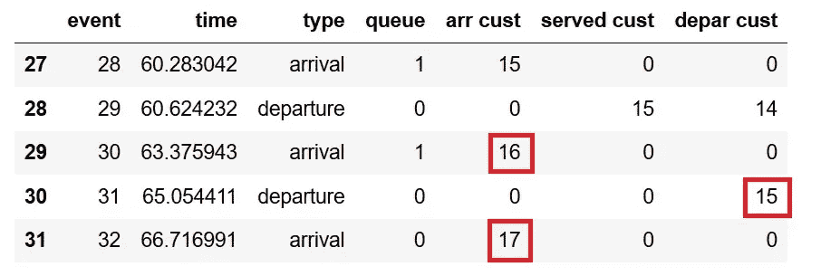
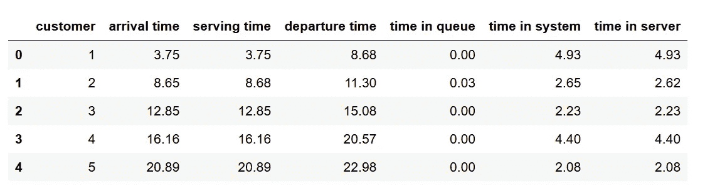
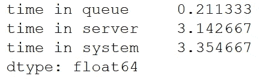
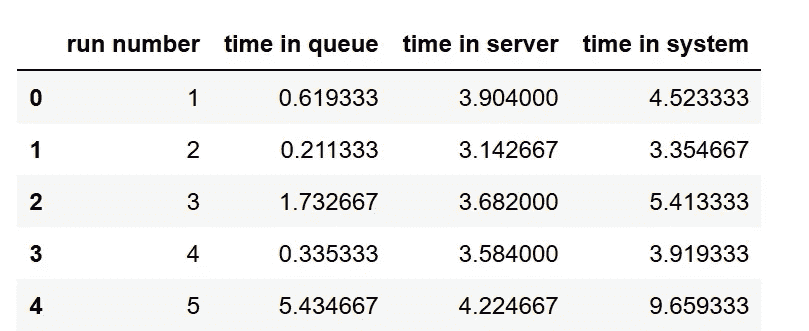
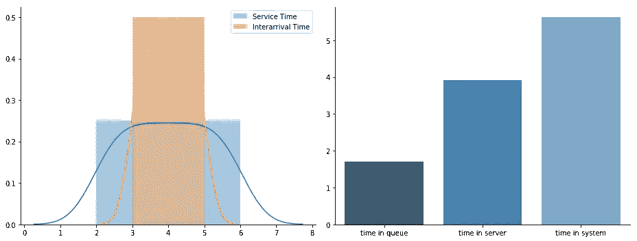
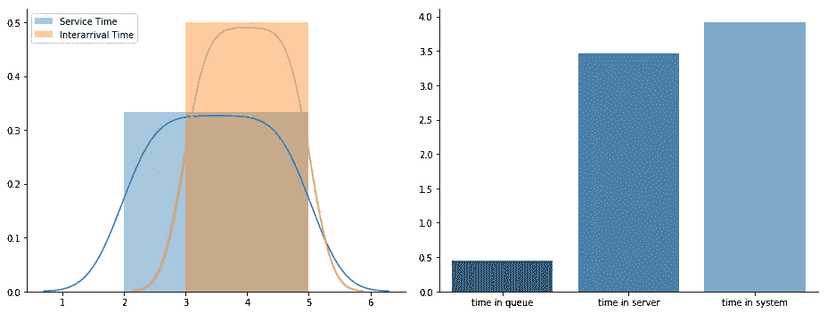

# 用 Python 模拟单服务器排队系统

> 原文：<https://medium.com/analytics-vidhya/simulating-a-single-server-queuing-system-in-python-f8e32578749f?source=collection_archive---------1----------------------->

# **定义和目标**

在这篇文章中，我将使用 python 中的 numpy 和 pandas 库在单服务器排队系统上展示一个**离散事件模拟。运行模拟的目的是先验地测量系统的性能，并观察它在预定情况下的行为。**

系统的元素只是客户和服务器，两者都可以是人或物体:

*   客户:接受服务
*   服务器:提供服务

在这个排队系统中，只有一个服务员为到达的顾客服务，这些顾客在得到服务后离开系统。为了简单起见，我们假设顾客到达的时间间隔服从均匀分布，服务员的服务时间也服从均匀分布。

下一个到达时间是在每次客户到达时生成的，这意味着当客户到达时，我们随机抽样到达间隔时间，并计算下一个客户的到达时间。类似地，当顾客去服务器时，我们随机抽样服务时间并计算该顾客的离开时间。有时顾客到达时，仍有顾客在接受服务，所以他们必须排队等候，直到当前顾客离开，服务员有空。下面的 flowchar 对此进行了更详细的解释。

# **型号**

我们将使用 numpy 和 pandas 库来创建这个系统。随机生成的到达间隔时间和服务时间通过 numpy.random.uniform()函数获得，该函数将均匀分布的最小值和最大值作为参数。

首先，我们导入所需的库并定义问题的参数:我们假设到达间隔时间和服务时间遵循均匀分布，最大值分别为 5 分钟和 6 分钟。类似地，我们假设到达间隔时间和服务时间的最小值分别为 3 分钟和 2 分钟。在本练习中，我们将模拟的事件数量设置为 30。

然后，系统在虚拟事件零处初始化，这通过 *numpy.random.uniform()* 函数生成第一个到达时间。默认情况下，第一个事件是到达，而服务器在第一个到达时间的状态是*空闲*，队列是*零*。事件归零完成，事件计数器增加(到 1)。

每个事件的细节都被添加到数据帧中，因此在最后我们可以用表格的方式来更好地理解这些事件，因此一旦服务器在事件 1 时的初始状态被确定；我们用之前获得的值创建这个数据框。

现在，每个到达在模拟中生成下一个到达时间，并且根据排队系统(和常识)，如果队列为零，到达的客户将直接进入服务器。因此，这个到达将生成两个事件:这个到达客户的离开时间和下一个客户的到达时间。

下面的代码将运行 event one 中的其余事件，并根据流程图获取每个客户的到达和离开时间。这段代码相对较慢，过于依赖熊猫，而且有多余的行，但是这样我发现更容易阅读和解释每一部分的功能，尤其是对于像我这样不是程序员的人。

在所有迭代结束时，生成的数据框如下所示:

需要注意的是，循环在 n_events 处停止，因此当达到所需的事件数时，系统会任意停止。这意味着一个客户可能已经在系统中，但是当模拟停止时，它将不会被服务。例如，下面是运行的最后五个事件，虽然客户 16 和 17 预期在运行停止之前到达，但是这些客户将不会被服务。因此，我们可以简单地删除这两行，只保留离开系统的客户。

最后，我们创建每个客户的事件时间摘要，并计算他们各自在队列、服务器和系统中花费的时间:从中我们可以计算平均值，等等。如果需要的话。

上面的代码删除了模拟停止时没有离开系统的客户

下面是上述代码生成的数据框的前五行，包含每个客户的时间:

到目前为止，我们已经进行了一次模拟运行，但是为了进行正确的分析和做出决策，需要进行多次模拟运行来观察系统的行为。我们需要多次运行上面的代码，并更改伪随机数生成器的种子，这样我们在每次运行时都会获得不同的随机数。为了实现这一点，我们创建了一个函数，它将运行上面解释的代码，并将一个“种子”整数作为参数，然后运行这个函数 n 次，每次迭代都改变“种子”,以便每次迭代都获得不同的随机样本。

下面代码中的函数 run_queue()运行上面解释的排队系统，并返回每个客户在队列、服务器和系统中的平均时间。例如，run_queue(seed = 1)返回以下内容:

然后，我们创建另一个运行 run_queue()函数 n 次的函数，并将每次运行的结果附加到一个数据帧中以查看结果。

*如上所述，运行队列的代码相对较慢，每次运行需要一秒多一点的时间，50 次运行大约需要 50 到 60 秒才能完成。*

生成的数据框如下表所示，从这里我们可以获得实验的汇总统计数据，并根据需要绘制结果。

# **模拟不同场景**

正如开始时提到的，运行模拟的目的是观察不同场景中的系统行为，并测量其性能。幸运的是，上面的代码允许通过改变分布的最大值和最小值很容易地做到这一点。

下面是原始问题的服务时间和到达间隔时间的分布(左图)以及 50 次运行后各自的平均指标(右图)。

平均排队时间= 1.713610
平均服务器时间= 3.914950
平均系统时间= 5.628637

假设我们无法控制客户的到达间隔时间，但我们可以将最大服务时间从 6 分钟降低到 5 分钟，并想看看系统会如何运行。我们只需将变量 s *中的值 service _ time _ max*更改为 5，并通过函数 *run_experiments()* 运行 50 次模拟。新的概率分布和结果指标如下:

平均排队时间= 0.450533
平均服务器时间= 3.465720
平均系统时间= 3.916413

上面的例子只是说明模拟的用途，我不打算对系统的特性做任何分析。系统可以在多种情况下运行，从改变两种分布的最小值和最大值，到将分布从均匀变为正态或指数分布，并比较变化的幅度。

# 结论

总之，我们建立了一个只有一个服务器的简单排队系统，到达时间和服务时间服从均匀分布。在现实生活中，排队系统显然比遇到的概率分布更复杂。然而，这个练习是一个很好的例子，说明了一旦我们构建了模型的代码，就可以很容易地重用它来运行实验，这些实验对于做出决策或预见可能阻碍所研究系统的稳定性的潜在场景是有用的。

请在评论中随意指出你可能遇到的错误或建议。