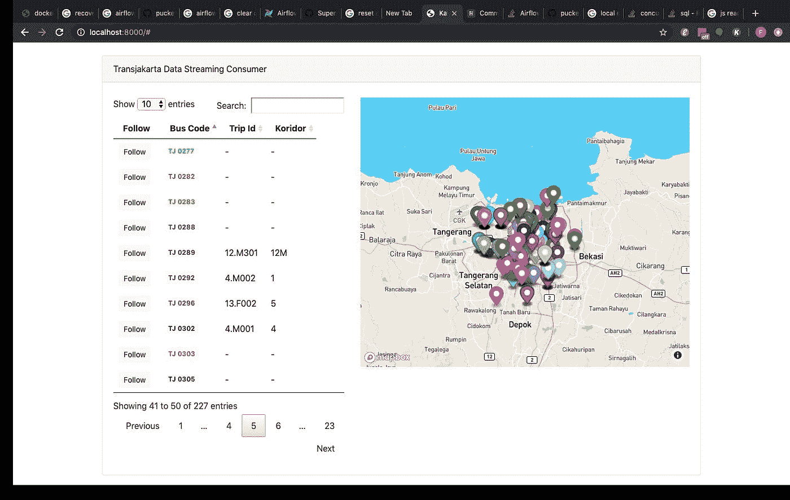
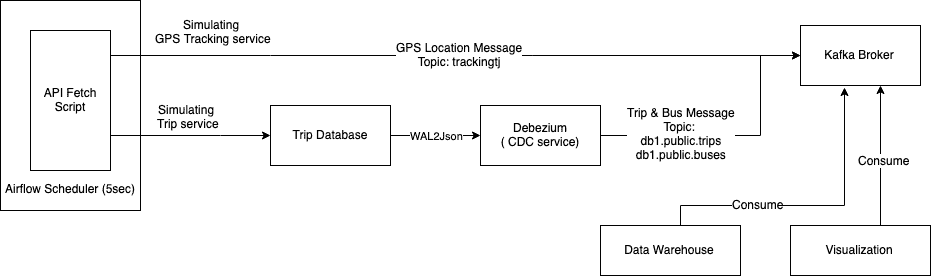
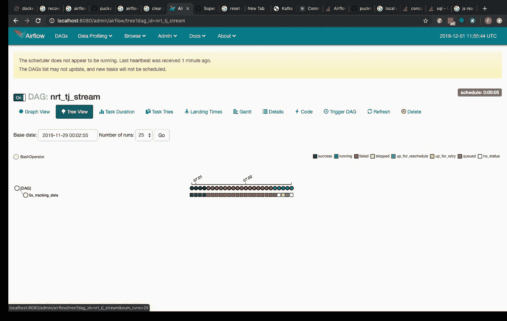
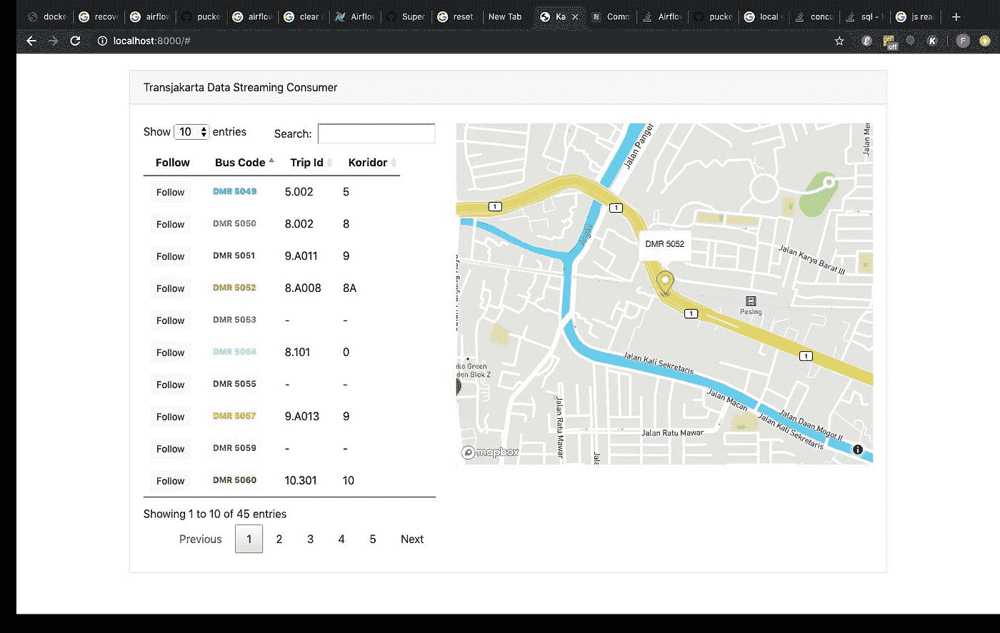
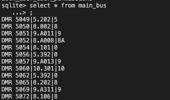
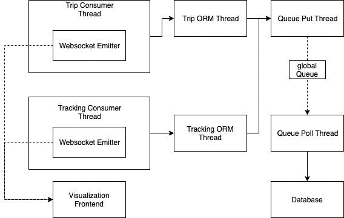
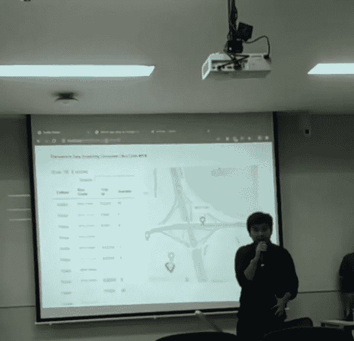

# 用 Kafka 和 Docker 模拟雅加达的 BRT 实时公交跟踪

> 原文：<https://medium.com/analytics-vidhya/simulating-jakartas-brt-real-time-bus-tracking-using-kafka-and-docker-3f09a96234ea?source=collection_archive---------14----------------------->

> 更好地利用技术使城市能够互动，并为市民提供更好的服务。世界各地城市的主要问题之一，当然也包括雅加达，是流动性。通过以尽可能低的延迟获取公共交通数据，如位置流和密度，这将改善市民的通勤体验，甚至改善公共交通之间的互操作性。我们为雅加达自己的快速公交系统建立了一个实时可视化平台，Transjakarta(感谢 T2 交通部门的启发)!).

雅加达公交实时跟踪系统

在我作为信息系统学生的最后一年，我参加了大数据管理课程。对于最终项目，我们面临的挑战是使用我们选择的技术构建大数据用例的书面和概念证明(PoC ),无论是数据工程还是分析和预测范围。我们的 4 人团队(向 Wikan、Usama 和 Edwin 致敬！)选择 Apache Kafka 作为我们项目的主要技术。

首先，Apache Kafka 是一个分布式流平台，构建在发布和订阅的消息队列机制之上。根据 [Apache Kafka 的官方文档](https://kafka.apache.org/intro)，Apache Kafka 是完全可扩展、分布式和容错的。这意味着它适用于高容量但高可用性的用例，如实时跟踪。

**该项目的整个架构看起来像这样**

对于流系统，我们运行 Apache Kafka 的两个代理(实例)来证明系统的高可用性和容错性。

由于我们是通过 REST API 获取数据的，所以我们必须模拟作为生产者的“异步”部分。对于这种情况，我们使用 Apache 气流；一个调度程序平台，每五秒钟获取一次端点并发布消息。模拟器脚本将消息分成三个主题流:

*   **公交车的经纬度，直接从脚本中产生。**
*   **单次出行和公交信息(出行 id、公交代码、公交颜色、出行走廊)存储到 PostgresSQL，监听预写日志(wal)并通过 Debezium 生成。**[**Debezium**](https://debezium.io/)**是一个 Kafka 连接器，以流消息的形式捕获持久性数据库(CDC)中的数据变化。这样做是为了展示对持久数据库(如 PostgreSQL)进行流处理的能力。**

Apache Airflow 的用户界面。绿色圆点表示成功的生产者作业，而黄色圆点表示正在运行的作业。

在消费者方面，我们有两个用例。第一个是可视化和实时公交跟随。第二个是数据存储，模拟数据仓库中的流数据摄取。

跟随可视化前端上的单个总线位置。多亏了 websocket 技术👏

对于数据存储用例，由于时间限制，我们只使用 SQLite3 作为数据库(我们承认，当时我们是致命的😅).然而，由于触发器是最终的，我们还没有处理系统中数据丢失的可能情况。对于未来的改进，可以通过在消费者和代理之间提交消息偏移量来实现。

我们在 SQLite 数据库上访问总线数据的尝试

我们在使用 Django 构建消费者平台时获得了很多乐趣，因为我们应用了很多新事物，如线程、队列、Kafka 的 Python API 和 websocket。另外， [Mapbox GL](https://docs.mapbox.com/mapbox-gl-js/api/) 的 Javascript 库是这个项目的 MVP🔥🔥🔥。

我们制作这个图表是为了指导我们如何构建消费者平台

在计算资源和开发时间有限的情况下，Docker 帮助我们构建、提供和编排实例。我们已经成功运行了 Airflow、PostgreSQL、Zookeeper、多个 Kafka brokers、Django、Redis、Debezium(加上 Kafka Connect)，没有任何麻烦(*，除了数小时计算 docker-compose 脚本和网络配置*

## 我们建议任何没有尝试过 Docker 的人学习并在任何即将到来的项目中使用它，尤其是在需要多个实例编排的项目中！

解脱时刻//项目演示(感谢 Adil 的记录！)

> 从集思广益到展示项目，我们在这个项目中获得了很多乐趣。如果你对这个项目或数据工程有任何反馈或分享，请通过**评论区**联系我们。生产者的源代码可以在这里的中找到[，这里的](http://github.com/vianhazman/bus-tracking-producer)[是消费者部分的](http://github.com/wikansetiaji/KafkaFinalProject_Consumer)。让我们合作学习吧😀

推荐阅读和参考资料:

[【PDF 电子书】卡夫卡:权威指南](https://book.huihoo.com/pdf/confluent-kafka-definitive-guide-complete.pdf)

[[Medium]通过网络套接字将 Kafka 消息路由到浏览器](/@amit.dhodi/routing-kafka-messages-to-browser-over-web-socket-e4d0cf4150a9)