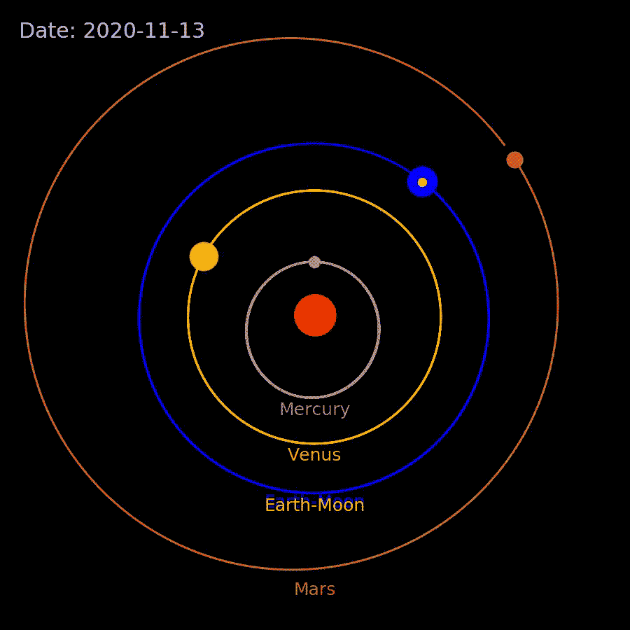
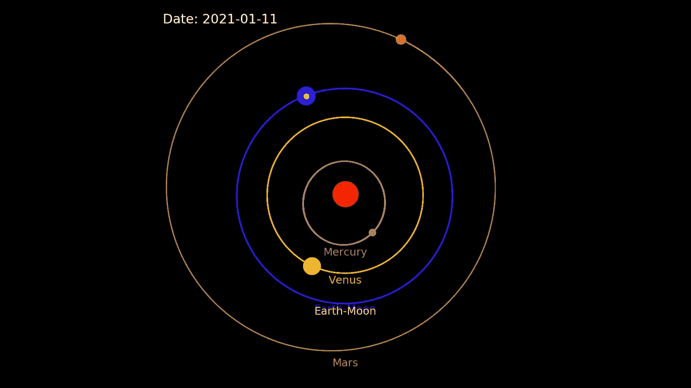

# 用 70 行 Python 代码模拟一个真实的太阳系

> 原文：<https://medium.com/analytics-vidhya/simulating-the-solar-system-with-under-100-lines-of-python-code-5c53b3039fc6?source=collection_archive---------1----------------------->

## 动画科学

计算天体物理学是一门非常有趣的学科，我们使用计算机来模拟天文物体和现象。为了展示计算机模拟在天文学研究中的威力和魅力，我在这里展示了一个我用 70 行 Python 代码编写的程序，它模拟了一个(有点)真实的太阳系。

我们知道行星遵循的轨道主要由来自太阳的引力决定。为了计算行星的轨道，我们需要计算来自太阳的引力，并将其积分以获得速度和位置。我们在普通物理学中了解到，遵循牛顿万有引力定律和牛顿第二运动定律的力给出了加速度:

我们用这个公式来计算行星的位置和速度:

这是欧拉积分法的修改版，其中第一个方程是向前的，第二个方程是向后的。与正常的欧拉方法不同，这个修改版本是稳定的。

用 Python 编程的好处是 Python 可以灵活地处理向量。这三个向量方程各有三个分量，可以很容易地转换成以下代码:

**这三行代码决定了太阳系中大多数物体的运动方式。**

现在我们有了积分器，我们需要初始条件，即某个日期行星的位置和速度。一颗行星的精确位置和速度是从美国宇航局 JPL 地平线在线太阳系数据库(【https://ssd.jpl.nasa.gov/?horizons】)获得的。这是通过调用 Python 模块完成的，该模块向数据库发送查询并获取数据。这部分代码如下所示:

其中`id=1`对应水银。然后，`obj['x']`给出 2017 年 1 月 1 日水星的 x 位置(由第二行“2017-01-01”定义)。

将所有内容放在一起，包括通过 matplotlib 动画工具制作的动画，本文开头生成电影的完整代码附在本文末尾。它计算 2019 年和 2020 年 4 个内行星(水星、金星、地球和火星)加上月球的轨道。这个周期可以很容易地在代码中调整。

# 问&答:

**动画中哪些是真实的，哪些是虚幻的？**

动画具有与左上角显示的日期相对应的真实而精确的位置和速度。尽管这些物体的相对尺寸是正确的，但它们的尺寸并不是按比例的。因为这个原因，月亮在地球的上面。

**代码是实时计算轨道，还是只是把从网上查询到的数据做成动画？**

这是一个实时计算。初始条件来自网络。该程序需要行星在某个日期的位置和速度，以便预测它们在未来的位置。

**水星的轨道为什么这么丑？**

嗯，确实是。与太阳系中的任何其他行星不同，水星的轨道偏心率很高，这意味着它的轨道不是很圆。

**你能把这个动画做成 3D 的吗？**

是的，但是 2D 看起来很适合这个演示。我怀疑有可能在保持代码在 100 行内的同时将它做成 3D 的。如果很多读者感兴趣，我可以在未来进行更新。

**为什么只有 4 颗行星，而不是全部 8 颗？**

因为从第 5 颗行星木星开始，轨道半径变得非常大(>地球的 5 倍)。在动画中包含它们将使内行星几乎看不见。

动画的特征图像