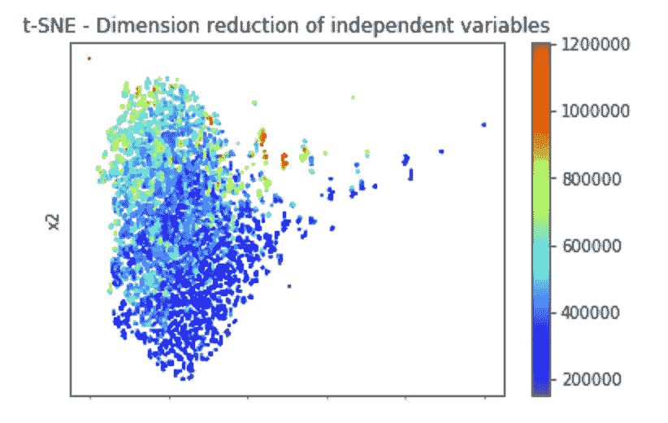
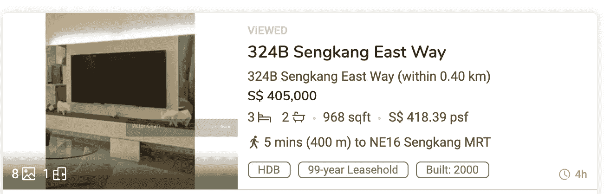

# 新加坡房价预测模型——新加坡房地产价格分析(三)

> 原文：<https://medium.com/analytics-vidhya/singapore-housing-prices-ml-prediction-analyse-singapores-property-price-part-iii-bd9438077423?source=collection_archive---------5----------------------->

> 在这个关于新加坡房价的系列文章的第一部分中，我将重点放在提取额外的信息，并创造新的与距离相关的变量，这些变量可能会对房价产生影响。在[第二部分](/analytics-vidhya/geospatial-data-visualisation-with-plotly-analyse-singapores-property-price-part-ii-eb4f8eb24d05)中，通过数据可视化，我已经表明公寓与生活设施的接近程度，尤其是交通、食品中心和顶级学校，对房价有重大影响。
> 
> 在这最后一部分，我将分享一些流行的机器学习算法来预测房价和我建立的 live 模型。我的目标是基于可用的数据集，找到一个可以生成高精度房价的模型，这样，给定一个新的房产和所需的信息，我们就可以知道该房产是估价过高还是过低。

# 使用的机器学习算法简介

我探索了用于预测新加坡房价的 5 种机器学习算法，即多元线性回归、lasso、ridge、决策树和神经网络。

多元线性回归模型，顾名思义，是一种广泛使用的模型，它假设自变量和因变量(价格)之间呈线性关系。这将是我的比较基准模型。

Lasso 和 ridge 是在参数过多时减少模型复杂性和过度拟合的模型。例如，套索模型将有效地缩小一些变量，这样它只考虑一些重要的因素。虽然数据集中只有 17 个变量，而且变量的数量可能不算多，但分析这些模型的有效性仍然是一个很好的练习。

决策树是一种易于理解的模型，它使用一组二元规则来实现目标值。这对于决策非常有用，因为可以绘制树形图来帮助理解每个变量的重要性(树中的变量越高，变量越重要)。

最后，我还探索了一个简单的多层感知器神经网络模型。简而言之，数据输入通过几层“过滤器”(前馈隐藏层)，模型学习如何通过改变“过滤器”矩阵中的值来最小化损失函数。

# 数据集概述

从数据集中获得了 17 个独立变量，其中近 1/3 的变量与公寓的特征相关，如建筑面积、位置、剩余租赁年数等。其他变量与公寓到公共设施的距离以及附近的犯罪率有关。

# 数据集探索性聚类可视化

我没有运行大量的 pairplots 相关图，而是使用 T-分布式随机邻居嵌入(t-SNE)，一种机器学习算法来进一步可视化自变量和房价之间的相关性。t-SNE 将高维数据降低到低二维空间。17 个独立变量被简化为 x-y 坐标，每个数据点的颜色代表公寓的价格。下图清楚地显示了按统一价格对数据点进行的聚类。因此，如果我们运行回归算法，我们应该获得高度准确的预测模型。

# 预测建模的数据集准备

训练和测试数据集被 80/20 分割并缩放。独立变量(X_train，X_test)的缩放对于模型收敛和速度都是至关重要的。如果我们不对大特征值进行缩放，优化函数可能不会收敛，因为数据可能会大幅波动，并且大数据点也将主导学习过程，从而导致模型不准确。

# 机器学习算法

Sklearn 是一个流行的库包，它提供了不同机器学习算法的易访问性和应用。我分享了下面的代码来展示使用 sklearn 库包应用各种算法的容易程度，因为它们具有相似的代码语法。

此外，我还使用 tensorflow 构建了一个多层感知器神经网络。由于数据集相对较小，当运行 500 个批量大小为 128 的 epoches 时，它不会导致任何计算效率低下。我已经尝试在每个隐藏层中使用较少数量的神经元，并且训练损失的收敛要慢得多。

# 结果

因此，我们终于看到了这篇文章中令人兴奋的部分。结果。

如上所述，我调查了两种情况，其中我只考虑了公寓的特点，另一种情况下，我包括了更多的变量，如离设施的距离。

结果表明，对于一些算法，额外的变量将模型准确性(使用 sklearn 度量标准“解释 _ 方差 _ 得分”，类似于 R2)提高了 10%。基线模型(多元线性回归)精确度从 73%增加到 84%。这表明了地理距离变量的重要性。lasso 和 ridge 的结果与基线模型差别不大。对于神经网络算法，与两种情况下的基线模型相比，它报告了更高的准确性。

决策树算法在这两种情况下都表现最佳。特别是，它实现了 94%的高准确率，而不考虑添加的额外变量。该算法还报告平均绝对误差(“MAE”)为 24，997 美元，是各种预测模型中最低的。与一套公寓的价格相比，这是相当低的。从 15 万美元到 120 万美元不等

仅使用平板的特征变量

使用更多的变量，包括到公共设施的距离和每个街区的犯罪率

# 构建一个实时模型

回到关于新加坡房价的系列文章的目标，目的是生成基于地理距离的变量，确定它们在预测建模中是否有用，如果有用，则创建一个模型来帮助确定房子的价值是过高还是过低。

由于我已经将到娱乐设施的距离确定为重要变量，并且决策树算法在所研究的算法中具有最高的准确性，因此我随后基于这些发现构建了一个实时模型(使用决策树算法)。

用户必须输入 3 个信息(“公寓的地址”、“公寓的楼层面积”和“公寓的楼层”)。其余变量从公共住房的[元数据中提取，并使用第一部分](https://data.gov.sg/dataset/hdb-property-information)中的[代码生成地理距离变量。使用僧康地区](/@michael.wy.ong/web-scrape-geospatial-data-analyse-singapores-property-price-part-i-276caba320b) [propertyguru](https://www.propertyguru.com.sg/) 上的两个最新列表，并假设它们在第 8 层(在属性列表中没有显示该层)，注意到一个属性低于预测值销售，而另一个属性以预测值销售。这可以帮助买家确定他们感兴趣的公寓是否得到了合理的价格；也有助于卖家确定他们是否为其单位设定了合理的挂牌价。

例 1:出售物业的挂牌价格

示例 1:模型显示预测价格高于房产的挂牌价格

例 2:出售物业的挂牌价格

示例 2:模型显示预测价格与房产的挂牌价格相似

# 结论

在新加坡房价系列的最后一部分，我研究了各种机器学习算法来预测房价，并得出结论，决策树算法(在所研究的 5 种模型中)具有最高的准确性。此外，我建立了一个实时模型，这样它可以获取任何新的公寓列表，生成公寓的预测值，并与房地产的列表价格进行比较。这将表明上市单位是否是一个“好买卖”。

模型的准确性可以进一步提高，例如考虑其他时间序列变量，即宏观经济变量。此外，交叉验证总是确保模型一致性的好方法。然而，由于从该模型获得的高准确率，它应该足以用于这项研究。