# 新加坡的“怕输父母”？—通过数据分析了解 HDB 转售价格

> 原文：<https://medium.com/analytics-vidhya/singapores-kiasu-parents-understanding-hdb-resale-prices-through-data-analysis-85b4edead6e2?source=collection_archive---------8----------------------->

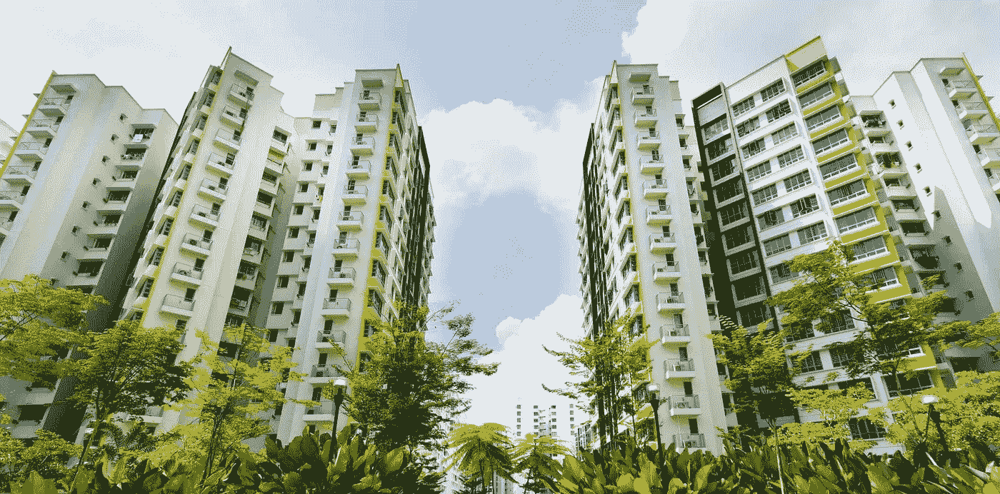

转售的 HDB 公寓；来自 Photo 的照片

许多新加坡年轻夫妇或年轻父母面临的一个共同问题是如何选择房子。例如，一个家庭附近有(好的)小学，因为他们优先考虑学校半径 2 公里内的居民。

该项目旨在解决这一问题，试图找出价值较低但靠近(好)小学的房产，并了解 HDB 的转售价格。这都是用 Python 实现的，源代码可以在 [Github](https://github.com/ZeeTsing/Investigating_Singapore_HDB_resale) 上找到。

# 方法学

1.  **数据来源**

**转售统一价格数据集**:从[数据政府](https://data.gov.sg/dataset/resale-flat-prices)下载，日期为 2017 年 1 月至 2019 年 11 月(含)。数据特征包括:月(交易)、镇(HDB 镇)、公寓类型、街区(编号)、街道名称、楼层范围、平方米建筑面积、公寓模型、租赁开始日期、剩余租赁(年、月)和转售价格。

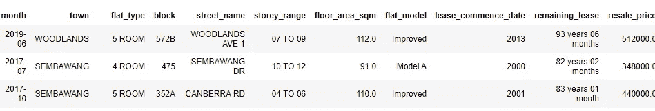

从 data.gov 获得的数据快照

**地址的地理信息**:根据转售统一价格数据集中的街区编号和街道名称，我已经使用[新 Onemap 的 API](https://docs.onemap.sg) 下载了所有地理信息。地理信息包括邮政编码、纬度、经度和 X，Y 地址。

**地址的小学信息:**根据之前获取的邮政编码，从 New Onemap 的小学查询中获取。它包括地址附近半径 2 公里内的学校列表。

**小学排名信息:**我们希望获得一些过去一年的 PSLE 分数，但这在网上是不可用的。我们根据教育部教学奖([链接此处](https://mathsproblemsums.com/pranking/))，从 Beautifulsoup 中提取，选出了这个排名。

**2。数据可视化(可选)**

在我们开始之前，我们想想象一下 HDB 在各自地理位置上的转售价格。这将使我们对岛上的价格有一个高层次的了解。

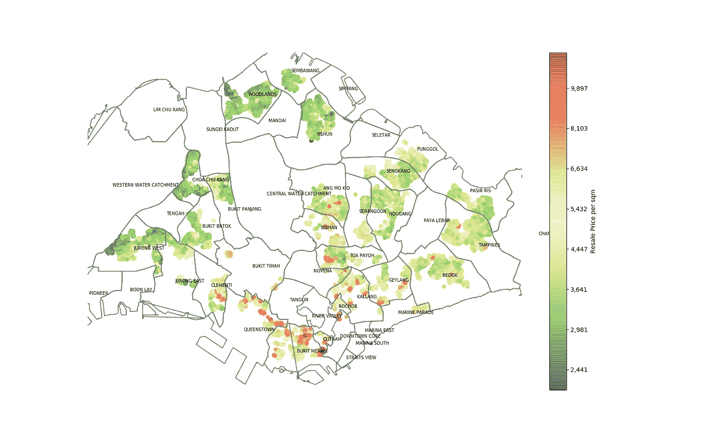

**HDB 每平方米转售价格热图**；仅 1 月 17 日至 11 月 19 日的交易，不包括 2015 年后的 HDB 置顶

由于数据过于向右倾斜，我们用对数变换转换了交易价格。

从图表中我们观察到，最昂贵的交易发生在 Outram、Bukit Merah 和 Queenstown，而 Clementi、Bishan、Kallang-Whampoa 地区也相当昂贵。

同样清楚的是，岛的西北侧通常比东南区域便宜。

**3。特征清洁和处理**

在使用模型之前，需要对特征进行清理和处理。

**公寓类型:**我们对公寓类型进行了重新分组，每个类别都有超过 500 个记录，1 室和 2 室公寓被分组为“1 /2 室”，类似地，行政和多代单元被分组为“行政&多代”。

**平面模型类型:**类似于平面模型类型，我们重新组合了一些平面模型类型。

**楼层:**我们取低楼层和高楼层的平均值作为楼层，即对于 7 至 9 层，楼层返回 8 层，而不是 7 或 9 层。

**剩余租期:**以年为单位提取数值，即 3 个月转换为 0.25 年。

**学校数量:**附近 2 公里半径内学校数量。

**附近学校排名:**显示半径 2 公里内最好的学校排名；基于提取的数据进行排名。有四个类别:顶级学校(排名前 20 的小学)、优秀学校(排名从 21 到 50)、好学校(排名从 51 到 100)和发展中学校(排名从 101 开始)。例如，如果某个地址附近有五所学校，其中一所是顶级学校，而其余的都是好学校或发展中学校，则附近的要素学校排名会返回该特定居民地址的顶级学校。

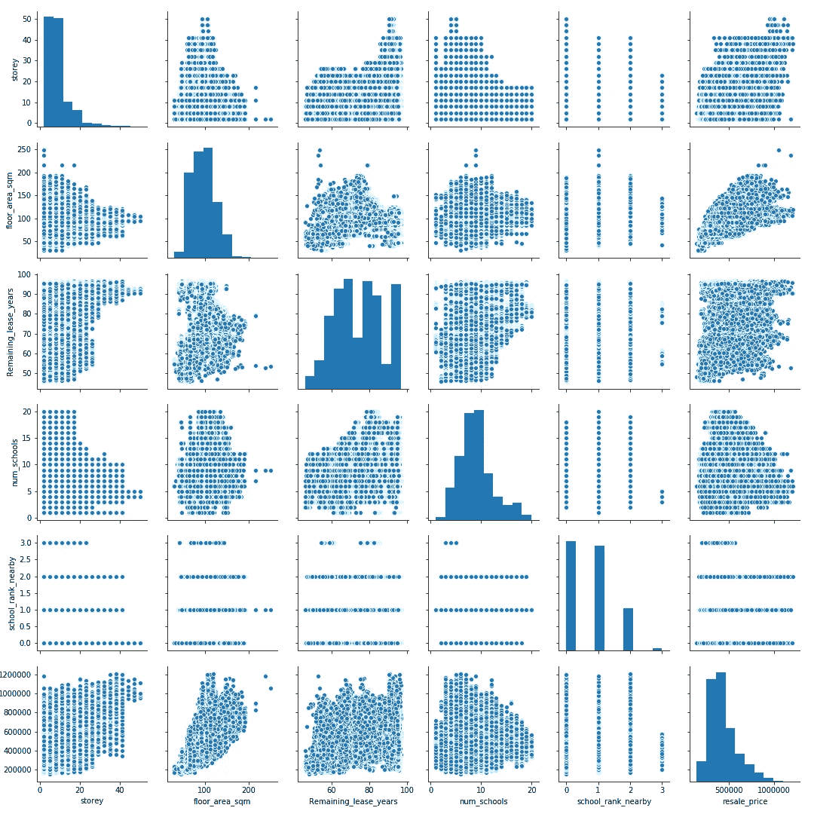

**转售价格转换前的特征配对图**

**转售价格:**对数转换为分布显示严重右偏；

所有分类变量都使用一个热编码进行转换。

**4。特征选择和建模**

在拟合普通最小二乘模型的基础上，使用特征相关性和 p 值方法选择特征。

最终模型是基于易于解释和满足线性回归正常假设条件来选择的。线性回归模型是用于拟合数据的主要模型，因为高级机器学习模型的结果更难解释。

最终选择的模型有八个变量:城镇地价、建筑面积、公寓类型、楼层、剩余年限、学校排名、学校数量和公寓模型地价。基于 p 值方法，发现所有这些都具有统计显著性，并且与目标变量具有相对较高的特征相关性。

# **结果**

我们的最终模型是一个普通的最小二乘模型，其中目标变量 log 经过了转换:

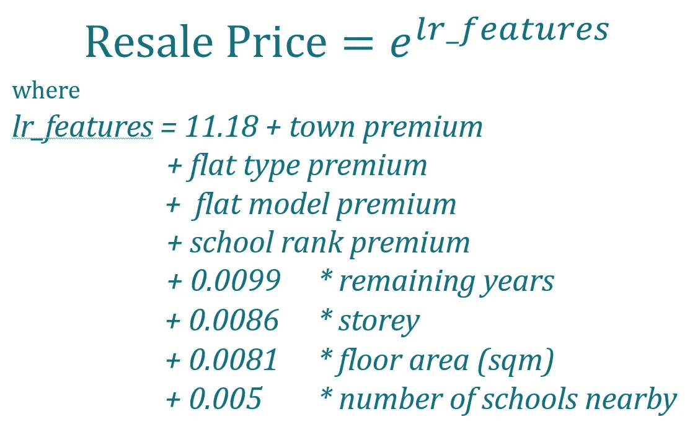

**我们最终模型的公式**

**城镇地价:**

城镇地价被解释为超过 Ang Mo Kio 价格的百分比；人们愿意为 Clementi 支付比 Ang Mo Kio 高 11%的价格。

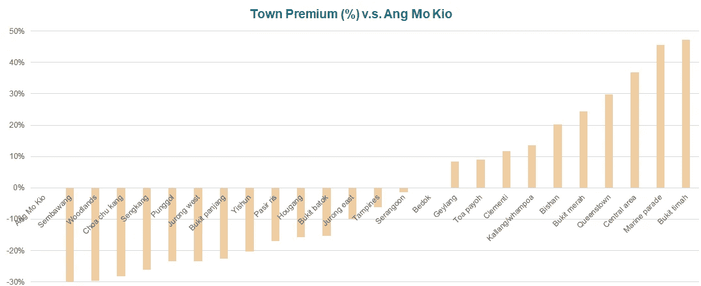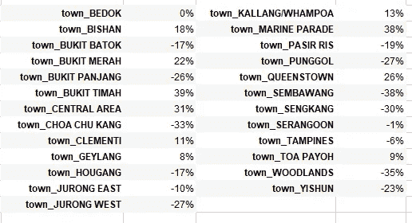

城镇溢价

**扁平型保费:**

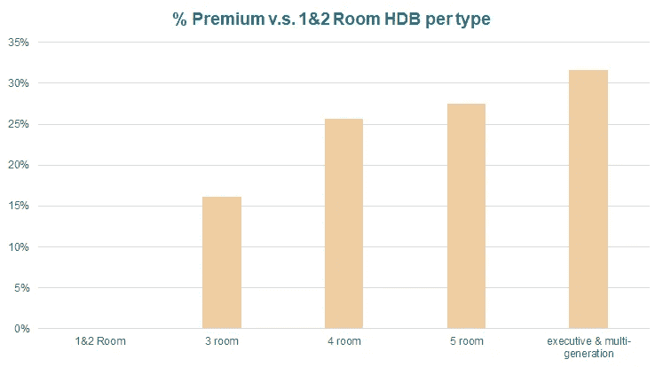

公寓型溢价被解释为 1 房和 2 房 HDB 的百分比；人们愿意为三居室公寓支付比一居室或两室公寓平均高出 15%的价格

**平模型保费:**

平面模型溢价解释为改进模型的百分比；例如，在类似条件下，人们愿意为“新一代”公寓比“改良型”公寓多支付 5%

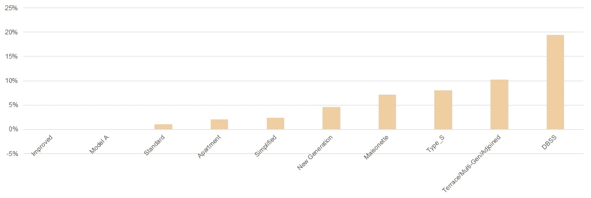

**扁平型溢价超过改进型**

**附近学校排名:**

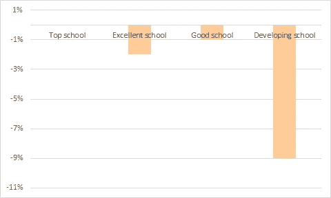

**学校排名溢价:**顶级学校(排名前 20 的小学)、优秀学校(排名从 21 到 50)、好学校(排名从 51 到 100)和发展中学校(排名从 101 开始)

附近的学校排名是使用半径 2 公里内的小学信息计算的。只显示附近最好学校的排名。排名是基于教育部奖励数据，以反映教学质量，并根据排名分为四组。

我们将排名前 20 的学校作为基线，百分比是相对于基线的。阅读图表，很明显，人们愿意为附近的发展中学校平均支付 9%的费用，而优秀学校和好学校或多或少都差不多。

**剩余租赁年限:**

对于剩余的每一年租约，人们平均愿意多支付 **0.99%** 的费用。换句话说，对于市值为 500，000 美元的单位，每年剩余价值为 500，000 美元* 0.99% =多 4，960 美元，少剩余一年。

**建筑面积(平方米):**

每平方米，人们平均愿意多支付 **0.82%** 。换句话说，一个基本价值为 50 万美元的公寓，每平方米增加价值 50 万美元* 0.87% = 4，080 美元。

**楼层:**

平均而言，每高一层，人们愿意多付 0.87%的 T21。换句话说，一个第 4 层的单位，价值 50 万元* 0.87% =比一个市值 50 万元的第 3 层类似单位高出 4，340 元。

**附近学校数量:**

对于附近的每所小学，人们平均愿意多支付 **0.05%** 。换句话说，在类似的条件下，对于一个基价为 50 万美元的单位，买家平均要为附近多一所小学多支付 2，488 美元。

# 建议

我们确定了价值低于我们的模型预测的公寓，并认为找到的公寓对购房者来说是物有所值的。通过最小数量的事务对结果进行过滤，以避免离线事务。

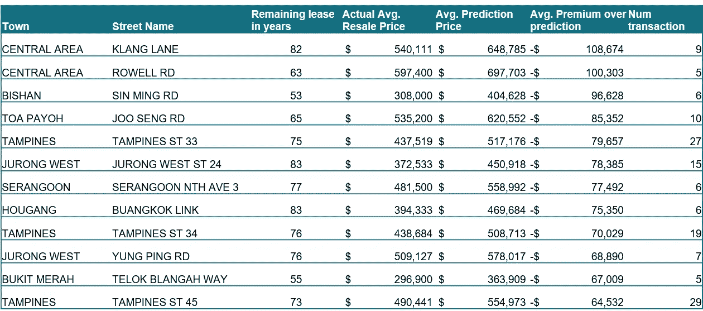

最具价值的前 15 个地址

确定的地址通常是热门城镇(中环、璧山、大巴窑等)内的旧公寓(剩余不到 90 年)。

我们还进一步筛选了最佳价值公寓的名单，并确定了附近有(好)学校的公寓。

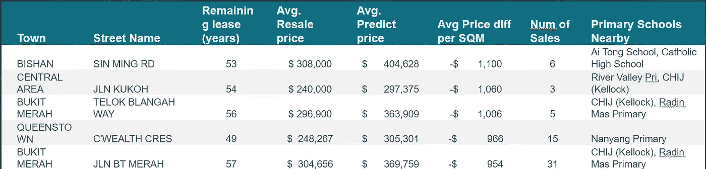

附近有最好的价值和好学校的前 5 个地址

确定的地址大多都很旧(剩余年限不到 60 年)，这可能是其价值首先被低估的原因。

我们还利用预测结果更新了我们的热图。这些点用颜色编码，预测价格与实际转售价格的百分比存在差异。正值表示实际转售价格高于预测价格，而负值表示实际转售价格低于预测价格。

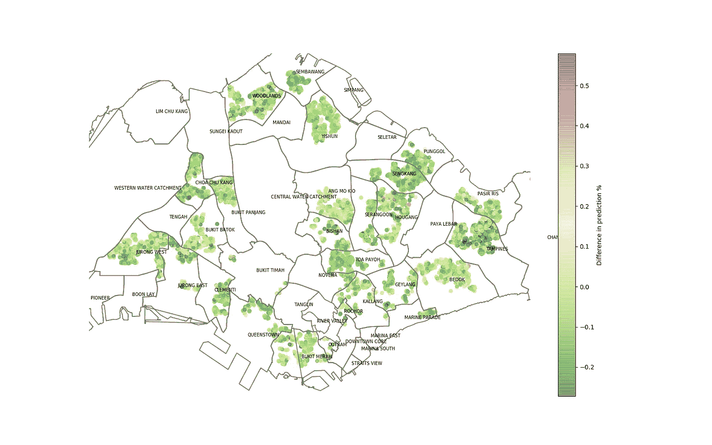

**HDB 转售价格预测与实际**

大多数交易遵循建模行为或略低(深绿色)，但也有少数情况高于模型预测，主要是在 Serangoon-Hou gang 地区。对于大多数购房者来说，这是一个好消息，因为这意味着转售交易市场非常透明和可预测。

# 讨论

我想进一步了解转售价格，包括距离便利设施和交通的距离、租赁价格等。如果给更多的时间。此外，如果我们不关心可解释性，像 random forest 这样的高级机器学习模型可以用来更好地模拟价格。

最后，谢谢你的阅读，我希望每个人都能找到自己理想的家！