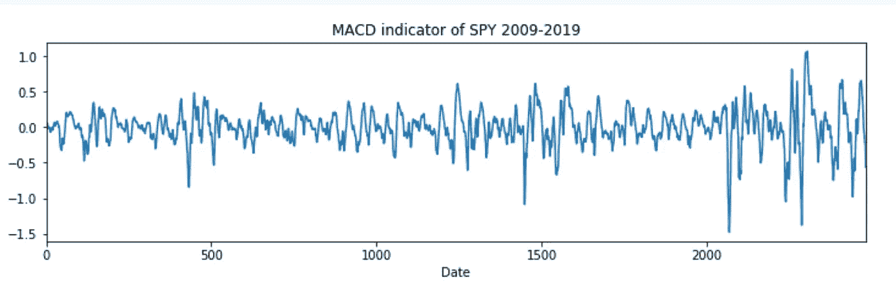

# 奇异谱分析+核主成分分析用于时间序列回归

> 原文：<https://medium.com/analytics-vidhya/singular-spectrum-analysis-kernel-pca-for-time-series-regression-64679c155c80?source=collection_archive---------10----------------------->

图一。SPY 的移动平均收敛发散指标。

TLDR:我们使用的单变量时间序列是 SPY 的移动平均收敛发散，SPY 是一个跟踪 S&P500 的 ETF，覆盖了过去 10 年(2009 年 10 月-2019 年 10 月)。 [MACD 定义为](https://www.google.com/url?sa=t&rct=j&q=&esrc=s&source=web&cd=3&cad=rja&uact=8&ved=2ahUKEwjQ4a-ls__kAhUOVN8KHWpBCdUQFjACegQIDBAH&url=https%3A%2F%2Fwww.investopedia.com%2Fterms%2Fm%2Fmacd.asp&usg=AOvVaw2xh3SBw1WyNdcJ_481DNVi)，取 26 天指数移动平均线(EMA(26))并从中减去 EMA(12)。一个更快的信号穿过一个更慢的信号表明上升趋势的可能性…