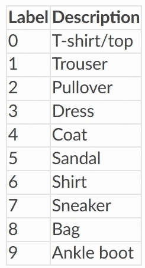

# 跳过数据预处理！访问 12 个现成的数据集

> 原文：<https://medium.com/analytics-vidhya/skip-the-data-preprocessing-accessing-12-ready-to-go-datasets-829e53f2d78?source=collection_archive---------12----------------------->

## CIFAR、IMDB、路透社、MNIST 等

当数据集可以被访问而不必从以前下载时，这是很方便的。通常，当数据集直接取自数据源时，需要对数据进行转换、清理和预处理。对于大型 NLP 数据集，需要对单词进行量化，这对于大型数据集来说会花费大量时间。在本文中，我将概述如何使用 Keras 和 Scikit-Learn 加载 12 个数据集，这些数据集经过预处理，可以进行分析或输入到机器学习模型中。

注意——如果在 Kaggle 这样的环境中下载，请确保打开互联网。图书馆从网上检索他们的数据，所以他们需要互联网来工作。否则，它将抛出一个错误。

# CIFAR10 和 CIFAR100

加拿大高级研究所(CIFAR-10)数据集包含 10 个不同类别的 60，000 幅 32 乘 32 的彩色图像。这 10 个不同的类别是飞机、汽车、鸟、猫、鹿、狗、青蛙、马、船和卡车。每个类有 6000 张图片。CIFAR-100 数据集有 100 个不同的类。


CIFAR-10 和 CIFAR-100 数据集通常用于评估图像识别深度学习方法。CIFAR 网站有可供下载的数据集，但需要烦人的解压缩和数据转换。Keras 可以通过以下方式轻松访问该数据集:

```
**#to import cifar10
import** keras **from** keras.datasets **import** cifar10  
(x_train, y_train), (x_test, y_test) = cifar10.load_data()**#to import cifar100
import** keras **from** keras.datasets **import** cifar100
(x_train, y_train), (x_test, y_test) = cifar100.load_data()
```

# IMDB 电影评论情感数据集

IMDB 电影评论情感数据集由来自 IMDB 的 25，000 条电影评论组成，由情感(正面/负面)标记。评论已经过预处理，每个评论都被编码为一系列的单词索引。单词通过数据集中的总频率进行索引，例如，整数“3”编码数据中第三个最频繁的单词。这意味着不需要进行复杂的 NLP 预处理。

由于其丰富的数据、二进制分类和上下文的一致性，该数据集通常用于测试自然语言处理技术。

Keras 图书馆可以帮助—

```
import keras
from keras.datasets import imdb
(x_train, y_train), (x_test, y_test) = imdb.load_data(path="imdb.npz",num_words=None,skip_top=0, maxlen=None,seed=1,start_char=1,oov_char=2,index_from=3)
```

# 路透社新闻主题分类

路透社新闻主题分类数据集包括来自路透社的 11，228 条新闻，标记了超过 46 个主题。与 IMDB 数据集一样，每条线都被编码为一系列字索引(类似于 IMDB 数据集)。

```
import keras
from keras.datasets import reuters
(x_train, y_train), (x_test, y_test) = reuters.load_data(path="reuters.npz",num_words=None,skip_top=0, maxlen=None,test_split=0.2,seed=1,start_char=1,oov_char=2,index_from=3)#Access word index
word_index = reuters.get_word_index(path="reuters_word_index.json")
```

# MNIST 手写数字

MNIST 数据库包括 60，000 幅训练图像和 10，000 幅 28×28 像素的手写数字图像，从 0 到 9。


[来源](https://en.wikipedia.org/wiki/MNIST_database)

MNIST 数据库是测试图像识别的基准标准。Keras 以易于加载的格式实现了 MNIST(最初的 MNIST 数据库需要一些预处理):

```
**import** keras **from** keras.datasets **import** mnist  
(x_train, y_train), (x_test, y_test) = mnist.load_data()
```

# 时尚 MNIST

时尚 MNIST 数据集由 10 个时尚类别的 60，000 个 28×28 灰度图像组成，以及 10，000 个图像的测试集。


[来源](https://github.com/zalandoresearch/fashion-mnist)

该数据集可作为 MNIST 的替代物。类别标签包括:



MNIST 时装数据集的 Keras 实现是:

```
**import** keras **from** keras.datasets **import** fashion_mnist  
(x_train, y_train), (x_test, y_test) = fashion_mnist.load_data()
```

# 波士顿房价回归

波士顿房价数据集取自卡内基梅隆大学维护的 StatLib 图书馆。样本包含 20 世纪 70 年代末波士顿郊区不同位置房屋的 13 个属性，目标是某个位置房屋的中值。

波士顿住房数据集被视为回归算法的基准数据集。

```
**import** keras **from** keras.datasets **import** boston_housing  
(x_train, y_train), (x_test, y_test) = boston_housing.load_data()
```

# 鸢尾植物数据集

著名的鸢尾植物数据集由测量植物的四个特征和鸢尾物种的 3 类目标组成，由加州大学欧文分校机器学习知识库维护。

```
import sklearn
data = sklearn.datasets.load_iris()
```

# 糖尿病数据集

糖尿病数据集由十个基线变量组成:年龄、性别、体重指数、平均血压和六项血清测量值。这些都是从 442 名糖尿病患者中获得的。该目标是基线后一年疾病进展的定量测量。

```
import sklearn
data = sklearn.datasets.load_diabetes()
```

# 葡萄酒识别数据集

UCI 葡萄酒识别数据集由 13 个葡萄酒定量指标和一个代表葡萄酒类型的 3 级目标值组成。这个著名的数据集是多类分类算法的另一个基准。

```
import sklearn
data = sklearn.datasets.load_wine()
```

# 威斯康星州乳腺癌诊断数据集

著名的威斯康星州乳腺癌诊断数据集由 30 个数字特征组成，描述了一个癌细胞，最终的二元目标诊断为恶性或良性。该数据集是高维度和使用主成分分析辅助分类的基准数据集。

```
import sklearn
data = sklearn.datasets.load_breast_cancer()
```

# Olivetti 人脸数据集

由剑桥美国电话电报公司实验室收集的 Olivetti 人脸数据集是一组 40 个不同人的 400 个 64 乘 64 像素的图像。目标是识别这个人的身份。该数据集对于在具有几个类和很少训练数据的数据集中评估图像识别算法的性能特别有帮助。

```
import sklearn
data = sklearn.datasets.fetch_olivetti_faces()
```

我希望你喜欢这篇文章！如果你看过，请随意看看我的其他作品。